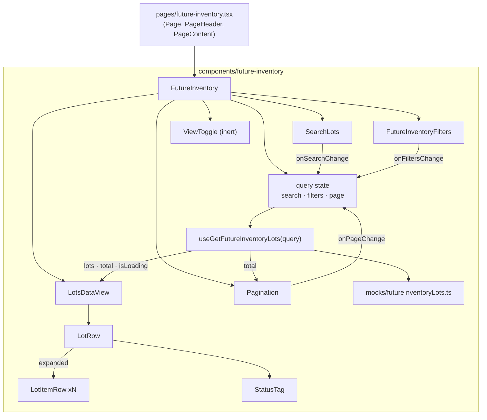

# Future Inventory — Lot Listing (Prototype)

> **Status**: Approved
> **Created**: 2026-08-06
> **Area**: Admin — new Future Inventory module, rendered at `/future-inventory`
> (Admin route `/admin/future-inventory`, section `products`, subsection `inventory`)
> **Primary files** (planned):
> [pages/future-inventory.tsx](../pages/future-inventory.tsx) ·
> `components/future-inventory/FutureInventory.tsx` ·
> `components/future-inventory/LotsDataView/LotsDataView.tsx` ·
> `components/future-inventory/Filters/FutureInventoryFilters.tsx` ·
> `components/future-inventory/types.ts` ·
> `components/future-inventory/mocks/futureInventoryLots.ts` ·
> `hooks/useGetFutureInventoryLots.ts`
> **Design**: [Figma — Future inventory, frame `listagem por lote`](https://www.figma.com/design/xLwjBVD8h1llHt7FcW96Fv/Future-inventory?node-id=86-60142)

## 1. Business Context

### Problem Statement

Today inventory is modeled as a **single present quantity**, with no notion of *when* more
stock will arrive. A merchant who knows that 100 units land on a specific date has to
choose between two bad options: leave the product unavailable and lose the demand, or open
the stock now and risk overselling.

This limitation unfolds into three structural gaps:

1. **No forward selling.** There is no way to sell and promise stock that has not yet
   arrived physically.
2. **No native lifecycle for expected stock.** There is no `agendado → recebido /
cancelado / inativo` transition owned by the platform, which forces the merchant to
   intervene manually every single day just to keep the promised date trustworthy.
3. **The existing feature does not fit modern architectures.** Supply Lot guarantees
   future availability but fails exactly in the architectures enterprise clients are
   adopting — multi-seller, franchise accounts and Delivery Promise.

Four clients interviewed in discovery (**Fast Shop**, **Samsung**, **Dakota** and **Loja
Santo Antonio**), from distinct business profiles, confirmed the same central diagnosis:
the platform has no native concept of a future lot with a real arrival date, and each of
them absorbs the operational cost of that gap with daily manual workarounds. **Eight
enterprise clients** are confirmed running this kind of workaround in production today,
including **Container Store**, **World Wide Golf** and **ODP**, which manually release
backorder lines outside VTEX as soon as stock arrives in their own WMS.

### Scope of this Specification

This spec covers **only the prototype of the lot listing** — the first screen of a new
Admin module called **Inventário Futuro**. Its purpose is to **validate the UX with the
team** using mock data. It does **not** specify the platform capability, the backend, or
the inventory reservation semantics.

The vocabulary this listing establishes (lot, destination, arrival date, lifecycle status)
is intended to be the vocabulary a future API honors, so the prototype doubles as a
contract proposal.

### Goals

- Render the **"Por lote"** listing inside the existing `/future-inventory` page, built
  entirely with Shoreline, faithful to the Figma frame `listagem por lote`.
- Make four interactions **genuinely functional** over mock data: **search**, **filters**,
  **pagination** and **expanding a lot** to reveal its SKUs.
- Express the lifecycle **`Agendado → Recebido / Cancelado / Inativo`** as the status
  vocabulary, replacing the `Ativo / Inativo` pair drawn in the Figma.
- Keep the remaining affordances **visible but inert**, so the screen reads as complete in
  a design review without implying behavior that does not exist yet.
- Shape the mock data and the query surface so that swapping the fixture for a real API
  later touches **one hook only**.

### User Stories

#### US-1: See the future lots

- **Story**: As a merchant, I want to see every future lot with its destination, total
  quantity, arrival date and status, so that I can tell at a glance what stock is coming
  and when.
- **Acceptance Criteria**:
  - **Given** the module is open with no search term and no active filter, **when** the
    listing renders, **then** the first 25 lots are shown, each row displaying lot code and
    name (e.g. `#001 Reposição de agosto`), destination as seller plus warehouse on two
    lines, total quantity, arrival date formatted `DD/MM/YYYY`, and a status tag.
  - **Given** the listing rendered, **when** I read a lot row, **then** its quantity equals
    the sum of the quantities of the SKUs inside it.
  - **Given** the listing is still resolving its data, **when** it has not resolved yet,
    **then** a skeleton occupies the table area instead of an empty frame.

#### US-2: Expand a lot to see its SKUs

- **Story**: As a merchant, I want to expand a lot, so that I can see which products and
  quantities compose it without leaving the listing.
- **Acceptance Criteria**:
  - **Given** a collapsed lot row, **when** I click its expand control, **then** one child
    row per SKU appears directly beneath it, each showing product image, product name, SKU
    ID and the SKU quantity.
  - **Given** an expanded lot, **when** I read a child row, **then** the Destino, Chegada
    and Status cells show an em dash, because a SKU inherits those values from its lot.
  - **Given** an expanded lot, **when** I click the control again, **then** the child rows
    collapse.
  - **Given** two lots, **when** I expand both, **then** both stay expanded — expansion is
    independent per lot, not a single-open accordion.

#### US-3: Search by lot or SKU

- **Story**: As a merchant, I want to search by lot or by SKU, so that I can find the
  arrival I care about without scrolling.
- **Acceptance Criteria**:
  - **Given** any listing state, **when** I type a term that matches a lot code or lot
    name, **then** only the lots matching it remain, accent- and case-insensitively.
  - **Given** any listing state, **when** I type a term that matches a product name or SKU
    ID, **then** the lots containing that SKU remain **and are automatically expanded**, so
    the reason for the match is visible.
  - **Given** an active search term, **when** I clear it, **then** the full set returns and
    the automatic expansion is undone.
  - **Given** an active search term, **when** it matches nothing, **then** the empty result
    state is shown with an action to clear search and filters.

#### US-4: Filter the listing

- **Story**: As a merchant, I want to filter by destination, arrival date, quantity and
  status, so that I can isolate the arrivals relevant to a decision.
- **Acceptance Criteria**:
  - **Given** the filter row, **when** I select one or more destinations, **then** only
    lots whose destination is among the selected ones remain.
  - **Given** the filter row, **when** I pick an arrival date range, **then** only lots
    whose arrival date falls inside the range, inclusive of both ends, remain.
  - **Given** the arrival date filter, **when** I set an end date earlier than the start
    date, **then** the filter is not applied and the field reports the invalid range.
  - **Given** the filter row, **when** I set a minimum and/or maximum quantity, **then**
    only lots whose total quantity falls inside those bounds remain.
  - **Given** the filter row, **when** I select one or more statuses, **then** only lots
    with those statuses remain.
  - **Given** several active filters, **when** they are combined, **then** they apply
    together as a conjunction, and combined with the search term as well.
  - **Given** any active filter, **when** I clear it, **then** its restriction is lifted
    without touching the other filters.

#### US-5: Paginate the results

- **Story**: As a merchant, I want to page through the lots, so that a long list stays
  readable.
- **Acceptance Criteria**:
  - **Given** more than 25 results, **when** the listing renders, **then** the pagination
    reports the current window and the total, and the previous control is disabled on the
    first page.
  - **Given** I am not on the last page, **when** I go to the next page, **then** the next
    25 results are shown and every lot renders collapsed.
  - **Given** I am on a page beyond the first, **when** I change the search term or any
    filter, **then** the listing returns to the first page.

#### US-6: Read the lifecycle status at a glance

- **Story**: As a merchant, I want each lot's lifecycle state to be visually distinct, so
  that I can spot what is still expected versus already settled.
- **Acceptance Criteria**:
  - **Given** a lot row, **when** its status is rendered, **then** it uses a Shoreline
    `Tag` whose colour is stable per status: `Agendado` blue, `Recebido` green, `Cancelado`
    red, `Inativo` gray.
  - **Given** the status filter, **when** I open it, **then** the four statuses offered are
    exactly the four above.

#### US-7: Understand what is not available yet

- **Story**: As a stakeholder reviewing the prototype, I want the not-yet-built affordances
  to be visible but clearly inert, so that the review discusses layout and flow without
  mistaking the prototype for a working feature.
- **Acceptance Criteria**:
  - **Given** the page header, **when** I see the "Criar lote futuro" button, **then** it
    is rendered in its primary style and clicking it does nothing.
  - **Given** the collection header, **when** I see the "Por lote / Por SKU" toggle,
    **then** "Por lote" is selected and clicking "Por SKU" does nothing.
  - **Given** a lot row, **when** I see its overflow menu, **then** clicking it does
    nothing.
  - **Given** any table column header, **when** I click it, **then** nothing is sorted.

### Key Scenarios

| Scenario | Pre-conditions | Steps | Expected Result |
| --- | --- | --- | --- |
| Happy path — browse | Module open, no search, no filters | Read the first page | 25 lot rows, collapsed, pagination reports `1 — 25 of 74` |
| Happy path — expand | Listing rendered | Click the expand control of `#001` | Three child SKU rows appear with quantities `3`, `2`, `10`; Destino/Chegada/Status show `—` |
| Happy path — search by lot | Listing rendered | Type `Reposição de agosto` | Only `#001` remains, collapsed; pagination total updates |
| Happy path — search by SKU | Listing rendered | Type `#123` | Lots containing SKU `#123` remain and are auto-expanded |
| Happy path — combined filters | Listing rendered | Select two destinations + status `Agendado` | Only lots satisfying both remain; page resets to 1 |
| Error case — invalid date range | Arrival date filter open | Set end date before start date | Filter not applied, invalid range reported, listing unchanged |
| Error case — no results | Listing rendered | Search a term that matches nothing | Empty result state with a "Limpar filtros" action that restores the full set |
| Edge — quantity bound only | Listing rendered | Set minimum quantity `50`, leave maximum empty | Only lots with quantity `>= 50` remain |
| Edge — page reset on filter | On page 3 | Apply the status filter | Listing jumps to page 1 with the filtered set |
| Edge — expansion resets across pages | `#001` expanded on page 1 | Go to page 2, then back to page 1 | Rows render collapsed; no stale expansion is carried over |
| Edge — lot with a single SKU | Listing rendered | Expand a lot with one SKU | One child row whose quantity equals the lot quantity |
| Edge — inert affordance | Listing rendered | Click "Criar lote futuro", then "Por SKU", then a row menu | Nothing happens in all three cases; no navigation, no console error |

### Functional Requirements

- **FR-1**: The module renders inside the existing `/future-inventory` page, reusing its
  Shoreline `Page` / `PageHeader` / `PageContent` structure and its behaviour of hiding the
  mock Admin shell when embedded in the real Admin.
- **FR-2**: The listing shows the **"Por lote"** view only. The `Por lote / Por SKU` toggle
  is rendered with `Por lote` selected and is inert.
- **FR-3**: Lot rows expose: lot code and name, destination (seller and warehouse),
  total quantity, arrival date, status tag and an inert overflow menu.
- **FR-4**: A lot's total quantity is **derived** from the sum of its SKU quantities, never
  stored independently.
- **FR-5**: Expansion is per lot, independent, and defaults to collapsed. Child SKU rows
  render product image, product name, SKU ID and quantity, and an em dash for Destino,
  Chegada and Status.
- **FR-6**: Search matches, accent- and case-insensitively, against lot code, lot name,
  product name and SKU ID. Lots matched only through a SKU are auto-expanded.
- **FR-7**: Four filters are functional and conjunctive: **Destino** (multi-select),
  **Data de chegada** (inclusive date range), **Quantidade** (optional min and max bounds)
  and **Status** (multi-select over the four lifecycle values).
- **FR-8**: An arrival date range whose end precedes its start is rejected and not applied.
- **FR-9**: Pagination is 25 items per page over the filtered set, and any change to the
  search term or to a filter resets the current page to the first.
- **FR-10**: Status is rendered with a fixed status-to-colour mapping: `Agendado` blue,
  `Recebido` green, `Cancelado` red, `Inativo` gray.
- **FR-11**: Two distinct empty states exist: **no results** for the current search and
  filters, offering a clear-filters action; and **no lots at all**, offering the (inert)
  creation call to action.
- **FR-12**: A skeleton occupies the table area while the listing data is unresolved.
- **FR-13**: All interface copy is written in **pt-BR directly in the components**, with no
  `react-intl` usage and no additions to `messages/`.
- **FR-14**: Column sorting, the page header overflow menu, the row overflow menu and the
  creation button are rendered but perform no action.

### Non-Functional Requirements

- **UI compliance**: Every element comes from `@vtex/shoreline`. No CSS Modules, no
  Tailwind, no one-off inline styles. If a gap appears, `styled-components` with Shoreline
  tokens is the only escape hatch, and it must carry a comment justifying it.
- **Data isolation**: The fixture and the query surface are shaped like a paginated API
  response, so replacing the mock with a real endpoint changes
  `useGetFutureInventoryLots` and nothing else.
- **Performance**: Filtering, searching and paging run over an in-memory collection of ~74
  lots. Derived collections are computed with `useMemo` keyed on the query, so typing in
  the search field does not re-filter on unrelated re-renders.
- **Accessibility**: The expand control is a real button with an accessible name and an
  `aria-expanded` state. Inert controls remain focusable and are not announced as
  disabled unless they are visually disabled.
- **Typing**: No `any`. Status is a union type, not a loose string.

### Out of Scope

- The **"Por SKU"** listing (Figma frame `listagem por produto`) — a separate spec.
- The **lot creation** form (Figma frame `Criação de lote`) — a separate spec.
- Row actions and their confirmation flows: editing, inactivating, cancelling, marking a
  lot as received.
- Column sorting.
- Any real backend, API proxy route, or persistence. No endpoint exists for future
  inventory today.
- Internationalisation of the module's copy.
- Inventory semantics: reservation, overselling protection, Delivery Promise integration,
  multi-seller propagation. This prototype only *displays* future lots.
- Bulk selection of lots.

---

## 2. Arch Decisions

### Proposed Solution

Add a self-contained feature folder, `components/future-inventory/`, and keep
`pages/future-inventory.tsx` as a thin entry point. A single hook,
`useGetFutureInventoryLots`, owns the whole data story: it reads an in-memory fixture,
applies search, filters and pagination, and returns a page-shaped result. The listing
components stay pure presentation driven by that hook plus a query state object.

Because Shoreline's `Table` has **no expandable-row primitive**, expansion is composed:
the lot row renders a caret `IconButton` in its first cell, and when expanded the component
emits additional `TableRow`s for the lot's SKUs immediately after the parent row. The table
remains a flat sequence of rows; "nesting" is purely visual, achieved through the first
cell's content and indentation.

The query state (`search`, `filters`, `page`) lives in the feature's top-level component as
plain React state. Since there is no server, there is no need for TanStack Query, providers
or cache invalidation.

### Architecture Overview



**Pipeline inside the hook**, in a fixed order:

```
fixture → search match → destination → arrival date range → quantity bounds → status
        → total (for pagination) → slice(page) → { lots, total, autoExpandedLotIds }
```

### Alternatives Considered

| Alternative | Pros | Cons | Verdict |
| --- | --- | --- | --- |
| In-memory fixture read directly by a hook (chosen) | Zero infrastructure; instant iteration; the whole data story sits in one file | Does not exercise latency, so loading states must be reasoned about rather than observed | **Accepted** |
| Mock behind a Next API route under `pages/api/` | Exercises real latency, server-side pagination and TanStack Query, closer to the eventual shape | Buys realism the review does not need, and adds a route that must later be deleted | Rejected |
| TanStack Query over the fixture | Consistent with every other list in this repo | Cache, keys and invalidation for data that cannot change; ceremony without benefit | Rejected |
| Shoreline `Collection` / `CollectionView` as the container | Matches the Figma layer named `Collection`; brings header, footer and states | `CollectionView` drives its own row rendering, which fights the manual parent/child row emission expansion requires | Rejected — compose `Table` directly |
| `Tab` / `TabList` for the `Por lote / Por SKU` toggle | Semantically a view switch | Tabs imply a mounted panel per tab; the second view does not exist yet, so the semantics would lie | Rejected — two `Button`s styled as a segmented control |
| Single-open accordion for expansion | Keeps the table short | Merchants compare lots side by side; forcing a collapse loses the comparison | Rejected — independent expansion |
| Types in `shared/types.ts` per `AGENTS.md` | Follows the repo convention | Pollutes the delivery-options domain with a module destined to be extracted | Rejected — see Decision 5 |

### Risks & Mitigations

| Risk | Impact | Likelihood | Mitigation |
| --- | --- | --- | --- |
| Spec status vocabulary diverges from the Figma, which shows `Ativo / Inativo` on lots | Med | High | Explicitly agreed with the requester; recorded as Decision 1 so the design file can be reconciled afterwards |
| Manually composed expansion breaks table semantics or column alignment | Med | Med | Child rows reuse the parent's `columnWidths`; indentation lives in the first cell only, never as a column offset |
| The prototype is mistaken for a working feature in review | High | Med | Inert affordances are enumerated in FR-14 and demonstrated by the last Key Scenario |
| Hardcoded pt-BR copy leaks into production code paths | Low | Low | The module is isolated in its own folder and reachable only from `/future-inventory`; i18n is a tracked follow-up |
| Fixture drifts from the eventual API shape | Med | Med | The fixture is typed by the same types the hook returns, and the hook returns a page-shaped result rather than a raw array |
| CSS Modules already used by the prototype's Admin shell set a precedent for this module | Med | Med | This module adds no CSS Modules; the pre-existing `admin-shell.module.css` deviation is tracked separately |

### Key Decisions

#### Decision 1: Lifecycle vocabulary replaces the Figma's `Ativo / Inativo`

- **Status**: Accepted
- **Context**: The Figma lot listing tags lots as `Ativo` or `Inativo`, while the SKU
  listing shows `Agendado`, `Em trânsito`, `Recebido` and `Inativo`. The business problem is
  stated in terms of a lifecycle: `agendado → recebido / cancelado / inativo`.
- **Decision**: Adopt **`Agendado`, `Recebido`, `Cancelado`, `Inativo`** as the single
  status set for lots, dropping both `Ativo` and `Em trânsito`. `Em trânsito` is a shipment
  concern the prototype does not model; `Ativo` conflates lifecycle with enablement.
- **Consequences**: The prototype will not match the Figma tags literally, and the design
  file should be updated to match. The status filter offers exactly these four values.

#### Decision 2: Expansion is composed, not a Table feature

- **Status**: Accepted
- **Context**: Shoreline exports `Table`, `TableHeader`, `TableHeaderCell`, `TableBody`,
  `TableRow`, `TableCell` and `TableSortIndicator`. There is no expandable, collapsible or
  nested-row primitive.
- **Decision**: Track expanded lot ids in a `Set` in `LotsDataView`, and render, for each
  lot, the parent `TableRow` followed by its SKU `TableRow`s when expanded. The caret lives
  in the first cell as an `IconButton` with `aria-expanded`.
- **Consequences**: Full control over the visual hierarchy, at the cost of owning the
  accessibility attributes by hand. The table stays a flat row sequence, which keeps
  `columnWidths` alignment trivially correct.

#### Decision 3: A SKU row inherits its lot's destination, date and status

- **Status**: Accepted
- **Context**: In the Figma, child rows show an em dash for Destino, Chegada and Status.
  A lot is received as a unit.
- **Decision**: Model a lot item with product identity and quantity only. Destination,
  arrival date and status exist **on the lot**, and child rows render an em dash for those
  columns.
- **Consequences**: The data model stays honest about where the lifecycle lives. Should
  per-SKU statuses ever be needed, that is an additive change and a new spec.

#### Decision 4: Search by SKU auto-expands the matching lots

- **Status**: Accepted
- **Context**: When a search term matches a SKU rather than the lot itself, a collapsed
  result gives the merchant no explanation for why the lot is in the list.
- **Decision**: The hook returns, alongside the page of lots, the ids of lots matched
  **only** through a SKU. `LotsDataView` treats those as expanded, unless the merchant has
  explicitly collapsed one during the current search.
- **Consequences**: The match is always visible. Requires distinguishing "expanded by
  search" from "expanded by click", which the merchant's explicit collapse must win.

#### Decision 5: Module-local types instead of `shared/types.ts`

- **Status**: Accepted — deviation from `AGENTS.md`, justified here
- **Context**: `AGENTS.md` places shared types in `shared/types.ts`. This repository is
  `admin-delivery-options`; Future Inventory is an unrelated domain that is expected to
  move to its own app.
- **Decision**: Keep the module's types and its status constants inside
  `components/future-inventory/`, so the folder can be lifted out wholesale.
- **Consequences**: One intentional divergence from the repo convention, contained to this
  module and recorded in the PR description as the constitution requires.

#### Decision 6: No TanStack Query, no providers

- **Status**: Accepted
- **Context**: Every other list in this repo fetches through TanStack Query, and
  `/future-inventory` is already wired with a `QueryClientProvider` by `_app.tsx`.
- **Decision**: The prototype derives everything synchronously from a fixture with
  `useMemo`. The provider stays available for whenever a real endpoint arrives, but the
  hook does not use it.
- **Consequences**: No cache, no keys, no invalidation to reason about. The eventual
  migration converts the hook body into a `useQuery` call, leaving its signature intact.

### Implementation Plan

1. **Types and constants** — define the lot, item, destination, status, filter and query
   types plus the status-to-colour mapping in `components/future-inventory/`.
2. **Fixture** — author ~74 lots in `mocks/futureInventoryLots.ts`, reproducing the Figma
   rows (`#001 Reposição de agosto` through `#005 Coleção primavera verão`) and spreading
   the remainder across destinations, dates, quantities and the four statuses, with at
   least one single-SKU lot and one lot per status.
3. **Hook** — implement `useGetFutureInventoryLots(query)`: normalise the search term,
   apply the filter pipeline in the documented order, compute the total, slice the page,
   and return the SKU-matched lot ids.
4. **Status tag** — a small component mapping status to a Shoreline `Tag` colour and label.
5. **Data view** — compose the `Table`: header cells, lot rows, expansion state, child SKU
   rows, skeleton and the two empty states.
6. **Search and filters** — `Search` for the term; a `Filter` per dimension, with the
   arrival date range validated before it is applied.
7. **Toggle and inert affordances** — segmented `Button` pair, page header creation button,
   row overflow `Menu`, all rendered without handlers.
8. **Wire the page** — mount the feature inside `PageContent`, keeping the existing mock
   shell behaviour intact.
9. **Verify** — `yarn lint`, `yarn test:ci` and `yarn build` all exit 0; walk every row of
   the Key Scenarios table in the browser at `/future-inventory`.

---

## 3. Technical Contract

### Data Models

```ts
/** Lifecycle of an expected lot. Replaces the Figma's `Ativo / Inativo`. */
export type FutureInventoryStatus =
  | 'scheduled'
  | 'received'
  | 'cancelled'
  | 'inactive'

/** Where the lot lands: the seller/franchise and the warehouse within it. */
export type FutureInventoryDestination = {
  sellerName: string
  warehouseName: string
}

/** A SKU inside a lot. Carries identity and quantity only — see Decision 3. */
export type FutureInventoryLotItem = {
  id: string
  skuId: string
  productName: string
  imageUrl: string
  quantity: number
}

export type FutureInventoryLot = {
  id: string
  /** Human-facing sequential code, e.g. `#001`. */
  code: string
  name: string
  destination: FutureInventoryDestination
  /** Expected arrival, ISO `YYYY-MM-DD`. Rendered as `DD/MM/YYYY`. */
  arrivalDate: string
  status: FutureInventoryStatus
  items: FutureInventoryLotItem[]
}

export type FutureInventoryDateRange = {
  start: string | null
  end: string | null
}

export type FutureInventoryQuantityRange = {
  min: number | null
  max: number | null
}

export type FutureInventoryFilters = {
  /** Matched against `${sellerName} — ${warehouseName}`; empty means no restriction. */
  destinations: string[]
  arrivalDate: FutureInventoryDateRange
  quantity: FutureInventoryQuantityRange
  statuses: FutureInventoryStatus[]
}

export type FutureInventoryQuery = {
  search: string
  filters: FutureInventoryFilters
  page: number
}
```

Derived, never stored:

| Value | Derivation |
| --- | --- |
| Lot total quantity | `lot.items.reduce((total, item) => total + item.quantity, 0)` |
| Destination filter option | `` `${destination.sellerName} — ${destination.warehouseName}` `` |
| `isDateRangeValid` | `!start \|\| !end \|\| start <= end` |

Status presentation, exhaustive over the union:

| Status | Label (pt-BR) | `Tag` color |
| --- | --- | --- |
| `scheduled` | Agendado | `blue` |
| `received` | Recebido | `green` |
| `cancelled` | Cancelado | `red` |
| `inactive` | Inativo | `gray` |

### Interfaces

The data surface — the single seam a real API replaces:

```ts
export type UseGetFutureInventoryLotsResult = {
  /** The current page of lots, already searched, filtered and sliced. */
  lots: FutureInventoryLot[]
  /** Size of the filtered set, before pagination — feeds `Pagination.total`. */
  total: number
  /** Lots on this page matched only through one of their SKUs — see Decision 4. */
  skuMatchedLotIds: string[]
  isLoading: boolean
}

export const useGetFutureInventoryLots: (
  query: FutureInventoryQuery
) => UseGetFutureInventoryLotsResult
```

Component surface, following the repo's `ComponentName + Props` convention:

`FutureInventory` takes no props — it owns the query state and passes it down.

```ts
export type LotsDataViewProps = {
  lots: FutureInventoryLot[]
  skuMatchedLotIds: string[]
  isLoading: boolean
  /** True when a search term or any filter is active — selects the empty state. */
  hasActiveQuery: boolean
  onClearQuery: () => void
}

export type LotRowProps = {
  lot: FutureInventoryLot
  isExpanded: boolean
  onToggleExpanded: (lotId: string) => void
}

export type LotItemRowProps = {
  item: FutureInventoryLotItem
}

export type StatusTagProps = {
  status: FutureInventoryStatus
}

export type SearchLotsProps = {
  search: string
  onSearchChange: (search: string) => void
}

export type FutureInventoryFiltersProps = {
  filters: FutureInventoryFilters
  destinationOptions: string[]
  onFiltersChange: (filters: FutureInventoryFilters) => void
}
```

Table geometry, mirroring the Figma columns:

| # | Header | Content on a lot row | Content on a SKU row |
| --- | --- | --- | --- |
| 1 | Lote | caret button + `code` + `name` | product image + `productName` + `SKU ID {skuId}` |
| 2 | Destino | `sellerName` over `warehouseName` | `—` |
| 3 | Quantidade | derived total | `quantity` |
| 4 | Chegada | `arrivalDate` as `DD/MM/YYYY` | `—` |
| 5 | Status | `StatusTag` | `—` |
| 6 | — | inert overflow `Menu` | empty |

### Integration Points

- **`pages/future-inventory.tsx`** — mounts `FutureInventory` inside `PageContent`. Its
  existing behaviour is preserved: the mock Admin shell renders only outside the Admin
  iframe, via `useIsInsideAdminShell`.
- **`admin/navigation.json`** — already registers the route under section `products`,
  subsection `inventory`, so the item sits directly below "Gerenciamento de inventário".
  This spec does not change it.
- **`@vtex/shoreline`** — the only UI source. Components used: `Page`, `PageHeader`,
  `PageHeaderRow`, `PageHeading`, `PageContent`, `Table`, `TableHeader`,
  `TableHeaderCell`, `TableBody`, `TableRow`, `TableCell`, `Search`, `FilterProvider`,
  `Filter`, `FilterTrigger`, `FilterPopover`, `FilterList`, `FilterItem`,
  `FilterItemCheck`, `FilterApply`, `FilterClear`, `DateRangePicker`, `Input`,
  `Pagination`, `Tag`, `Menu`, `MenuTrigger`, `MenuPopover`, `MenuItem`, `Button`,
  `IconButton`, `Text`, `Stack`, `Skeleton`, `EmptyState`, plus the
  `IconCaretRightSmall`, `IconCaretDownSmall`, `IconDotsThreeVertical` and `IconPlus`
  icons.
- **No API proxy route, no `fetcher`, no `useAdmin`.** The module performs no network I/O.

### Invariants & Constraints

- **INV-1**: A lot's displayed quantity always equals the sum of its items' quantities.
- **INV-2**: `status` and `arrivalDate` exist only on the lot; a SKU row never renders its
  own value for either.
- **INV-3**: Filters and the search term compose as a conjunction. An empty filter value
  imposes no restriction.
- **INV-4**: An arrival date range is applied only when `isDateRangeValid` holds; both ends
  are inclusive.
- **INV-5**: Any change to `search` or `filters` resets `page` to `1`.
- **INV-6**: `total` always reflects the filtered set before pagination, never the fixture
  size and never the current page length.
- **INV-7**: Expansion state is keyed by lot id and does not survive a page change.
- **INV-8**: An explicit collapse by the merchant overrides auto-expansion from a SKU
  match for as long as that search term is active.
- **INV-9**: Exactly one view exists, `Por lote`. The toggle never changes what is
  rendered.
- **INV-10**: The module issues no network request and mutates no state outside itself.
- **INV-11**: Every status value maps to a label and a colour; the mapping is exhaustive
  over `FutureInventoryStatus`.
