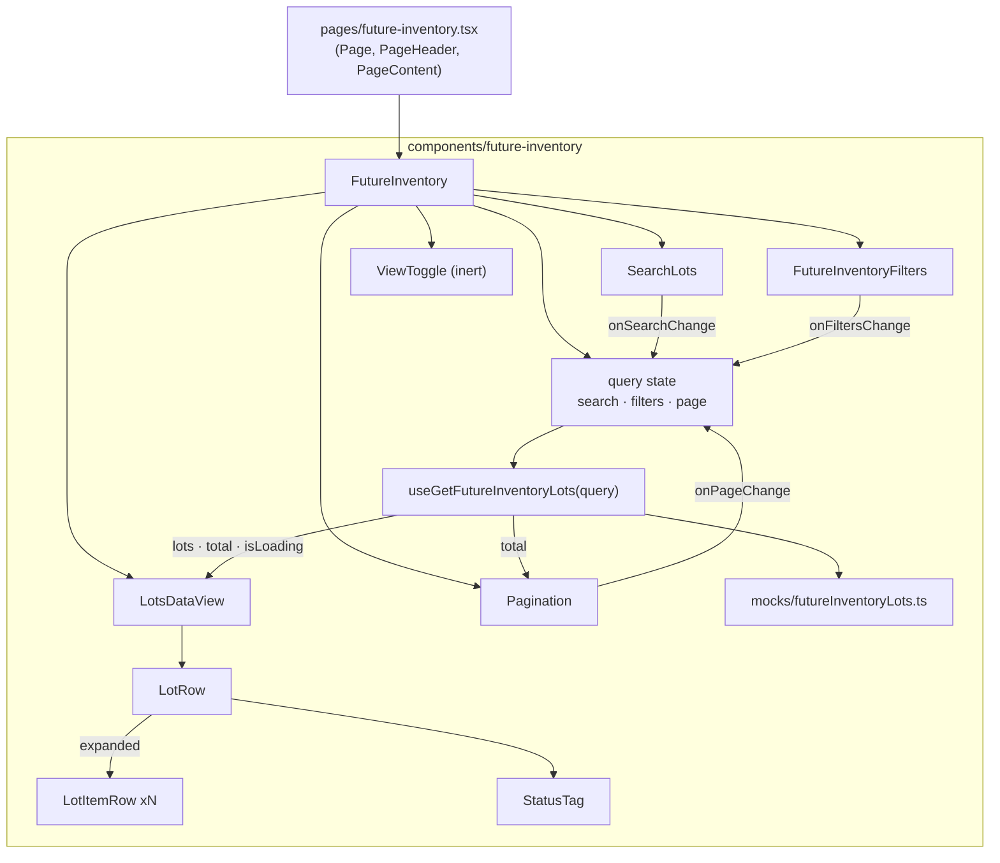

# Future Inventory — Lot Listing (Prototype)

> **Status**: Approved
> **Created**: 2026-08-06
> **Spec**: **002.1** — UI contract under [`002-future-inventory`](./product-spec.md)
> **Area**: Admin — new Future Inventory module, rendered at `/future-inventory`
> (Admin route `/admin/future-inventory`, section `products`, subsection `inventory`)
> **Prototype**: [`prototype/inventario-futuro-listagem.html`](./prototype/inventario-futuro-listagem.html)
> **Product source**: [`product-spec.md`](./product-spec.md)
> **Sibling**: [`002.2-listagem-por-sku.md`](./002.2-listagem-por-sku.md)
> **Primary files** (planned for the Next.js module):
> `pages/future-inventory.tsx` ·
> `components/future-inventory/FutureInventory.tsx` ·
> `components/future-inventory/LotsDataView/LotsDataView.tsx` ·
> `components/future-inventory/Filters/FutureInventoryFilters.tsx` ·
> `components/future-inventory/types.ts` ·
> `components/future-inventory/mocks/futureInventoryLots.ts` ·
> `hooks/useGetFutureInventoryLots.ts`
> **Design**: [Figma — Future inventory, frame `listagem por lote`](https://www.figma.com/design/xLwjBVD8h1llHt7FcW96Fv/Future-inventory?node-id=86-60142)

## 1. Business Context

### Problem Statement

Today inventory is modeled as a **single present quantity**, with no notion of *when* more
stock will arrive. A merchant who knows that 100 units land on a specific date has to
choose between two bad options: leave the product unavailable and lose the demand, or open
the stock now and risk overselling.

This limitation unfolds into three structural gaps:

1. **No forward selling.** There is no way to sell and promise stock that has not yet
   arrived physically.
2. **No native lifecycle for expected stock.** There is no `agendado → recebido /
cancelado / inativo` transition owned by the platform, which forces the merchant to
   intervene manually every single day just to keep the promised date trustworthy.
3. **The existing feature does not fit modern architectures.** Supply Lot guarantees
   future availability but fails exactly in the architectures enterprise clients are
   adopting — multi-seller, franchise accounts and Delivery Promise.

Four clients interviewed in discovery (**Fast Shop**, **Samsung**, **Dakota** and **Loja
Santo Antonio**), from distinct business profiles, confirmed the same central diagnosis:
the platform has no native concept of a future lot with a real arrival date, and each of
them absorbs the operational cost of that gap with daily manual workarounds. **Eight
enterprise clients** are confirmed running this kind of workaround in production today,
including **Container Store**, **World Wide Golf** and **ODP**, which manually release
backorder lines outside VTEX as soon as stock arrives in their own WMS.

### Scope of this Specification

This spec covers **only the prototype of the lot listing** — the first screen of a new
Admin module called **Inventário Futuro**. Its purpose is to **validate the UX with the
team** using mock data. It does **not** specify the platform capability, the backend, or
the inventory reservation semantics.

The vocabulary this listing establishes (lot, destination, arrival date, lifecycle status)
is intended to be the vocabulary a future API honors, so the prototype doubles as a
contract proposal.

### Goals

- Render the **"Por lote"** listing inside the existing `/future-inventory` page, built
  entirely with Shoreline, faithful to the Figma frame `listagem por lote`.
- Make four interactions **genuinely functional** over mock data: **search**, **filters**,
  **pagination** and **expanding a lot** to reveal its SKUs.
- Express the lifecycle **`Agendado → Recebido / Cancelado / Inativo`** as the status
  vocabulary, replacing the `Ativo / Inativo` pair drawn in the Figma.
- Keep the remaining affordances **visible but inert**, so the screen reads as complete in
  a design review without implying behavior that does not exist yet.
- Shape the mock data and the query surface so that swapping the fixture for a real API
  later touches **one hook only**.

### User Stories

#### US-1: See the future lots

- **Story**: As a merchant, I want to see every future lot with its destination, total
  quantity, arrival date and status, so that I can tell at a glance what stock is coming
  and when.
- **Acceptance Criteria**:
  - **Given** the module is open with no search term and no active filter, **when** the
    listing renders, **then** the first 25 lots are shown, each row displaying lot code and
    name (e.g. `#001 Reposição de agosto`), destination as seller plus warehouse on two
    lines, total quantity, arrival date formatted `DD/MM/YYYY`, and a status tag.
  - **Given** the listing rendered, **when** I read a lot row, **then** its quantity equals
    the sum of the quantities of the SKUs inside it.
  - **Given** the listing is still resolving its data, **when** it has not resolved yet,
    **then** a skeleton occupies the table area instead of an empty frame.

#### US-2: Expand a lot to see its SKUs

- **Story**: As a merchant, I want to expand a lot, so that I can see which products and
  quantities compose it without leaving the listing.
- **Acceptance Criteria**:
  - **Given** a collapsed lot row, **when** I click its expand control, **then** one child
    row per SKU appears directly beneath it, each showing product image, product name, SKU
    ID, the SKU quantity and the units already reserved for that SKU.
  - **Given** an expanded lot, **when** I read a child row, **then** the Destino, Chegada
    and Status cells show an em dash, because a SKU inherits those values from its lot.
  - **Given** an expanded lot, **when** I click the control again, **then** the child rows
    collapse.
  - **Given** two lots, **when** I expand both, **then** both stay expanded — expansion is
    independent per lot, not a single-open accordion.

#### US-3: Search by lot or SKU

- **Story**: As a merchant, I want to search by lot or by SKU, so that I can find the
  arrival I care about without scrolling.
- **Acceptance Criteria**:
  - **Given** any listing state, **when** I type a term that matches a lot code or lot
    name, **then** only the lots matching it remain, accent- and case-insensitively.
  - **Given** any listing state, **when** I type a term that matches a product name or SKU
    ID, **then** the lots containing that SKU remain **and are automatically expanded**, so
    the reason for the match is visible.
  - **Given** an active search term, **when** I clear it, **then** the full set returns and
    the automatic expansion is undone.
  - **Given** an active search term, **when** it matches nothing, **then** the empty result
    state is shown with an action to clear search and filters.

#### US-4: Filter the listing

- **Story**: As a merchant, I want to filter by destination, arrival date, quantity and
  status, so that I can isolate the arrivals relevant to a decision.
- **Acceptance Criteria**:
  - **Given** the filter row, **when** I select one or more destinations, **then** only
    lots whose destination is among the selected ones remain.
  - **Given** the filter row, **when** I pick an arrival date range, **then** only lots
    whose arrival date falls inside the range, inclusive of both ends, remain.
  - **Given** the arrival date filter, **when** I set an end date earlier than the start
    date, **then** the filter is not applied and the field reports the invalid range.
  - **Given** the filter row, **when** I set a minimum and/or maximum quantity, **then**
    only lots whose total quantity falls inside those bounds remain.
  - **Given** the filter row, **when** I select one or more statuses, **then** only lots
    with those statuses remain.
  - **Given** several active filters, **when** they are combined, **then** they apply
    together as a conjunction, and combined with the search term as well.
  - **Given** any active filter, **when** I clear it, **then** its restriction is lifted
    without touching the other filters.

#### US-5: Paginate the results

- **Story**: As a merchant, I want to page through the lots, so that a long list stays
  readable.
- **Acceptance Criteria**:
  - **Given** more than 25 results, **when** the listing renders, **then** the pagination
    reports the current window and the total, and the previous control is disabled on the
    first page.
  - **Given** I am not on the last page, **when** I go to the next page, **then** the next
    25 results are shown and every lot renders collapsed.
  - **Given** I am on a page beyond the first, **when** I change the search term or any
    filter, **then** the listing returns to the first page.

#### US-6: Read the lifecycle status at a glance

- **Story**: As a merchant, I want each lot's lifecycle state to be visually distinct, so
  that I can spot what is still expected versus already settled.
- **Acceptance Criteria**:
  - **Given** a lot row, **when** its status is rendered, **then** it uses a Shoreline
    `Tag` whose colour is stable per status: `Agendado` blue, `Recebido` green, `Cancelado`
    red, `Inativo` gray.
  - **Given** the status filter, **when** I open it, **then** the four statuses offered are
    exactly the four above.

#### US-7: Understand what is not available yet

- **Story**: As a stakeholder reviewing the prototype, I want the not-yet-built affordances
  to be visible but clearly inert, so that the review discusses layout and flow without
  mistaking the prototype for a working feature.
- **Acceptance Criteria**:
  - **Given** the page header, **when** I see the "Criar lote futuro" button, **then** it
    is rendered in its primary style and clicking it does nothing.
  - **Given** the collection header, **when** I see the "Por lote / Por SKU" toggle,
    **then** "Por lote" is selected and clicking "Por SKU" does nothing.
  - **Given** a lot row, **when** I open its overflow menu, **then** it lists **Editar**,
    **Marcar como recebido**, **Histórico de alterações** and, after a separator,
    **Cancelar lote** as critical — and picking any of them only closes the menu.
  - **Given** a lot already received or cancelled, **when** I open its overflow menu,
    **then** **Marcar como recebido** is absent, not disabled.
  - **Given** any table column header, **when** I click it, **then** nothing is sorted.

### Key Scenarios

| Scenario | Pre-conditions | Steps | Expected Result |
| --- | --- | --- | --- |
| Happy path — browse | Module open, no search, no filters beyond the default | Read the first page | 25 lot rows, collapsed, pagination reports `1 — 25 de 38` — the 74 lots minus the received and cancelled ones the default `Status` filter leaves out (FR-7d) |
| Happy path — expand | Listing rendered | Click the expand control of `#001` | Fifteen child SKU rows appear; Destino/Chegada/Status show an em dash |
| Happy path — search by lot | Listing rendered | Type `Reposição de agosto` | Only `#001` remains, collapsed; pagination total updates |
| Happy path — search by SKU | Listing rendered | Type `#123` | Lots containing SKU `#123` remain and are auto-expanded |
| Happy path — combined filters | Listing rendered | Select two destinations + status `Agendado` | Only lots satisfying both remain; page resets to 1 |
| Error case — invalid date range | Arrival date filter open | Type an end date before the start date | Filter not applied, "A data final não pode ser anterior à data inicial." reported, listing unchanged |
| Edge — earlier days disabled | Arrival date filter open with a start date set | Open the "Até" calendar | Every day before the start renders disabled; changing the start while the calendar is open updates it |
| Edge — later days disabled | Arrival date filter open, **end** date filled first | Open the "De" calendar | Every day after the end renders disabled — the mirror of the rule above (FR-8b) |
| Edge — empty calendar's month | End date set to a date in an earlier month, "De" still empty | Open the "De" calendar | It opens on the **end date's month**, with clickable days, instead of on today's month with everything disabled |
| Edge — moving a range that is set | Range 10/09–15/09 applied | Move it to 20/09–25/09 | Editing "Até" first works; editing "De" first finds 20/09 disabled. No state is unreachable, but the order matters (FR-8b) |
| Edge — clearing one end | Range 10/09–15/09 in the popover | Clear the "Até" field | The "De" calendar returns to its full range: an empty field bounds nothing |
| Error case — inverted quantity bounds | Quantity filter open | Set Mínima `50` and Máxima `10` and apply | Filter not applied, "A quantidade mínima não pode ser maior que a quantidade máxima." reported |
| Edge — filters exceed the width | Several filters applied on a narrow window | Look at the filter row | It wraps onto a second line; no trigger is clipped and the row does not scroll sideways |
| Edge — account without other sellers | Account confirmed to hold only its own warehouses | Open the Destino filter | Estoques are listed directly: no seller rows, no chevrons, no tri-state; search reads "Buscar estoque"; the trigger still reads "Destino" |
| Edge — architecture unknown | The signal of Decision 7 is unavailable or the call fails | Open the Destino filter | The two-level tree renders — the shape never collapses on a missing answer |
| Error case — no results | Listing rendered | Search a term that matches nothing | Empty result state with a "Limpar filtros" action that restores the full set |
| Edge — quantity bound only | Listing rendered | Set minimum quantity `50`, leave maximum empty | Only lots with quantity `>= 50` remain |
| Error case — zero quantity bound | Quantity filter open | Type `0` in Mínima (or Máxima) and apply | Filter not applied, "A quantidade precisa ser maior que 0." reported, listing unchanged |
| Happy path — filter by a whole seller | Destination filter open | Check a seller with two estoques and apply | Both estoques are in force; the trigger lists the first key and `+1`; only lots landing on that seller remain |
| Happy path — filter by one estoque | Destination filter open | Expand a seller, check one of its estoques and apply | Only lots landing on that estoque remain; the seller checkbox shows the dash state |
| Edge — search matches an estoque | Destination filter open | Search `mostruário` | Only sellers holding a matching estoque are listed, already expanded, showing just the estoques that matched |
| Edge — seller state ignores the search | A seller with two estoques, one checked | Search a term that leaves only the checked estoque visible | The seller still shows the dash state, not the check |
| Edge — click beside the chevron | Destination filter open | Click the seller's name, or the gap between chevron and name | The seller expands; nothing is selected and the popover stays open |
| Edge — page reset on filter | On page 3 | Apply the status filter | Listing jumps to page 1 with the filtered set |
| Edge — expansion resets across pages | `#001` expanded on page 1 | Go to page 2, then back to page 1 | Rows render collapsed; no stale expansion is carried over |
| Edge — every lot has multiple SKUs | Listing rendered | Expand any lot | At least two child rows appear, and their quantities sum to the lot quantity |
| Edge — inert affordance | Listing rendered | Click an item of a row menu | The menu closes and nothing else happens; no console error. Two affordances inert here have since become functional: **"Por SKU"** in `002.2`, FR-1, and **"Criar lote futuro"**, which now opens the creation form (`002.3`, FR-1). |
| Edge — row menu near the viewport bottom | A lot row in the last visible rows | Open its overflow menu | The popover flips above the trigger and stays fully inside the window |

### Functional Requirements

- **FR-1**: The module renders inside the existing `/future-inventory` page, reusing its
  Shoreline `Page` / `PageHeader` / `PageContent` structure and its behaviour of hiding the
  mock Admin shell when embedded in the real Admin.
- **FR-2**: The listing shows the **"Por lote"** view only. The `Por lote / Por SKU` toggle
  is rendered with `Por lote` selected and is inert. **Superseded by `002.2`, FR-1**: both
  views are real, and the toggle switches between them.
- **FR-3**: Lot rows expose: lot code and name, destination (seller and warehouse),
  total quantity, total reservations, arrival date, status tag and an overflow menu. The
  destination cell groups the two on two lines; in an account without other sellers it
  carries the estoque alone (FR-7c).
- **FR-4**: A lot's total quantity is **derived** from the sum of its SKU quantities, never
  stored independently. The same holds for its total reservations.
- **FR-4a**: **Reservas** reports units already sold in orders and held against the lot.
  A SKU's reservations never exceed its quantity. The column carries a `ContextualHelp`
  in the header saying so. Reservations are independent of status: a cancelled lot still
  carries what had been sold before it was cancelled.
- **FR-4b**: **Quantidade** and **Reservas** are **left-aligned**, like every other column.
  Right alignment is the convention for numbers meant to be compared down the column, and
  these are not: they are read one row at a time, against the lot on that row. Aligning them
  left also keeps each number next to the header that names it.
- **FR-4c**: The `ContextualHelp` in a header — **Destino** and **Reservas**, in **both
  views** — follows one pattern:
  - The text is a full sentence with final punctuation: "Seller e estoque que receberão o
    lote." and "Unidades já vendidas em pedidos e reservadas neste lote."
  - It ends with a **"Saiba mais"** link to the Help Center, flowing inline as the
    continuation of that sentence rather than sitting on a line of its own. The link uses
    the `action` type token in `fg-accent`, with `fg-accent-hover` on hover, and carries the
    external-link icon (`arrow-up-right-small`). It opens in a new tab.
  - The popover opens **below the icon and grows to the left** (its right edge anchored to
    the icon's), because a header near the right edge of the table would otherwise push the
    popover off screen at narrow window widths. Its text is left-aligned — the header cell
    of a right-hand column can pass down a right alignment, and the popover must not inherit
    it.
  - It closes on `Escape` and on a click outside.
- **FR-5**: Expansion is per lot, independent, and defaults to collapsed. Child SKU rows
  render product image, product name, SKU ID, quantity and reservations, while Destino,
  Chegada and Status show an em dash.
- **FR-6**: Search matches, accent- and case-insensitively, against lot code, lot name,
  product name and SKU ID. Lots matched only through a SKU are auto-expanded.
- **FR-7**: Four filters are functional and conjunctive: **Destino** (multi-select),
  **Data de chegada** (inclusive date range), **Quantidade** (optional min and max bounds)
  and **Status** (multi-select over the four lifecycle values).
- **FR-7a**: **Destino** is a **two-level tree**, seller → estoque, not a flat list. A
  seller row carries its checkbox, then a chevron, then the seller name — in that order —
  and its estoques render indented below it when expanded. The chevron exists on **every**
  seller, including the 40 of 48 that hold a single estoque, so the list never has two
  shapes of row.
  - Checking a **seller** filters by **all of its estoques**; checking a single **estoque**
    filters by that estoque of that seller only.
  - On a seller row the two gestures are split by target: the **checkbox** selects, and the
    **rest of the row** — chevron, name and the space between them — expands and collapses.
    The chevron alone is a 16px target with no padding around it, and missing it by a pixel
    must not mean "I filtered by this entire seller" when the intent was to look inside it.
    An estoque row has nothing to expand, so there the whole row still selects.
  - The seller checkbox is **tri-state**: unchecked, a dash when only some of its estoques
    are checked, and a check when all are. The state is always computed over **all** of the
    seller's estoques, never over the subset a search left on screen — and checking a
    seller likewise reaches the estoques the search is hiding, since the request is "this
    whole seller".
  - Sellers arrive **collapsed**. Opening the filter expands the sellers that already have
    an estoque applied, so what is in force is visible without hunting for it; after that
    the user's clicks are the only authority, so an auto-expanded seller can be collapsed.
  - Selection is still stored as a flat list of `Seller — Estoque` keys, so the filter
    predicate is unchanged: checking a seller is exactly equivalent to checking each of its
    estoques.
  - The popover's search reads **"Buscar seller ou estoque"**, naming both levels it matches.
    Now that the list is a tree, "destino" is the pair, not something the user can type.
    Only this popover is widened to `18.75rem`, through the `--sl-filter-popover-width`
    the component exposes: at the default `16.25rem` that label loses its last letter and
    the longer estoque names wrap onto a second line. The other three filters keep the
    default width.
- **FR-7b**: The filter row **wraps onto a second line** when the applied filters no longer
  fit the width available. Triggers are never clipped and the row never scrolls sideways: a
  filter the user cannot see is a filter they cannot remove.
- **FR-7c**: In an account whose stock lives **only in its own warehouses**, with no other
  sellers connected, the destination has **one level, not two**. The tree of FR-7a is the
  **default**; this is the variant.
  - The popover lists **estoques directly** — no seller row, no chevron, no tri-state. The
    trigger keeps the label **"Destino"** and summarises estoque names
    (`Destino: Estoque principal, +2`), the search reads **"Buscar estoque"**, and the
    popover returns to the default `16.25rem`, since the widening of FR-7a existed for the
    longer of the two labels.
  - Everything else about the filter is untouched: multi-select, conjunctive with the other
    three, applied only on **Aplicar**, and selection still stored as the same flat list of
    keys, so the filter predicate never learns which shape is on screen.
  - The shape is decided **once per account and shared by every surface** — this filter, the
    SKU view (`002.2`), the export Drawer (`002.4`, FR-5b) and the creation form (`002.3`,
    FR-22a). The listing and the Drawer can never disagree about whether sellers exist.
  - **The two levels are what we render when unsure.** A seller level shown in an account
    that has one seller is redundant; a seller level *hidden* in an account that has several
    misreports where the stock is landing, which is the one thing this screen exists to
    answer. So the collapse requires a **positive** answer about the account's architecture,
    never the absence of an     answer. The datum that gives that answer is **an open dependency
    on engineering** — see Decision 7.
  - The **Destino column** of both listings follows the same flag: its cell prints **only
    the estoque**, on one line, and the grouped two-line cell of FR-3 is the multi-seller
    shape. Hiding the seller in the filter while the column beside it still printed the
    seller on every row would be incoherent — same account, same question, two answers.
  - The **export CSV does not follow it**: it keeps its `Seller` and `Estoque` columns in
    every account (`002.4`, FR-23a). The screen serves an operator reading it; the file
    serves the spreadsheets, scripts and BI jobs downstream, and those pay a far higher
    price for a header row that changes shape per account than for a column that repeats
    one value.
- **FR-7d**: **The listing does not open unfiltered.** `Status` starts applied with
  **`Agendado` + `Inativo`** — the two states in which a lot still has a future — so the
  first screen shows **38 of the 74 lots** (and **124 of the 231 SKU rows** in `002.2`).
  `Recebido` and `Cancelado` are the lot's past: they belong in the module, but not in the
  view of someone who opened it to see what is coming.
  - **The filter is pre-applied, never hidden.** The trigger reads `Status: Agendado, +1`
    from the first paint, so the count the user sees is explained on the same screen. A
    default that did not say its own name would read as missing data.
  - **Search suspends it** while the user has not touched `Status`
    (`statusScopeActive() = statusesTouched || !search`). Someone who types the code of a
    received lot wants **that lot**, and an empty result would answer "it does not exist"
    instead of "it is outside the current status filter". The suspension shows in all three
    places at once — trigger, popover marks and query — so they never disagree.
  - **Touching `Status` ends the suspension for good.** From the first interaction,
    `statusesTouched` is true and the marks are the user's, not the default's: search stops
    overriding a choice the user made deliberately.
  - **`Limpar filtros` restores the default, it does not empty it** — clearing returns the
    listing to how it opens, `statusesTouched` back to false. Emptying to all four statuses
    would make "clear" a way to reach a state the listing never opens in.
  - **The default does not count as an active filter.** `hasActiveQuery()` only counts
    `statuses` when `statusesTouched`, so the empty state offers "Limpar filtros" for
    filters the user applied — not for the one the screen came with (FR-11).
- **FR-8**: An arrival date range whose end precedes its start is rejected and not applied,
  reporting **"A data final não pode ser anterior à data inicial."**. The message stays
  necessary whatever the calendars do, because a date can be **typed** into the segments,
  and no bound on a calendar prevents that.
- **FR-8b**: The two fields **bound each other, in both directions**. A start date sets the
  **Até** picker's minimum, and an end date sets the **De** picker's maximum, so each
  `Calendar` renders the days on the far side of the other field as disabled. Both bounds
  are applied live while the popover is open, and an **empty field bounds nothing** —
  clearing one gives the other its full range back. The rule is symmetric because the
  invariant is: whichever end the operator fills first is a commitment the other end has to
  respect, and there is no reason for that to hold in one order of filling and not the other.
  - **The bound decides which month an empty calendar opens on.** A `Calendar` seeded on
    today would be an entirely disabled grid whenever the other field points at a different
    month — the operator sees a wall, and the way out (paging back through the months) is
    written nowhere. So an empty picker opens on **its own bound's month**: the **De** on the
    month of the **Até**, and the **Até** on the month of the **De**. Month navigation itself
    is never disabled, in either direction; only individual days are.
  - **This cannot lock the operator in, and it is worth being explicit about why.** Each
    field can always move in the direction that *widens* the range — the start earlier, the
    end later — so a bound never closes both exits, and **Limpar** resets the pair. What the
    symmetry does cost is that neither field is unconstrained any more: **moving a range
    that is already set requires the right order**. To push it later, edit the **Até** first;
    to pull it earlier, the **De**. In the wrong order the day is simply disabled, with no
    explanation of which field is holding it — the accepted cost of never letting an invalid
    range be composed by clicking. The narrowest case is a single-day range, where each field
    can only move in one direction until the other one moves.
- **FR-8a**: The **Quantidade** bounds must be greater than zero. A lot never holds zero
  units — its quantity is the sum of its items and every item has one or more (INV-12) — so
  zero is not a reachable bound. A `0` typed into **Mínima** or **Máxima** is rejected with
  **"A quantidade precisa ser maior que 0."** and the filter is not applied; the bounds stay
  optional, and an empty field means "no bound". A minimum above the maximum is rejected the
  same way, with **"A quantidade mínima não pode ser maior que a quantidade máxima."** The
  two messages share the field's single `FieldError`, so the text is written at validation
  time instead of sitting fixed in the markup.
- **FR-9**: Pagination is 25 items per page over the filtered set, and any change to the
  search term or to a filter resets the current page to the first.
- **FR-9a**: The top pagination label has a **reserved width**, measured from the widest
  label either view can produce. It sits left of the arrows inside a right-aligned row, so
  without the reservation each extra digit in the total pushes the view toggle sideways —
  the buttons drifted 61px between `1 — 25 de 38` and `226 — 231 de 231`, on every view
  switch, page turn and search. The text stays flush against the arrows and the slack falls
  before it.
- **FR-10**: Status is rendered with a fixed status-to-colour mapping: `Agendado` blue,
  `Recebido` green, `Cancelado` red, `Inativo` gray.
- **FR-11**: Two distinct empty states exist: **no results** for the current search and
  filters, offering a clear-filters action; and **no lots at all**, offering the (inert)
  creation call to action.
- **FR-12**: A skeleton occupies the table area while the listing data is unresolved.
- **FR-13**: All interface copy is written in **pt-BR directly in the components**, with no
  `react-intl` usage and no additions to `messages/`.
- **FR-14**: Column sorting and the creation button are rendered but perform no action.
  **Superseded in part by `002.3`, FR-1**: "Criar lote futuro" — in the page header and in
  the all-empty state — now routes to the creation form. Column sorting is still inert.
- **FR-14a**: The **row overflow menu** is a Shoreline `Menu` anchored to the row's
  `IconButton`, opening `bottom-end` with a 4px gutter and flipping above the trigger when
  the window bottom is near. It lists **Editar**, **Marcar como recebido**, **Histórico de
  alterações** and, after a `MenuSeparator`, **Cancelar lote** with `data-critical`.
  **Marcar como recebido** is omitted for lots whose status is `received` or `cancelled`:
  the lot's past is not marked again. Every item is inert in the prototype — none of the
  four has a screen in this scope, so picking one only closes the menu and returns focus to
  the trigger. **Histórico de alterações is the one that will not stay inert**: it is a link
  out of the module, specified in FR-14c.
  Arrow keys walk the items, `Esc` and an outside click close it, and any re-render of the
  table closes it, since the trigger that anchored it no longer exists.
- **FR-14b**: The **page header** carries a "Mais ações" `Menu` beside "Criar lote futuro",
  holding **Importar lotes via planilha**, **Exportar inventário futuro** and, after a
  `MenuSeparator`, **Histórico de alterações**. Only the export item acts: it opens the
  export Drawer (`002.4`, FR-1), and it is disabled while three exports are in flight
  (`002.4`, FR-15). **Importar lotes via planilha** is inert; **Histórico de alterações** is
  a link out of the module, specified in FR-14c.
- **FR-14c**: **Histórico de alterações** is the same item in both menus — same name, same
  `arrow-up-right` icon — and it **opens the VTEX Admin's Audit module in another tab**.
  The module does not keep its own history: Audit already records who changed what and when
  across the Admin, and a second, partial log inside future inventory would be one more
  place to disagree with it.
  - **The name is one name.** It read "Histórico de alterações" in the page header and
    "Histórico de atualizações" in the row menu — two labels for one destination, which
    reads as two features. **"Histórico de alterações"** is the single spelling, and it is
    the one Audit itself uses for what it shows.
  - **It is a link, not a button**: `<a role="menuitem" target="_blank" rel="noopener
    noreferrer">`. The distinction is not cosmetic — a link is announced as a link, survives
    ⌘-click and middle-click, and offers the context menu a real URL. Rendering a departure
    as a `button` would take all of that away and leave the `arrow-up-right` icon promising
    something the element cannot do.
  - **Another tab is a requirement, not a preference.** Consulting history is a lookup made
    *during* work: the operator still has a search, a set of filters, a page and expanded
    rows on screen, and same-tab navigation would spend all of it on a consult. More than
    that, **an export in flight lives in this page's memory** (`002.4`, FR-15) — leaving in
    the same tab would silently kill the queue the operator is waiting on.
  - **Open with engineering — the destination URL.** Audit is reached in the Admin through
    Apps > Installed Apps > Audit; the **deep-link path and its query parameters have to be
    confirmed with the Audit team** before this is wired. Documented here as a dependency,
    not as a known address.
  - **Open with product — what the row-level item filters by.** From the page header the
    destination is unambiguous: the module's history. From a lot's row, the operator expects
    **that lot's** history, and Audit filters by application plus event details — so the row
    link has to carry the lot's identifier into those filters. If it cannot, the row item
    promises a lot's history and delivers a global list, and it is better to keep the item
    only in the page header than to keep it lying in every row.

### Non-Functional Requirements

- **UI compliance**: Every element comes from `@vtex/shoreline`. No CSS Modules, no
  Tailwind, no one-off inline styles. If a gap appears, `styled-components` with Shoreline
  tokens is the only escape hatch, and it must carry a comment justifying it.
- **Data isolation**: The fixture and the query surface are shaped like a paginated API
  response, so replacing the mock with a real endpoint changes
  `useGetFutureInventoryLots` and nothing else.
- **Performance**: Filtering, searching and paging run over an in-memory collection of ~74
  lots. Derived collections are computed with `useMemo` keyed on the query, so typing in
  the search field does not re-filter on unrelated re-renders.
- **Accessibility**: The expand control is a real button with an accessible name and an
  `aria-expanded` state. Inert controls remain focusable and are not announced as
  disabled unless they are visually disabled.
- **Typing**: No `any`. Status is a union type, not a loose string.

### Out of Scope

- The **"Por SKU"** listing (Figma frame `listagem por produto`) — a separate spec.
- The **lot creation** form (Figma frame `Criação de lote`) — a separate spec.
- Row actions and their confirmation flows: editing, inactivating, cancelling, marking a
  lot as received.
- Column sorting.
- Any real backend, API proxy route, or persistence. No endpoint exists for future
  inventory today.
- Internationalisation of the module's copy.
- Inventory semantics: reservation, overselling protection, Delivery Promise integration,
  multi-seller propagation. This prototype only *displays* future lots.
- Bulk selection of lots.
- **The single-level destination of FR-7c, as built code.** The rule is specified and its
  open question is recorded (Decision 7), but the prototype ships only the two-level tree:
  its fixture is a multi-seller account, and the signal that would identify the other
  architecture does not exist yet. Nothing to look for in
  `inventario-futuro-listagem.html`.

---

## 2. Arch Decisions

### Proposed Solution

Add a self-contained feature folder, `components/future-inventory/`, and keep
`pages/future-inventory.tsx` as a thin entry point. A single hook,
`useGetFutureInventoryLots`, owns the whole data story: it reads an in-memory fixture,
applies search, filters and pagination, and returns a page-shaped result. The listing
components stay pure presentation driven by that hook plus a query state object.

Because Shoreline's `Table` has **no expandable-row primitive**, expansion is composed:
the lot row renders a caret `IconButton` in its first cell, and when expanded the component
emits additional `TableRow`s for the lot's SKUs immediately after the parent row. The table
remains a flat sequence of rows; "nesting" is purely visual, achieved through the first
cell's content and indentation.

The query state (`search`, `filters`, `page`) lives in the feature's top-level component as
plain React state. Since there is no server, there is no need for TanStack Query, providers
or cache invalidation.

### Architecture Overview



**Pipeline inside the hook**, in a fixed order:

```
fixture → search match → destination → arrival date range → quantity bounds → status
        → total (for pagination) → slice(page) → { lots, total, autoExpandedLotIds }
```

### Alternatives Considered

| Alternative | Pros | Cons | Verdict |
| --- | --- | --- | --- |
| In-memory fixture read directly by a hook (chosen) | Zero infrastructure; instant iteration; the whole data story sits in one file | Does not exercise latency, so loading states must be reasoned about rather than observed | **Accepted** |
| Mock behind a Next API route under `pages/api/` | Exercises real latency, server-side pagination and TanStack Query, closer to the eventual shape | Buys realism the review does not need, and adds a route that must later be deleted | Rejected |
| TanStack Query over the fixture | Consistent with every other list in this repo | Cache, keys and invalidation for data that cannot change; ceremony without benefit | Rejected |
| Shoreline `Collection` / `CollectionView` as the container | Matches the Figma layer named `Collection`; brings header, footer and states | `CollectionView` drives its own row rendering, which fights the manual parent/child row emission expansion requires | Rejected — compose `Table` directly |
| `Tab` / `TabList` for the `Por lote / Por SKU` toggle | Semantically a view switch | Tabs imply a mounted panel per tab; the second view does not exist yet, so the semantics would lie | Rejected — two `Button`s styled as a segmented control |
| Single-open accordion for expansion | Keeps the table short | Merchants compare lots side by side; forcing a collapse loses the comparison | Rejected — independent expansion |
| Types in `shared/types.ts` per `AGENTS.md` | Follows the repo convention | Pollutes the delivery-options domain with a module destined to be extracted | Rejected — see Decision 5 |

### Risks & Mitigations

| Risk | Impact | Likelihood | Mitigation |
| --- | --- | --- | --- |
| Spec status vocabulary diverges from the Figma, which shows `Ativo / Inativo` on lots | Med | High | Explicitly agreed with the requester; recorded as Decision 1 so the design file can be reconciled afterwards |
| Manually composed expansion breaks table semantics or column alignment | Med | Med | Child rows reuse the parent's `columnWidths`; indentation lives in the first cell only, never as a column offset |
| The prototype is mistaken for a working feature in review | High | Med | Inert affordances are enumerated in FR-14 and demonstrated by the last Key Scenario |
| Hardcoded pt-BR copy leaks into production code paths | Low | Low | The module is isolated in its own folder and reachable only from `/future-inventory`; i18n is a tracked follow-up |
| Fixture drifts from the eventual API shape | Med | Med | The fixture is typed by the same types the hook returns, and the hook returns a page-shaped result rather than a raw array |
| CSS Modules already used by the prototype's Admin shell set a precedent for this module | Med | Med | This module adds no CSS Modules; the pre-existing `admin-shell.module.css` deviation is tracked separately |
| The seller level is hidden in an account that **does** have other sellers, because the signal identifying the architecture was partial — franchise accounts being the likely blind spot | High | Med | Two levels are the default and the collapse needs a positive confirmation (FR-7c); the signal is a **blocking open question with engineering** (Decision 7), and the shape comes from a single derived flag so it can be corrected in one place |

### Key Decisions

#### Decision 1: Lifecycle vocabulary replaces the Figma's `Ativo / Inativo`

- **Status**: Accepted
- **Context**: The Figma lot listing tags lots as `Ativo` or `Inativo`, while the SKU
  listing shows `Agendado`, `Em trânsito`, `Recebido` and `Inativo`. The business problem is
  stated in terms of a lifecycle: `agendado → recebido / cancelado / inativo`.
- **Decision**: Adopt **`Agendado`, `Recebido`, `Cancelado`, `Inativo`** as the single
  status set for lots, dropping both `Ativo` and `Em trânsito`. `Em trânsito` is a shipment
  concern the prototype does not model; `Ativo` conflates lifecycle with enablement.
- **Consequences**: The prototype will not match the Figma tags literally, and the design
  file should be updated to match. The status filter offers exactly these four values.

#### Decision 2: Expansion is composed, not a Table feature

- **Status**: Accepted
- **Context**: Shoreline exports `Table`, `TableHeader`, `TableHeaderCell`, `TableBody`,
  `TableRow`, `TableCell` and `TableSortIndicator`. There is no expandable, collapsible or
  nested-row primitive.
- **Decision**: Track expanded lot ids in a `Set` in `LotsDataView`, and render, for each
  lot, the parent `TableRow` followed by its SKU `TableRow`s when expanded. The caret lives
  in the first cell as an `IconButton` with `aria-expanded`.
- **Consequences**: Full control over the visual hierarchy, at the cost of owning the
  accessibility attributes by hand. The table stays a flat row sequence, which keeps
  `columnWidths` alignment trivially correct.

#### Decision 3: A SKU row inherits its lot's destination, date and status

- **Status**: Accepted
- **Context**: In the Figma, child rows show an em dash for Destino, Chegada and Status.
  A lot is received as a unit.
- **Decision**: Model a lot item with product identity and quantity only. Destination,
  arrival date and status exist **on the lot**, and child rows render a muted em dash in
  those columns, as the Figma does. The actions column stays empty, because the overflow
  menu belongs to the lot.
- **Consequences**: The data model stays honest about where the lifecycle lives. Should
  per-SKU statuses ever be needed, that is an additive change and a new spec.

#### Decision 4: Search by SKU auto-expands the matching lots

- **Status**: Accepted
- **Context**: When a search term matches a SKU rather than the lot itself, a collapsed
  result gives the merchant no explanation for why the lot is in the list.
- **Decision**: The hook returns, alongside the page of lots, the ids of lots matched
  **only** through a SKU. `LotsDataView` treats those as expanded, unless the merchant has
  explicitly collapsed one during the current search.
- **Consequences**: The match is always visible. Requires distinguishing "expanded by
  search" from "expanded by click", which the merchant's explicit collapse must win.

#### Decision 5: Module-local types instead of `shared/types.ts`

- **Status**: Accepted — deviation from `AGENTS.md`, justified here
- **Context**: `AGENTS.md` places shared types in `shared/types.ts`. This repository is
  `admin-delivery-options`; Future Inventory is an unrelated domain that is expected to
  move to its own app.
- **Decision**: Keep the module's types and its status constants inside
  `components/future-inventory/`, so the folder can be lifted out wholesale.
- **Consequences**: One intentional divergence from the repo convention, contained to this
  module and recorded in the PR description as the constitution requires.

#### Decision 6: No TanStack Query, no providers

- **Status**: Accepted
- **Context**: Every other list in this repo fetches through TanStack Query, and
  `/future-inventory` is already wired with a `QueryClientProvider` by `_app.tsx`.
- **Decision**: The prototype derives everything synchronously from a fixture with
  `useMemo`. The provider stays available for whenever a real endpoint arrives, but the
  hook does not use it.
- **Consequences**: No cache, no keys, no invalidation to reason about. The eventual
  migration converts the hook body into a `useQuery` call, leaving its signature intact.

#### Decision 7: The destination's shape follows the account's architecture — and the signal that identifies it is an open dependency on engineering

- **Status**: **Behaviour accepted; the signal is an open question.** Blocking for
  implementation, not for the prototype. Raised by the requester on 2026-09-02.
- **Context**: Two very different accounts land on this screen. In a multi-seller or
  franchise operation the destination genuinely is a **pair**: the same warehouse name can
  exist under two sellers, and "where is this lot going" is only answered by naming both.
  That is why FR-7a is a tree. In an account that only has **its own warehouses**, every row
  repeats the same seller — the account itself, the platform's `Seller 1` — and the first
  level of the tree carries no information at all: it costs a click to open, a line of text
  on every row, and a tri-state to explain, to say something the operator already knows.
  The same asymmetry shows up worse in the creation form, where it costs a required field:
  a `Combobox` with exactly one option, which the operator must still choose before the
  Estoque field unlocks (`002.3`, FR-24).
- **Decision**: The destination renders **one level or two, driven by the account**, decided
  in **one place** and consumed by the four surfaces (FR-7c). The default is two. One level
  is rendered only on a **positive** confirmation that the account has no sellers besides
  itself; the absence of an answer, a failed request or a timeout all mean "render the tree".
- **Open question for engineering** — *what datum answers "this account has no sellers other
  than itself?" with certainty, in one cacheable call, without a per-render cost?* Candidates
  to evaluate, **none of them confirmed**:

  | Candidate | What it would tell us | What it would not |
  | --- | --- | --- |
  | Seller Management — `GET /api/seller-register/pvt/sellers` returning only the account's own seller | The set of sellers connected to the account, which is the question almost verbatim | Whether the list is complete for our purposes: franchise accounts are white label sellers of the main account, so a merchant with franchises **does** have sellers even though it may think of itself as "warehouses only". Also unclear whether an inactive or never-activated seller should count |
  | Logistics — `GET /api/logistics/pvt/configuration/warehouses` | The warehouses the account can receive stock into, which is the level we would keep | Nothing about sellers. Useful as the source of the single-level list, useless as the signal |
  | The inventory records themselves — every existing lot pointing at the same seller | That the operation *has behaved* as single-seller so far | That it **is** single-seller. An account that connects its first seller tomorrow would keep the collapsed shape until a lot lands on the new seller, which is exactly the failure mode we cannot afford |
  | An account-level configuration or contract flag, if one exists | Architecture as declared, rather than inferred | Whether it is exposed to the Admin, kept up to date, and readable from the frontend |

- **On "seller type 3"**: the requester named *seller type 3* as the architecture in
  question. The platform's public contract documents **two** values for `sellerType` — `1`
  regular seller and `2` white label seller — so "type 3" is either internal vocabulary for
  something else (a warehouse-only or fulfilment-only setup), or a value that exists without
  being in the documented enum. **Settling which is the first task here**: this rule needs
  the datum behind the term, not the term. `sellerType` in any case classifies *a seller*,
  and our question is about *the account* — so even confirmed, it is likely a property of the
  rows returned by the candidate above, not the signal itself.
- **Consequences**: Until the signal is confirmed, the module implements the **two-level
  tree only**, and reads the shape from a **single derived flag** — one function, one call
  site, e.g. `hasOtherSellers(account)` — so that answering the open question changes that
  function and nothing else. Two questions that ride on the same flag were settled with the
  requester on 2026-09-02 and are in FR-7c: the **Destino column** collapses to the estoque
  alone, and the **export CSV** does **not** collapse, keeping both columns in every account.
  The boundary between them is the audience — the column is read by the operator who is
  already looking at the filter, the file is read by whatever is downstream of it. Shipping
  the collapse on a signal that turns out to be partial is the risk recorded in
  Risks & Mitigations.

### Implementation Plan

1. **Types and constants** — define the lot, item, destination, status, filter and query
   types plus the status-to-colour mapping in `components/future-inventory/`.
2. **Fixture** — author ~74 lots in `mocks/futureInventoryLots.ts`, reproducing the Figma
   rows (`#001 Reposição de agosto` through `#005 Coleção primavera verão`) and spreading
   the remainder across destinations, dates, quantities and the four statuses, with at
   least two SKUs per lot and one lot per status.
3. **Hook** — implement `useGetFutureInventoryLots(query)`: normalise the search term,
   apply the filter pipeline in the documented order, compute the total, slice the page,
   and return the SKU-matched lot ids.
4. **Status tag** — a small component mapping status to a Shoreline `Tag` colour and label.
5. **Data view** — compose the `Table`: header cells, lot rows, expansion state, child SKU
   rows, skeleton and the two empty states.
6. **Search and filters** — `Search` for the term; a `Filter` per dimension, with the
   arrival date range validated before it is applied.
7. **Toggle and inert affordances** — segmented `Button` pair, page header creation button,
   row overflow `Menu`, all rendered without handlers.
8. **Wire the page** — mount the feature inside `PageContent`, keeping the existing mock
   shell behaviour intact.
9. **Verify** — `yarn lint`, `yarn test:ci` and `yarn build` all exit 0; walk every row of
   the Key Scenarios table in the browser at `/future-inventory`.

---

## 3. Technical Contract

### Data Models

```ts
/** Lifecycle of an expected lot. Replaces the Figma's `Ativo / Inativo`. */
export type FutureInventoryStatus =
  | 'scheduled'
  | 'received'
  | 'cancelled'
  | 'inactive'

/** Where the lot lands: the seller/franchise and the warehouse within it. */
export type FutureInventoryDestination = {
  sellerName: string
  warehouseName: string
}

/** A SKU inside a lot. Carries identity, quantity and reservations — see Decision 3. */
export type FutureInventoryLotItem = {
  id: string
  skuId: string
  productName: string
  imageUrl: string
  quantity: number
  /** Units already sold in orders. Never greater than `quantity`. */
  reserved: number
}

export type FutureInventoryLot = {
  id: string
  /** Human-facing sequential code, e.g. `#001`. */
  code: string
  name: string
  destination: FutureInventoryDestination
  /** Expected arrival, ISO `YYYY-MM-DD`. Rendered as `DD/MM/YYYY`. */
  arrivalDate: string
  status: FutureInventoryStatus
  items: FutureInventoryLotItem[]
}

export type FutureInventoryDateRange = {
  start: string | null
  end: string | null
}

export type FutureInventoryQuantityRange = {
  min: number | null
  max: number | null
}

export type FutureInventoryFilters = {
  /** Matched against `${sellerName} — ${warehouseName}`; empty means no restriction. */
  destinations: string[]
  arrivalDate: FutureInventoryDateRange
  quantity: FutureInventoryQuantityRange
  statuses: FutureInventoryStatus[]
}

export type FutureInventoryQuery = {
  search: string
  filters: FutureInventoryFilters
  page: number
}
```

Derived, never stored:

| Value | Derivation |
| --- | --- |
| Lot total quantity | `lot.items.reduce((total, item) => total + item.quantity, 0)` |
| Destination filter option | `` `${destination.sellerName} — ${destination.warehouseName}` `` |
| `isDateRangeValid` | `!start \|\| !end \|\| start <= end` |

Status presentation, exhaustive over the union:

| Status | Label (pt-BR) | `Tag` color |
| --- | --- | --- |
| `scheduled` | Agendado | `blue` |
| `received` | Recebido | `green` |
| `cancelled` | Cancelado | `red` |
| `inactive` | Inativo | `gray` |

### Interfaces

The data surface — the single seam a real API replaces:

```ts
export type UseGetFutureInventoryLotsResult = {
  /** The current page of lots, already searched, filtered and sliced. */
  lots: FutureInventoryLot[]
  /** Size of the filtered set, before pagination — feeds `Pagination.total`. */
  total: number
  /** Lots on this page matched only through one of their SKUs — see Decision 4. */
  skuMatchedLotIds: string[]
  isLoading: boolean
}

export const useGetFutureInventoryLots: (
  query: FutureInventoryQuery
) => UseGetFutureInventoryLotsResult
```

Component surface, following the repo's `ComponentName + Props` convention:

`FutureInventory` takes no props — it owns the query state and passes it down.

```ts
export type LotsDataViewProps = {
  lots: FutureInventoryLot[]
  skuMatchedLotIds: string[]
  isLoading: boolean
  /** True when a search term or any filter is active — selects the empty state. */
  hasActiveQuery: boolean
  onClearQuery: () => void
}

export type LotRowProps = {
  lot: FutureInventoryLot
  isExpanded: boolean
  onToggleExpanded: (lotId: string) => void
}

export type LotItemRowProps = {
  item: FutureInventoryLotItem
}

export type StatusTagProps = {
  status: FutureInventoryStatus
}

export type SearchLotsProps = {
  search: string
  onSearchChange: (search: string) => void
}

export type FutureInventoryFiltersProps = {
  filters: FutureInventoryFilters
  destinationOptions: string[]
  onFiltersChange: (filters: FutureInventoryFilters) => void
}
```

Table geometry, mirroring the Figma columns:

| # | Header | Content on a lot row | Content on a SKU row |
| --- | --- | --- | --- |
| 1 | Lote | caret button + `name` over `Lote ID {code}` | product image + `productName` over `SKU ID {skuId}` |
| 2 | Destino | `sellerName` over `warehouseName` | muted em dash |
| 3 | Quantidade | derived total | `quantity` |
| 4 | Reservas | derived total | `reserved` |
| 5 | Chegada | `arrivalDate` as `DD/MM/YYYY` | muted em dash |
| 6 | Status | `StatusTag` | muted em dash |
| 7 | — | inert overflow `Menu` | empty |

### Integration Points

- **`pages/future-inventory.tsx`** — mounts `FutureInventory` inside `PageContent`. Its
  existing behaviour is preserved: the mock Admin shell renders only outside the Admin
  iframe, via `useIsInsideAdminShell`.
- **`admin/navigation.json`** — already registers the route under section `products`,
  subsection `inventory`, so the item sits directly below "Gerenciamento de inventário".
  This spec does not change it.
- **`@vtex/shoreline`** — the only UI source. Components used: `Page`, `PageHeader`,
  `PageHeaderRow`, `PageHeading`, `PageContent`, `Table`, `TableHeader`,
  `TableHeaderCell`, `TableBody`, `TableRow`, `TableCell`, `Search`, `FilterProvider`,
  `Filter`, `FilterTrigger`, `FilterPopover`, `FilterList`, `FilterItem`,
  `FilterItemCheck`, `FilterApply`, `FilterClear`, `DateRangePicker`, `Input`,
  `Pagination`, `Tag`, `Menu`, `MenuTrigger`, `MenuPopover`, `MenuItem`, `Button`,
  `IconButton`, `Text`, `Stack`, `Skeleton`, `EmptyState`, plus the
  `IconCaretRightSmall`, `IconCaretDownSmall`, `IconDotsThreeVertical` and `IconPlus`
  icons.
- **No API proxy route, no `fetcher`, no `useAdmin`.** The module performs no network I/O.
- **Account architecture (FR-7c, Decision 7) — not yet integrated.** The single-level
  destination needs one datum the module does not have today. The candidates to evaluate are
  **Seller Management** (`GET /api/seller-register/pvt/sellers`, the list of sellers
  connected to the account) as the signal, and **Logistics**
  (`GET /api/logistics/pvt/configuration/warehouses`) as the source of the estoque list once
  the seller level is gone. Both would be read **once per session and cached**: this is
  account shape, not listing data, and it must not be re-fetched per render, per filter
  opening or per page. Until engineering confirms the signal, the module renders the
  two-level tree and performs no call.

### Invariants & Constraints

- **INV-1**: A lot's displayed quantity always equals the sum of its items' quantities.
- **INV-2**: `status` and `arrivalDate` exist only on the lot; a SKU row never renders its
  own value for either.
- **INV-3**: Filters and the search term compose as a conjunction. An empty filter value
  imposes no restriction.
- **INV-4**: An arrival date range is applied only when `isDateRangeValid` holds; both ends
  are inclusive.
- **INV-5**: Any change to `search` or `filters` resets `page` to `1`.
- **INV-6**: `total` always reflects the filtered set before pagination, never the fixture
  size and never the current page length.
- **INV-7**: Expansion state is keyed by lot id and does not survive a page change.
- **INV-8**: An explicit collapse by the merchant overrides auto-expansion from a SKU
  match for as long as that search term is active.
- **INV-9**: Exactly one view exists, `Por lote`. The toggle never changes what is
  rendered.
- **INV-10**: The module issues no network request and mutates no state outside itself.
- **INV-11**: Every status value maps to a label and a colour; the mapping is exhaustive
  over `FutureInventoryStatus`.
- **INV-12**: A lot's quantity is never zero. Every item carries one or more units — the
  creation form enforces it at save time (`002.3`, INV-3) — so with INV-1 the lot total is
  always one or more. Anything that takes a quantity as input, filter bounds included,
  treats zero as invalid rather than as a meaningful value.
- **INV-13**: The destination's **shape** — one level or two (FR-7c) — is derived once per
  account and is the same for every surface in the module. No screen decides it locally, and
  no screen can disagree with another about whether sellers exist.
- **INV-14**: A lot's destination is **stored** as a `(seller, warehouse)` pair in every
  account, whatever the shape rendered. The single level hides the seller; it never drops it
  from the data. So the filter predicate, the CSV and the eventual API payload keep one shape
  across accounts, and an account that connects its first seller does not need its existing
  lots migrated.
