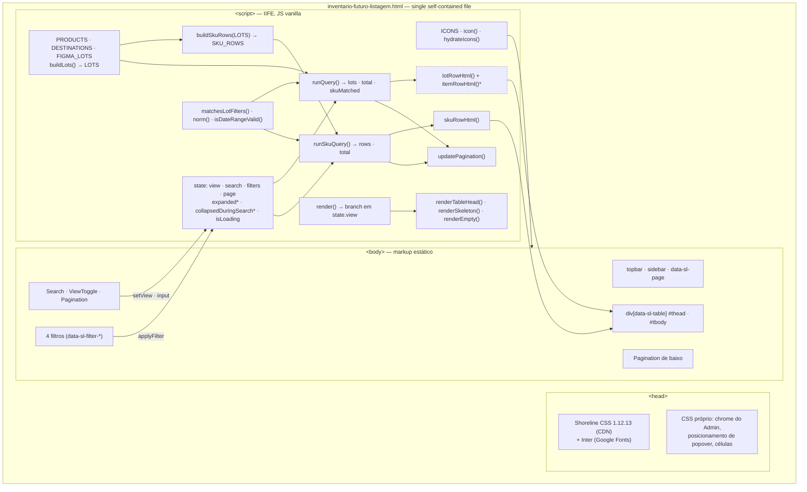

# Future Inventory — SKU View (Prototype)

> **Status**: Approved
> **Created**: 2026-08-10
> **Area**: Navigable prototype of the **Inventário futuro** module — the "Por SKU"
> view of the listing, alongside the "Por lote" view already built
> **Target artifact**: the static prototype
> [`inventario-futuro-listagem.html`](./prototype/inventario-futuro-listagem.html)
> — a single self-contained HTML file. **Not** the Next.js app.
> **Depends on**: [002.1 — Listagem por lote](./002.1-listagem-por-lote.md)
> **Product source**: [`product-spec.md`](./product-spec.md)
> **Primary files**:
> `prototype/inventario-futuro-listagem.html` ·
> `prototype/README.md` ·
> `002.2-listagem-por-sku.md` (this document)
> **Design**: [Figma — Future inventory, frame `listagem por produto`](https://www.figma.com/design/xLwjBVD8h1llHt7FcW96Fv/Future-inventory?node-id=88-5259)

## Why the prototype is the target

[002.1 — Listagem por lote](./002.1-listagem-por-lote.md) is `Approved` but **has not
been implemented in the Next.js app**: `pages/future-inventory.tsx` is still an "Em
construção" stub and `components/future-inventory/` does not exist. The only artifact
the team can open, click through and review is the static prototype, which already
implements the whole of 002.1 — search, expansion, the four filters, pagination,
skeleton and both empty states — in vanilla JavaScript against the real Shoreline CSS.

This spec therefore **contracts the prototype**, not the module. It describes the
functions, state and markup of that HTML file. When the Next.js module is eventually
built, this document and 002.1 together are its behavioural reference, and the data
models in §3 are the contract proposal a future API is expected to honour — which was
already a stated goal of 002.1.

This document lives next to the product MMR (`product-brief.md` /
`product-spec.md`) as UI sub-spec **002.2**, under `specs/002-future-inventory/`.

## Decisions agreed with the requester

The clarification round was answered on **2026-08-10**. Eleven points are settled and
are not open questions:

| Point | Agreed answer | Key Decision |
| --- | --- | --- |
| Inheritance | Destino, Chegada and Status belong to the **lot**; the SKU row inherits and renders them, even when that repeats the same trio across rows. The status set stays the one from 002.1 — `Agendado`, `Recebido`, `Cancelado`, `Inativo` — and `Em trânsito`, which resurfaces in this Figma frame, stays out. | Decision 2 |
| Quantity filter | In this view the **Quantidade** filter acts on the **SKU quantity in the row**, not on the lot total. The filter always talks about the number in the visible column. | Decision 5 |
| Switching views | Search term and filters are **preserved**; the page **resets to 1**. | Decision 6 |
| Default ordering | **Arrival date ascending**, tie-broken by lot code and then by the SKU's position inside its lot. | Decision 7 |
| Product name | **Plain text**, as the Figma renders it. Not a link. | Decision 9 |
| Contextual help copy | **"Seller e estoque que receberão o lote"** | Decision 10 |
| Empty states | Rebuilt on Shoreline's **`CollectionView`** pattern — illustration, title, description and action — instead of the prototype's hand-rolled approximation. The `not-found` title carries the noun of the current view. The fix covers **both** views, since they share one function. | Decision 14 |
| Filter item hover | The hover responds in the **type of the item**, not in the row: a multi-select item reacts in its box, with the **Checkbox's** states. Overrides the row background that Shoreline ships today. | Decision 15 |
| Quantity field | No `type="number"`, because **Shoreline ships no number input**. The field is an `Input` restricted to digits, which is what the component's documentation prescribes. The range fields are rebuilt as `Field` > `Label` + control in a `Stack`. | Decision 16 |
| Arrival fields | Two `DatePicker`s — one per end of the range, each with its own calendar — rather than the single `DateRangePicker`. Keeps "De" and "Até" as separate labelled fields, parallel to the quantity popover. | Decision 17 |
| Destination filter | Gains the `Search` that Shoreline prescribes past five items, over a catalogue of **48** destinations of which the lots occupy **20** — so part of the list leads to results and part to the empty state. Pages of ten load on scroll, which is our extension: Shoreline has no paging in filters. | Decisions 18 and 19 |

Requirement and invariant numbering (`FR-n`, `INV-n`) is **local to this document**.
References to 002.1's numbering are always written as, for example, "`INV-9` of 002.1".

## 1. Business Context

### Problem Statement

002.1 answers **what is coming and when, at the lot level**. That is the right
granularity for the person who plans receiving: a lot is what arrives, is checked in
and is marked as received as a unit.

It is the wrong granularity for the far more frequent question: **when does *this
product* arrive?** Today the merchant can only answer it by expanding lots one at a
time and holding the result in their head. A SKU spread across five lots means five
expansions, five collapses and no side-by-side comparison — and if the merchant
searches by SKU, 002.1 auto-expands every matching lot, so the answer is scattered
across as many expanded blocks as there are lots, each surrounded by SKUs that were
not searched for.

The lot listing also cannot express **presence**: there is no view in which a single
row means "this quantity of this SKU lands on this date at this destination". That
row is the unit of every downstream decision the merchant actually makes — whether to
open forward selling on a product, whether to reallocate, whether to chase a
supplier.

The Figma frame `listagem por produto` was designed alongside `listagem por lote`
precisely to close that gap, and 002.1 deliberately deferred it ("The **'Por SKU'**
listing — a separate spec"). This is that spec.

### Scope of this Specification

This spec covers **only the "Por SKU" view** of the prototype's listing, plus the
activation of the view toggle that connects it to the "Por lote" view specified in
002.1. Its purpose is the same as 002.1's: **validate the UX with the team over mock
data**. It does not specify the platform capability, the backend, or inventory
reservation semantics.

It **revokes two points of 002.1**, which are now superseded:

- **`FR-2` of 002.1** — "The `Por lote / Por SKU` toggle is rendered with `Por lote`
  selected and is inert." The toggle becomes functional.
- **`INV-9` of 002.1** — "Exactly one view exists, `Por lote`. The toggle never changes
  what is rendered." Two views now exist.

Everything else in 002.1 stands unchanged, including its data model, its status
vocabulary and, in particular, its **Decision 3** (a SKU inherits its lot's
destination, arrival date and status), which this spec depends on rather than amends.

### Goals

- Add the **"Por SKU"** view to the prototype, faithful to the Figma frame `listagem
  por produto`: a **flat, non-expandable** Shoreline table of eight columns, where
  each row is one SKU inside one lot.
- **Activate the toggle** that 002.1 left inert, so "Por lote" and "Por SKU" both
  render a real view and switching between them is instant.
- Add the **"Lote"** column that makes the row self-explanatory: it names which lot
  the SKU belongs to, which is the only reason the same SKU can legitimately appear
  more than once in the listing.
- Keep **search, the four filters and pagination** working in this view, with the one
  deliberate semantic shift the new granularity forces: **Quantidade** now bounds the
  SKU quantity, not the lot total.
- Make the **inherited columns legible** rather than surprising, through a contextual
  help on the "Destino" header, so repeated trios across rows of the same lot read as
  intended and not as a rendering bug.
- Keep every remaining affordance **visible but inert**, exactly as 002.1 does, and
  keep the file's defining property intact: **one HTML file, no build, no
  dependency, opens straight in the browser.**

### User Stories

#### US-1: See what is arriving, SKU by SKU

- **Story**: As a merchant, I want one row per product inside each incoming lot, so
  that I can tell when a specific product arrives without opening lots one by one.
- **Acceptance Criteria**:
  - **Given** the "Por SKU" view with no search term and no active filter, **when**
    the listing renders, **then** the first 25 SKU rows are shown, each displaying
    product thumbnail, product name, `SKU ID #123`, the lot it belongs to,
    destination as seller over warehouse, the SKU quantity, the arrival date as
    `DD/MM/YYYY` and a status tag.
  - **Given** a SKU row, **when** I read its Quantidade cell, **then** it shows the
    quantity of **that SKU in that lot**, never the lot total.
  - **Given** any SKU row, **when** I click anywhere on it, **then** nothing expands
    — this view has no expand button and emits no child rows.
  - **Given** the prototype has just been opened, **when** the 450 ms loading delay
    has not elapsed, **then** the skeleton occupies the table body with the **eight**
    columns of this view, so nothing jumps when the data arrives.
  - **Given** a product name too long for its column, **when** the row renders,
    **then** the name truncates with an ellipsis and the row height stays 64px.

#### US-2: Switch between the lot view and the SKU view

- **Story**: As a merchant, I want to move between "Por lote" and "Por SKU", so that
  I can zoom between planning receiving and planning a product.
- **Acceptance Criteria**:
  - **Given** the "Por lote" view, **when** I click "Por SKU", **then** the SKU view
    renders, "Por SKU" becomes the `secondary` button with `aria-pressed="true"` and
    "Por lote" becomes `tertiary` with `aria-pressed="false"`.
  - **Given** the "Por SKU" view, **when** I click "Por lote", **then** the lot view
    from 002.1 renders, with every lot collapsed.
  - **Given** an active search term and one or more active filters, **when** I switch
    views, **then** the term and the filters are preserved and reapplied in the new
    view, and the filter triggers keep showing their summaries.
  - **Given** I am on page 3 of either view, **when** I switch views, **then** the
    listing lands on page 1.
  - **Given** either view, **when** I read the toggle, **then** "Por lote" carries
    `IconRows` and "Por SKU" carries `IconTag`.

#### US-3: Search in the SKU view

- **Story**: As a merchant, I want to search in the SKU view, so that I can isolate a
  product or a lot without paging through the whole list.
- **Acceptance Criteria**:
  - **Given** the SKU view, **when** I type a term matching a product name or a SKU
    ID, **then** only the rows for that SKU remain — one row per lot that contains it
    — accent- and case-insensitively.
  - **Given** the SKU view, **when** I type a term matching a lot code or lot name,
    **then** every SKU row belonging to that lot remains.
  - **Given** a term that matched through the SKU, **when** the results render,
    **then** nothing is auto-expanded, because the match is already the row itself.
  - **Given** an active search term, **when** I clear it, **then** the full set
    returns.
  - **Given** an active search term, **when** it matches nothing, **then** the empty
    result state is shown with a "Limpar filtros" action that restores the full set.

#### US-4: Filter the SKU view

- **Story**: As a merchant, I want to filter by destination, arrival date, quantity
  and status, so that I can narrow the incoming products down to a decision.
- **Acceptance Criteria**:
  - **Given** the filter row, **when** I select one or more destinations and click
    "Aplicar", **then** only rows whose lot lands on one of them remain.
  - **Given** the filter row, **when** I pick an arrival date range, **then** only
    rows whose lot arrives inside the range, inclusive of both ends, remain.
  - **Given** the arrival date filter, **when** I set an end date earlier than the
    start date, **then** the filter is not applied and the popover shows "A data
    final é anterior à inicial."
  - **Given** the filter row in the SKU view, **when** I set a minimum and/or maximum
    quantity, **then** only rows whose **SKU quantity** falls inside those bounds
    remain — a lot totalling 54 units contributes only the rows that individually
    satisfy the bounds.
  - **Given** the filter row, **when** I select one or more statuses, **then** only
    rows whose lot carries one of those statuses remain.
  - **Given** several active filters, **when** they are combined, **then** they apply
    together as a conjunction, and combined with the search term as well.
  - **Given** any active filter, **when** I click "Limpar" in its popover, **then**
    its restriction is lifted without touching the other filters.

#### US-5: Paginate the SKU view

- **Story**: As a merchant, I want to page through the SKU rows, so that a list
  roughly twice as long as the lot list stays readable.
- **Acceptance Criteria**:
  - **Given** more than 25 rows, **when** the listing renders, **then** both
    pagination controls report the same window and total — `1 — 25 de 231` — and the
    previous buttons are disabled on the first page.
  - **Given** the unfiltered fixture, **when** I compare the two views, **then** the
    lot view totals 74 and the SKU view totals 231 — the total is a property of the
    view, not of the module.
  - **Given** a filtered set of 25 rows or fewer, **when** pagination renders,
    **then** it omits the range and reads "N de N", as the lot view already does.
  - **Given** I am not on the last page, **when** I go to the next page, **then** the
    next 25 rows are shown in the same order.
  - **Given** I am on a page beyond the first, **when** I change the search term or
    any filter, **then** the listing returns to the first page.

#### US-6: Understand the columns inherited from the lot

- **Story**: As a merchant, I want to know why several rows repeat the same
  destination, date and status, so that I do not read the repetition as duplicated
  data.
- **Acceptance Criteria**:
  - **Given** the table header, **when** I look at "Destino", **then** a contextual
    help trigger sits immediately after the label.
  - **Given** the contextual help, **when** I open it, **then** it reads "Seller e
    estoque que receberão o lote".
  - **Given** the contextual help is open, **when** I press `Escape` or click
    outside, **then** it closes, like the filter popovers already do.
  - **Given** two rows of the same lot, **when** I compare them, **then** their
    Destino, Chegada and Status cells are identical, and the only cells that differ
    are Produto and Quantidade.
  - **Given** a row, **when** I read the Lote cell, **then** the lot name is on the
    first line and the lot code `#001` on the second, in `--sl-fg-base-soft`.

#### US-7: Understand what is still not available

- **Story**: As a stakeholder reviewing the prototype, I want the not-yet-built
  affordances to stay visible but clearly inert, so that the review discusses layout
  and flow without mistaking the prototype for a working feature.
- **Acceptance Criteria**:
  - **Given** the page header, **when** I click "Criar lote futuro", **then** nothing
    happens.
  - **Given** a SKU row, **when** I click its overflow menu, **then** nothing
    happens.
  - **Given** any table column header, **when** I click it, **then** nothing is
    sorted — the order stays the default one.
  - **Given** the SKU view, **when** I look for a row checkbox, **then** there is
    none; bulk selection does not exist in this view.

### Key Scenarios

| Scenario | Pre-conditions | Steps | Expected Result |
| --- | --- | --- | --- |
| Happy path — browse by SKU | Prototype open, SKU view, no search, no filters | Read the first page | 25 flat SKU rows, no expand button, no checkbox; both paginations read `1 — 25 de 231` |
| Happy path — activate the view | Lot view, page 1 | Click "Por SKU" | SKU view renders; "Por SKU" `secondary` and pressed, "Por lote" `tertiary`; icons `IconTag` and `IconRows` |
| Happy path — switch preserving state | SKU view, page 3, search `Reposição`, status `Agendado` | Click "Por lote" | Lot view renders on **page 1** with the same term and the same status filter still applied and still summarised on the trigger |
| Happy path — inherited trio repeats | SKU view, no filters | Read the three rows of `#001 Reposição de agosto` | All three show the same destination, `05/08/2026` and `Agendado`; only product and quantity differ |
| Happy path — search by SKU | SKU view | Type `#123` | Only rows for SKU `#123` remain, one per lot containing it; **nothing auto-expands**, unlike the lot view (Decision 4 of 002.1) |
| Happy path — search by lot | SKU view | Type `Reposição de agosto` | The three rows of `#001` remain; pagination reads `3 de 3` |
| Happy path — contextual help | SKU view | Open the help on the "Destino" header | Popover reads "Seller e estoque que receberão o lote" |
| Error case — invalid date range | SKU view, arrival date filter open | Set end date before start date, click "Aplicar" | Filter not applied, "A data final é anterior à inicial." shown, popover stays open, listing unchanged |
| Error case — no results | SKU view | Search a term that matches nothing | Empty state with a "Limpar filtros" action that restores the full set |
| Edge — quantity filter is per SKU | SKU view | Set minimum quantity `20`, click "Aplicar" | `#003` keeps its row of 20 and drops its row of 3; `#005` (24 + 18 + 12) keeps only its row of 24 — the 54-unit lot never qualifies as a whole |
| Edge — same filter, different view | Minimum quantity `20` applied | Switch to the lot view | The bound now reads against lot totals, so `#005` (54) qualifies as a single row — same filter, different subject (Decision 5) |
| Edge — lots with multiple SKUs | SKU view | Find `#004 Reposição setembro` | Two rows appear for the same lot, one per SKU, and their quantities sum to the lot total in the lot view |
| Edge — pagination total changes | Lot view reading `de 74` | Switch to the SKU view | Total becomes `de 231`, 10 pages instead of 3; the last page holds 6 rows |
| Edge — page reset on filter | SKU view, page 4 | Apply the status filter | Listing jumps to page 1 with the filtered set |
| Edge — skeleton geometry | Browser reloaded on the SKU view | Watch the first 450 ms | Skeleton rows carry eight cells with the SKU view's column widths; no column jumps when the data lands |
| Edge — inert affordance | SKU view | Click "Criar lote futuro", then a row menu, then a column header | Nothing happens in all three cases; no navigation, no console error |

### Functional Requirements

- **FR-1**: The listing renders **one of two views**, selected by the `Por lote / Por
  SKU` toggle and held in `state.view`. This supersedes `FR-2` and `INV-9` of 002.1.
- **FR-2**: In the SKU view the toggle renders "Por SKU" as `data-variant="secondary"`
  with `aria-pressed="true"` and "Por lote" as `data-variant="tertiary"` with
  `aria-pressed="false"`; in the lot view the pair is inverted. "Por lote" uses
  `IconRows`, "Por SKU" uses `IconTag`, replacing the `cube` icon the prototype ships
  today.
- **FR-3**: The SKU view renders a **flat** table: no expand button, no child rows,
  no row checkbox. Row height stays 64px and header height 44px, both by composition
  under `data-sl-table-density="default"`.
- **FR-4**: A SKU row is the pair **(lot, SKU)** and exposes, in order: Produto
  (thumbnail, product name, `SKU ID {skuId}`), Lote (lot name over lot code), Destino
  (seller over warehouse), Quantidade, Reservas, Chegada, Status and an inert overflow
  menu.
- **FR-5**: Destino, Chegada and Status on a SKU row are **read from the lot**. The
  row never carries its own value for any of the three, and never renders the em dash
  that `itemRowHtml` uses in the lot view.
- **FR-6**: The "Destino" column header carries a contextual help immediately after
  the label, reading "Seller e estoque que receberão o lote". The "Reservas" header
  carries one too, reading "Unidades já vendidas em pedidos e reservadas neste lote".
- **FR-6a**: **Reservas** reports the units of that `(lot, SKU)` pair already sold in
  orders. Unlike Destino, Chegada and Status, it is **not** read from the lot: the value
  belongs to the pair, and the lot view's total is the sum of the pairs. It never exceeds
  the row's quantity.
- **FR-7**: Quantidade is right-aligned via the existing `.num` class and rendered
  with tabular lining numerals (`font-feature-settings: "lnum" 1, "tnum" 1`).
- **FR-8**: Search matches, accent- and case-insensitively via the existing `norm`
  helper, against product name, SKU ID, lot code and lot name. **No auto-expansion
  exists in this view**, so `skuMatched` has no counterpart in the SKU pipeline.
- **FR-9**: The four filters stay functional and conjunctive, and each still applies
  only on "Aplicar". **Destino**, **Data de chegada** and **Status** read the row's
  lot; **Quantidade** reads the row's SKU quantity.
- **FR-10**: Pagination is `PAGE_SIZE` rows per page over the filtered set, mirrored
  in the two `data-sl-pagination` blocks. `total` counts SKU rows in this view and
  lots in the lot view.
- **FR-11**: Changing the search term, any filter, **or the view** resets the page to
  the first.
- **FR-12**: Switching views preserves `state.search` and `state.filters` untouched.
- **FR-13**: Rows are ordered by arrival date ascending, tie-broken by lot code and
  then by the SKU's position inside its lot. The order is deterministic and stable
  across renders and reloads.
- **FR-14**: The two empty states of 002.1 apply in this view and both follow Shoreline's
  `CollectionView` composition — illustration, title, description, action — at
  `size="large"` inside `data-sl-collection-view`. The **no results** state uses the
  magnifying-glass illustration, a title carrying the current view's noun
  (`Nenhum lote encontrado` / `Nenhum SKU encontrado`), the description "Tente outros
  termos ou filtros" and a secondary "Limpar filtros". The **no data at all** state uses
  the plus-circle illustration, the title "Nenhum lote futuro ainda", the description
  "Crie um lote para programar as chegadas" and the inert primary "Criar lote futuro"
  carrying `IconPlus`. Neither description ends in a period, and both start with a verb.
  See Decision 14.
- **FR-15**: The skeleton renders with the SKU view's eight columns and the same
  grid template as the data rows, preserving the prototype's rule that nothing jumps
  when the skeleton is replaced.
- **FR-16**: All interface copy is written in **pt-BR directly in the HTML and in the
  render functions**. There is no i18n layer in the prototype.
- **FR-17**: Column sorting, the page header overflow menu, the row overflow menu and
  the creation button are rendered but perform no action. Bulk selection does not
  exist. The SKU row menu stays a bare button, without the item list that 002.1 FR-14a
  gives the lot row: the actions there are the lot's, and the lot already carries them
  in the view where it is the row.
- **FR-18**: The fixture is corrected so that **no SKU appears twice inside the same
  lot**. `FIGMA_LOTS` entry `#001` keeps quantities `3`, `2` and `10` on three
  **distinct** products, so its total stays 15 and every scenario of 002.1 remains
  valid.
- **FR-19**: The file stays **self-contained**: one HTML document, Shoreline CSS and
  Inter from CDN, no build step, no bundler, no package. Opening the file in a
  browser remains the only way to run it.

### Non-Functional Requirements

- **UI compliance**: Every visual element keeps coming from the real
  `@vtex/shoreline` CSS, pinned at `1.12.13`, consumed through `data-sl-*` attribute
  selectors. New CSS is admissible only where Shoreline has no component — the same
  bar the prototype already applies to the Admin chrome and to popover positioning —
  and every value must come from `--sl-*` tokens.
- **Icon fidelity**: New icons are **extracted from the package** (`dist/index.mjs`),
  never redesigned, and displayed at the size they were drawn for: 20px for `Normal`,
  16px for `Small`. This follows the rule the README already documents.
- **Column stability**: Column widths stay fixed in pixels rather than `max-content`,
  so the skeleton and the data rows measure identically.
- **Performance**: The flattened row collection is ~231 rows derived from 74 lots,
  built once at load. Every interaction re-renders the table body by string
  concatenation, which is what the prototype already does for 25 rows.
- **Accessibility**: The toggle exposes the selected view through `aria-pressed`, not
  through colour alone. The contextual help is reachable by keyboard and closes on
  `Escape`. Truncated product names expose their full value as a `title`.
- **Determinism**: The fixture is generated in-file with no randomness, so the file
  renders identically on every open and screenshots stay comparable across reviews.

### Out of Scope

- **Aggregating a SKU across lots into a single row.** The presence of the "Lote"
  column is the proof that the row is the pair (lot, SKU); a "total incoming per SKU"
  view is a different screen and a different spec.
- **Any change to the Next.js app.** No file under `pages/`, `components/` or
  `hooks/` is touched by this spec.
- Column sorting, in either view.
- Row actions and their confirmation flows: editing, inactivating, cancelling,
  marking as received.
- Bulk selection of rows.
- Per-SKU status, per-SKU destination or per-SKU arrival date — explicitly rejected
  by Decision 2.
- The **lot creation** form (Figma frame `Criação de lote`) — a separate spec.
- Any real backend or persistence. No endpoint exists for future inventory today.
- Internationalisation of the prototype's copy.
- Inventory semantics: reservation, overselling protection, Delivery Promise
  integration, multi-seller propagation.

---

## 2. Arch Decisions

### Proposed Solution

Grow the existing prototype by one dimension instead of adding a second file. The
`state` object gains `view`, the toggle buttons gain a handler, and `render()`
branches on `state.view`. Search, the filter row, the toggle, the two paginations and
the collection containers are already rendered once in the static markup, above
anything view-specific, so switching views never rebuilds them and their state
survives by construction rather than by explicit copying.

The data story is a **sibling pipeline** next to `runQuery()`. A new `buildSkuRows()`
flattens `LOTS` into `SKU_ROWS` at load time: each lot contributes one row per item,
and each row keeps a reference to the lot it came from, carrying code, name,
destination, arrival date and status. A new `runSkuQuery()` then searches, filters,
sorts, counts and slices that flat array, in the same documented order `runQuery()`
uses. The predicates that do not depend on granularity — destination, date range,
status — are extracted into one shared function used by both pipelines, so a change
in filter semantics cannot silently apply to one view only.

Rendering follows the file's existing idiom: a `skuRowHtml(row)` function returning a
markup string, concatenated into `#tbody`. Because the two views have a different
number of columns, the table header stops being static markup and becomes
`renderTableHead()`, which emits the header cells and sets
`--sl-table-grid-template-columns` for the current view. `renderSkeleton()` reads the
same per-view column definition, which is what keeps the skeleton and the data rows
in the same geometry.

`SkusDataView` is markedly simpler than the lot view: because there is no expansion,
`state.expanded`, `state.collapsedDuringSearch`, the `data-toggle` click handler, the
`CARET_RIGHT` / `CARET_DOWN` pair, `itemRowHtml`, and the `.row-child` /
`.row-child-last` block-closing CSS are all **unused** in this view. They stay in the
file untouched, because the lot view still needs every one of them.

### Architecture Overview



`*` marks the structures the SKU view does not use: `state.expanded`,
`state.collapsedDuringSearch` and `itemRowHtml()` belong to the lot view only.

**Pipeline inside `runSkuQuery()`**, in a fixed order:

```
SKU_ROWS → search match (product name · SKU ID · lot code · lot name)
         → destino → data de chegada → quantidade (row.quantity) → status
         → sort (arrivalDate ↑, lot.code ↑, itemIndex ↑)
         → total → slice(page) → { rows, total }
```

The only steps that differ from `runQuery()` are the pre-built flattening at the
head, the subject of the quantity bound, and the absence of `skuMatched` at the tail.

### Alternatives Considered

| Alternative | Pros | Cons | Verdict |
| --- | --- | --- | --- |
| Second view inside the same HTML file, sibling `runSkuQuery()` (chosen) | Keeps the file self-contained and the toggle honest; both views share one state, one filter row and one fixture | Two pipelines to keep aligned when a filter changes semantics | **Accepted** |
| A second HTML file, `inventario-futuro-listagem-sku.html` | Zero risk to the working lot view; simpler diff | The toggle would have to navigate between files, so search, filters and page could not survive the switch — which is exactly the behaviour the requester asked for | Rejected |
| Build the view in the Next.js module instead | Where the feature will eventually live | 002.1 is unimplemented, so there is nothing to extend; the review would have no artifact | Rejected — see the note at the top and Decision 12 |
| Derive SKU rows on every render from the page of lots `runQuery()` returns | No second pipeline | Pagination would slice **lots** and then flatten, so a page would hold an arbitrary number of rows and `total` would be wrong | Rejected |
| One aggregated row per SKU, summing across lots | Answers "how much of this product is coming" in one line | Loses arrival date, destination and status, which differ per lot; contradicts the "Lote" column the Figma requires | Rejected — out of scope |
| Two static `<div data-sl-table-header>` blocks toggled by `display` | No new render function | The grid template still has to change with the view, so the column definition would live in two places; the skeleton would need a third | Rejected — `renderTableHead()` owns both |
| `data-sl-tab` markup for the toggle | Semantically a view switch, and now both panels exist | Tabs imply a mounted panel per tab and independent panel state; the two views deliberately share one query state, and the prototype's own comment already records this choice | Rejected — keep the two buttons |
| Keep the row expandable | Consistent with the lot view's interaction | Meaningless: the row already **is** a SKU. The Figma explicitly hides `Expandable Rows` and `Checkbox` | Rejected |
| Render `—` in Destino / Chegada / Status, as `itemRowHtml` does | Visually signals inheritance for free | In this view those columns are the answer to the merchant's question; hiding them empties the screen of its value | Rejected — Decision 2 |
| Reset search and filters when switching views | Avoids a filter meaning two things across views | Destroys the merchant's work at the exact moment they want the same question at a different granularity | Rejected — Decision 6 |
| `max-content` column widths | No measuring by hand | Already tried and reverted in the lot view: the columns jumped when the skeleton left, because the skeleton bars were what measured them | Rejected — fixed pixel widths |

### Risks & Mitigations

| Risk | Impact | Likelihood | Mitigation |
| --- | --- | --- | --- |
| The Figma mock contradicts the inheritance rule: the four rows of `#001` show four different destinations, dates and statuses | High | Confirmed | Diagnosed as mock contamination — those trios are the rows of lots `#001`–`#004` of the lot listing, copied across. Recorded as Decision 2; the design file should be reconciled |
| `Em trânsito` reappears as a status in this Figma frame | Med | Confirmed | Decision 1 of 002.1 stands: the status set is the four values in `STATUSES`. `Em trânsito` is not adopted |
| Duplicated rows read as a bug: the Figma repeats SKU `#762` in lot `#002` five times with quantity 54, and SKU `#784` in `#001` twice | High | Confirmed | Decision 3 makes (lot, SKU) unique; FR-18 corrects `FIGMA_LOTS` while preserving the quantities 002.1's scenarios depend on |
| Editing a 1350-line working prototype breaks the lot view | High | Med | The lot view's structures are additively preserved, not refactored; plan step 10 walks the lot view's Key Scenarios from 002.1 as a regression pass before publishing |
| The Quantidade filter silently changes subject between views | Med | High | Decision 5 binds the filter to the visible column and the behaviour is demonstrated by two Key Scenarios, one per view |
| Pagination total changes on view switch and reads as a bug | Low | Med | `total` is documented as a property of the view (US-5); the `de 74` in the Figma's SKU frame is a mock leftover |
| Column widths from the Figma do not survive Shoreline's 14px cells | Med | High | Already observed in the lot view and documented in the README. The Figma widths are the starting point; the final values are remeasured from the rendered content and fixed in pixels — Decision 11 |
| A 44px thumbnail does not fit a 64px row under the default density | Med | Confirmed | 12 + 44 + 12 = 68px. Decision 13 keeps the 64px row and scales the thumbnail to 40px, the largest value that fits exactly |
| The toggle's `cube` icon is wrong for "Por lote" | Low | Confirmed | FR-2 replaces it with `IconRows`, extracted from the package like every other icon |
| The two pipelines drift as filters evolve | Med | Med | The lot-level predicates are extracted into `matchesLotFilters()` and used by both; only the quantity predicate's subject differs |
| Shoreline attribute surface changes and breaks the markup | Med | Low | The CDN version stays pinned at `1.12.13`, as the README already warns |

### Key Decisions

#### Decision 1: The "Por SKU" view becomes real, revoking `FR-2` and `INV-9` of 002.1

- **Status**: Accepted
- **Context**: 002.1 shipped the toggle as decoration because the second view did not
  exist. It now does, and two of 002.1's statements assert the opposite. The prototype
  even carries the comment "Inerte: a visão 'Por SKU' é outra spec." — this is that
  spec.
- **Decision**: The listing renders one of two views driven by `state.view`, whose
  values are `'lots'` and `'skus'`. `FR-2` and `INV-9` of 002.1 are **explicitly
  revoked** and replaced by `FR-1`, `FR-2`, `FR-11` and `FR-12` here. The toggle also
  gets its Figma icons: `IconRows` for "Por lote", `IconTag` for "Por SKU", replacing
  the `cube` the file uses today.
- **Consequences**: 002.1 remains the authority on the lot view and on everything the
  two views share; only those two points are superseded. The prototype's own comment
  and the README's "Por SKU … inerte" note must both be updated.

#### Decision 2: Inherited columns render real values; the Figma's divergence is mock contamination

- **Status**: Accepted — agreed with the requester on 2026-08-10
- **Context**: The Figma's first four rows all claim lot `#001 Reposição de agosto`
  yet show four different trios: (Filial São Lucas / 05/08/2026 / Agendado), (Filial
  Centro Histórico / 12/08/2026 / Em trânsito), (Filial Jardim Primavera /
  19/08/2026 / Recebido) and (Filial Vila Nova / 26/08/2026 / Inativo). Cross-checked
  against `FIGMA_LOTS`, those are exactly the rows of lots `#001`, `#002`, `#003` and
  `#004` of the lot listing — the mock was copied from the other frame, not authored
  for this one.
- **Decision**: Treat the divergence as **mock data, not a business rule**.
  Destination, arrival date and status live on the lot, and the SKU row reads them
  through its lot reference. They are rendered in full — not as the em dash placeholder
  `itemRowHtml` uses for expanded child rows — because in this view they are the answer,
  not a placeholder. Every row of a given lot therefore shows the same trio.
  `Em trânsito` stays out of `STATUSES`, per Decision 1 of 002.1.
- **Consequences**: **Decision 3 of 002.1 stands unamended** and this spec depends on
  it. The design file should be corrected so reviewers do not read per-SKU
  destinations into the screen. Should per-SKU lifecycle ever be needed, it is an
  additive change and a new spec.

#### Decision 3: A row is the pair (lot, SKU), and a SKU appears at most once per lot

- **Status**: Accepted
- **Context**: The Figma repeats SKU `#762` in lot `#002` five times with the same
  quantity 54, and SKU `#784` in `#001` twice. In the lot view such repetitions hid
  inside a collapsed lot; here they surface as byte-identical rows that read
  unambiguously as a rendering bug. The fixture has the same defect in exactly one
  place: `FIGMA_LOTS` used to declare `#001` with repeated product indexes. The
  generated lots are already safe, because `buildLots()` picks
  `PRODUCTS[(i + k) % PRODUCTS.length]` with at most 4 items over a 15-product pool.
- **Decision**: The row's identity is `(lot.id, skuId)`, and that pair is **unique**.
  A lot holds a set of distinct SKUs, each with one quantity; a SKU may appear in
  many lots, which is exactly what the "Lote" column exists to disambiguate. `#001`
  becomes a large 15-SKU lot, with every product appearing at most once.
- **Consequences**: `#001` no longer totals 15 — its fifteen distinct SKUs sum to 93 —
  so the Key Scenario of 002.1 that asserted the quantities `3`, `2` and `10` now
  asserts fifteen child rows instead. Merging duplicate lines into one quantity becomes
  a data-entry concern for the creation form, not a rendering concern for this listing.

#### Decision 4: The "Lote" column renders the name above the code

- **Status**: Accepted
- **Context**: `lotRowHtml` renders lot identity inline as `#001 Reposição de
  agosto`. The Figma's SKU view stacks it on two lines and puts the **name first**,
  in `--sl-fg-base`, with the code `#001` beneath in `--sl-fg-base-soft`.
- **Decision**: Follow the Figma: name on top, code below, reusing the existing
  `.cell-stack` / `.cell-soft` pair that Destino already uses, so the two-line rhythm
  is identical across the three stacked columns.
- **Consequences**: The same datum is presented two ways across the two views. This
  is intentional — in the lot view the code leads because it identifies the row; in
  the SKU view it is secondary context for a row identified by its product. No new
  CSS is needed.

#### Decision 5: The Quantidade filter binds to the visible quantity column

- **Status**: Accepted — agreed with the requester on 2026-08-10
- **Context**: A single `state.filters.quantity` range is shared by both views, but
  the two views show different numbers in the Quantidade column: `lotQuantity(lot)`
  and `row.quantity`.
- **Decision**: The filter always constrains **the number the merchant can see**. In
  the lot view it bounds the lot total, as `runQuery()` already does; in the SKU view
  `runSkuQuery()` bounds `row.quantity`. The filter's markup, label and stored value
  are identical across views.
- **Consequences**: The same filter value yields different result sets in the two
  views — a 54-unit lot made of 24, 18 and 12 survives a minimum of 20 in the lot
  view and contributes a single row in the SKU view. That is the honest reading of
  the filter and it is demonstrated by a dedicated Key Scenario. The alternative —
  always bounding the lot total — would make the filter contradict the visible
  column.

#### Decision 6: Switching views preserves search and filters, and resets the page

- **Status**: Accepted — agreed with the requester on 2026-08-10
- **Context**: A view switch could reset the query, preserve it entirely, or preserve
  it partially.
- **Decision**: `state.search` and `state.filters` survive the switch untouched;
  `state.page` returns to `1`. `setView()` reuses the existing `resetToFirstPage()`
  rather than introducing a second reset path.
- **Consequences**: The switch behaves like a granularity change on the same
  question, which is the merchant's actual intent. The page reset is mandatory
  because the two views have different totals — page 5 of the SKU view does not exist
  in the lot view. Combined with Decision 5, the merchant may see a different result
  set after switching; the filter triggers keep their summaries, so the reason stays
  on screen.

#### Decision 7: Default order is arrival date ascending, with a deterministic tie-break

- **Status**: Accepted — agreed with the requester on 2026-08-10
- **Context**: Flattening produces rows in fixture order, which is meaningless to a
  merchant. The lot view does not sort at all, because `buildLots()` happens to emit
  lots in code order; flattening destroys that coincidence.
- **Decision**: Order by **arrival date ascending**, tie-broken by lot code
  ascending, then by the SKU's index inside its lot. Column sorting stays out of
  scope, so this order is the only one.
- **Consequences**: The page reads as a timeline of what lands next, which matches
  the module's purpose. SKUs of the same lot end up adjacent as a **consequence** of
  sharing an arrival date and a code, not as a grouping rule — no visual grouping, no
  group headers, no rowspans. The tie-break makes the order total, so pagination is
  stable across renders. This is the first sort in the file, so it is also the first
  place where the lot view and the SKU view legitimately disagree on row order.

#### Decision 8: No auto-expansion — 002.1's Decision 4 does not carry over

- **Status**: Accepted
- **Context**: 002.1's Decision 4 auto-expands lots matched only through a SKU, which
  in the file is the `skuMatched` array plus `state.collapsedDuringSearch`.
- **Decision**: This view has nothing to expand. `runSkuQuery()` returns no
  `skuMatched`, and the SKU render path reads neither `state.expanded` nor
  `state.collapsedDuringSearch`.
- **Consequences**: The most awkward interaction of the lot view disappears here,
  which is a substantive argument for the SKU view's existence. Both `Set`s stay in
  `state` because the lot view still needs them; they are simply inert while
  `state.view === 'skus'`.

#### Decision 9: The product name is plain text, not a link

- **Status**: Accepted — agreed with the requester on 2026-08-10
- **Context**: A product name in a listing invites a link to the catalogue. The
  requester's screenshot appears to show it in blue, but the Figma screenshot and the
  design context both render it as dark `fg-base` semibold.
- **Decision**: Render the product name as plain text, reusing the `.lot-name`
  ellipsis rule `itemRowHtml` already applies. No link, no navigation, no hover
  affordance.
- **Consequences**: One less inert affordance to explain in review. Linking to the
  catalogue is an additive change once the prototype has a real destination to link
  to.

#### Decision 10: A contextual help on the "Destino" header explains the inheritance

- **Status**: Accepted — copy agreed with the requester on 2026-08-10
- **Context**: The Figma places a contextual help icon beside the "Destino" label.
  Decision 2 guarantees that rows of the same lot repeat the same destination, which
  needs an explanation at the exact place the repetition is visible. The prototype has
  no popover positioning of its own — in Shoreline that is React Aria's job — but it
  already solves the same problem for the four filters with `.filter-popover`.
- **Decision**: The help reads **"Seller e estoque que receberão o lote"**, and it is
  built on Shoreline's real **`ContextualHelp`** component rather than assembled by
  hand: `data-sl-contextual-help` wrapping a `data-sl-contextual-help-trigger` icon
  button — whose face is a **"?" inside a grey circle** (`data-sl-contextual-help-trigger-bg`),
  not an icon from the library — and a `data-sl-contextual-help-popover` panel composed
  as `data-sl-popover` > `data-sl-container` > `data-sl-content`. Positioning is the
  same hand-written rule the filters use, since the prototype has no React Aria, and it
  closes on outside click and on `Escape` through the listeners that already exist. The
  24px trigger sits beside the 20px label inside a `data-sl-bleed` of `--sl-space-05`,
  so the header stays 44px tall. It sits only on "Destino", not on "Chegada" or
  "Status", matching the Figma and avoiding three popovers that would say the same
  thing.
- **Consequences**: The single most confusing property of this view is explained in
  place, and the popover behaviour is consistent with the filters. Because the trigger
  is the component's own circled "?", no info icon needs extracting — an earlier draft
  of this decision assumed the trigger was a library icon, which reading the component
  disproved. If review shows Chegada and Status confuse readers too, extending the copy
  to those headers is a trivial follow-up.

#### Decision 11: Figma widths are the starting point; the final widths are remeasured

- **Status**: Accepted
- **Context**: The Figma gives 362 / 180 / 170 / 101 / 105 / 90 / 60, summing to
  1068px in a 1080px container. The README already documents why the lot view could
  not keep the Figma's numbers: **Shoreline renders cells at 14px, above the size
  used in the design file**, so the widths were measured from the real content and
  fixed in pixels — `max-content` made the columns jump when the skeleton left.
- **Decision**: Treat the Figma widths as the starting point and remeasure each
  column from the rendered content, fixing the result in pixels in
  `--sl-table-grid-template-columns`, with the same justification. Six of the eight
  columns carry content identical to the lot view's, so they inherit the values
  already measured there: Destino 166px, Quantidade 94px, Reservas 106px, Chegada 97px,
  Status 106px and the menu 56px. Only **Produto** and **Lote** are new measurements — Produto
  takes the flexible `minmax(…, 1fr)` slot that Lote holds in the lot view, and Lote
  is measured from the longest lot name in the fixture.
- **Consequences**: The rendered table will be wider than 1068px, exactly as the lot
  view already is. The README's existing "Colunas mais largas que no Figma" row
  covers both views. If the fixture changes, both views must be remeasured — a
  constraint the README already states.

#### Decision 12: The contract is the prototype; the Next.js module is out of scope

- **Status**: Accepted — agreed with the requester on 2026-08-10
- **Context**: 002.1 is `Approved` but unimplemented in the Next.js app. The only
  reviewable artifact is the static prototype, which already implements 002.1 in full.
- **Decision**: This spec contracts **only** the prototype. Its Technical Contract
  describes that file's real architecture — plain objects, module-level constants,
  string-building render functions — and not a React module. The Definition of Done
  is opening the file in a browser, walking the Key Scenarios and republishing to
  Vercel. The lint, test and build scripts that close 002.1's plan belong to the
  Next.js repository and **do not apply here** — the prototype has no build step to
  run them against.
- **Consequences**: The data models in §3 remain expressed as types, because they
  double as the contract proposal for a future API — a stated goal of 002.1 — but
  nothing in the prototype type-checks them. When the module is finally built, this
  document plus 002.1 are its behavioural reference, and the migration is a rewrite of
  the presentation layer, not of the semantics.

#### Decision 13: The 64px row wins over the Figma's 44px thumbnail

- **Status**: Accepted
- **Context**: The Figma draws the product image at 44×44 with a 2px white border and
  an 8px radius, in a 64px row. Under `data-sl-table-density="default"` the cell
  carries 12px of vertical padding, so a 44px image would make the row 68px — and the
  README is explicit that 64px is the height Shoreline's Table guidance prescribes
  precisely for rows with an image or two lines of text.
- **Decision**: Keep the 64px row and render the thumbnail at **40px**, the largest
  size that fits exactly (12 + 40 + 12 = 64). Keep the Figma's 8px radius, which is
  `--sl-radius-2`. The placeholder stays the `image-square` icon the lot view already
  uses, scaled proportionally.
- **Consequences**: One deliberate 4px divergence from the design file, in exchange
  for a table whose row height matches the design system and the neighbouring view.
  It is recorded in the README's "Diferenças em relação ao Figma" table.

#### Decision 14: The empty states are rebuilt on Shoreline's `CollectionView` pattern

- **Status**: Accepted
- **Context**: The prototype's `renderEmpty()` already emits `data-sl-empty-state`, but
  it is an approximation of the pattern rather than the pattern. Shoreline prescribes the
  empty state of a listing through **`CollectionView`**, which replaces the table with an
  `EmptyState size="large"` composed of four fixed parts — illustration, title,
  description and action — and defines a status per situation (`not-found`, `empty`,
  `error`, `unauthorized`). The prototype diverges in five ways: no illustration at all;
  no `data-sl-size`, so it renders `medium` instead of the `large` a Collection requires;
  a custom `.empty-wrap` padding where `data-sl-collection-view` already centres the
  content and reserves a 380px minimum height; descriptions that end in a period and do
  not open with a verb, both against the component's written guidance; and a primary
  action missing the `IconPlus` that `CollectionView` puts there. The `.empty-wrap` class
  is the same category of mistake as the `.surface` wrapper already removed from the
  table: local CSS standing in for a component that exists.
- **Decision**: Emit the full composition — `data-sl-collection-view` wrapping
  `data-sl-empty-state` with `data-sl-size="large"`, an illustration
  (`IconMagnifyingGlass` for `not-found`, `IconPlusCircle` for `empty`, both in
  `--sl-color-gray-8`), the heading, the description and the action — and delete
  `.empty-wrap`. Adopt the pt-BR copy in FR-14, translated from Shoreline's canonical
  strings and conformed to its writing guidance. The `not-found` title carries the noun
  of the current view; the `empty` title stays "lote" in both views, because the noun
  there follows the **action** offered (creating a lot), not the view being listed.
  Because a single function serves both views, the correction lands on the lot view too.
- **Consequences**: The lot view's empty states change as a side effect of this spec —
  intended, and agreed with the requester. Two notes for whoever revisits the copy:
  Shoreline ships **no translation** (its `pt.json` still holds the English strings), so
  the pt-BR wording is ours either way; and its own default description, "Try using
  different terms or filters.", ends in a period, contradicting the guidance the same
  component documents. The guidance wins here.

#### Decision 15: The filter item hover responds in the item, not in the row

- **Status**: Accepted
- **Context**: Shoreline's shipped `Filter` CSS paints a row-wide background on
  `[data-sl-filter-item]:hover` — `--sl-bg-muted-plain-hover`, plus
  `--sl-fg-muted-hover` on the text. The prototype declares no CSS of its own for
  filter items, so that background is the design system's own output at 1.12.13, the
  latest published version. The requester reports it contradicts the pattern: the
  hover of an item follows the **type** of the item, so a multi-select item reacts in
  its box, with the states of the Checkbox. The component's source supports reading
  this as a half-done migration — it declares a pressed background and an active-item
  background and then, three rules below, cancels both back to
  `var(--sl-bg-muted-plain)`, leaving only the row hover behind. A second gap points
  the same way: `FilterItem` does not compose the real `Checkbox`; it draws its own
  `FilterItemCheck`, which defines no hover at all.
- **Decision**: Override the shipped rules. On `:hover` and `:active` the row keeps
  `--sl-bg-muted-plain` and `--sl-fg-base`, and the box takes the Checkbox's states —
  the border goes from `gray-5` to `gray-6` when empty, and the indicator's fill from
  `blue-10` to `blue-11` on hover and to `blue-12` while pressed. The indicator hides
  the border under a 1px ring of its own colour, so the ring has to follow the fill in
  every state, otherwise the old border resurfaces underneath. The prototype's
  `<style>` sits outside `@layer`, so it beats the `sl-components` layer without extra
  specificity.
- **Consequences**: The only point where the prototype knowingly contradicts the CSS
  the Admin renders today, recorded as such in the README. It reaches every filter in
  both views. Worth taking to the Shoreline team: if the intended pattern is the one
  above, the self-cancelling rules in the Filter's CSS are a bug, and the fix belongs
  in the component rather than here.

#### Decision 16: The quantity field is an `Input` restricted to digits, not a `type="number"`

- **Status**: Accepted
- **Context**: The range filters rendered `<input data-sl-input type="number">`, which
  brings the browser's own spinner arrows — chrome the design system never draws. Two
  separate mistakes sit behind it. First, **Shoreline ships no number input**: there is
  no `NumberInput` and no stepper in 1.12.13, and the `Input`'s own documentation
  defines it as "a field for short text values" that "can include masks and character
  restrictions, such as accepting only numbers". Its error-state guidance says the same
  thing from the other side — "implement restrictions in the field itself whenever
  possible". Nothing in the CSS touches `::-webkit-inner-spin-button`, because the
  component never expects `type="number"`. Second, the `Input` **is a `div`**: the
  frame, the 44px height and the focus ring live on `[data-sl-input]`, and the
  horizontal padding of `--sl-space-4` only exists in the rule targeting
  `[data-sl-input] > [data-sl-input-element]`. Putting `data-sl-input` on the `<input>`
  itself takes the frame and loses the padding, so the value touched the border. The
  label, the field wrapper and the range error were hand-rolled CSS as well, while
  `Label`, `Field` and `FieldError` all exist.
- **Decision**: Rebuild both range popovers as `Field data-space="normal"` > `Label` +
  `Input` (the wrapper plus `data-sl-input-element`), stacked in a `Stack`, with the
  inverted-range warning as a `FieldError`. The quantity inputs become
  `type="text" inputmode="numeric"`, and a delegated `input` handler drops anything
  that is not a digit, restoring the caret so that correcting a digit in the middle of
  the value does not send it to the end. Delete `.filter-fields`, `.filter-field`,
  `.filter-field-label` and `.filter-error`.
- **Consequences**: The `min="0"` attribute goes away and is no longer needed — a minus
  sign can no longer be typed. The labels move from 12px to the 14px that `Label`
  prescribes, and the field gap from 12px to the `Stack` default of 16px. The date
  fields gain the same composition, and their own native chrome is dealt with
  separately in Decision 17.

#### Decision 17: The arrival fields become two `DatePicker`s, not a `DateRangePicker`

- **Status**: Accepted
- **Context**: `type="date"` has the same defect as `type="number"` — the browser draws
  the widget, not the design system — but the conclusion is the opposite, because here
  Shoreline **does** ship the component: `DateField`, `DatePicker` and
  `DateRangePicker` all exist. `DateRangePicker` is the literal match for an arrival
  range, and was offered; the requester chose to **keep the two labelled fields, "De"
  and "Até", each with its own calendar**. That keeps the popover parallel to the
  quantity one, where two separate fields are the only option, and keeps each end of
  the range independently clearable.
- **Decision**: Each field becomes a `DatePicker`: `DateField` > three `DateSegment`s
  with `/` literals between them, plus an `IconButton` carrying `IconCalendarBlank`
  inside a `Bleed` of `-8px` at the end, opening a `Calendar` in a `Popover`. The
  attribute tree and the styling are the component's. The behaviour is React Aria's
  and does not exist outside React, so it is reimplemented: digits fill a segment and
  advance when it can hold no more, vertical arrows step with wrap-around, horizontal
  arrows move between segments, backspace empties. A day of 31 typed in February falls
  back to the last day of the month, in the segment as well as in the value. The
  selected date lives in a hidden ISO input, so `applyFilter` reads exactly what it
  read before.
- **Consequences**: Two of the component's measurements are adjusted through the custom
  properties it exposes for that purpose: `--sl-datepicker-min-width` drops from its
  320px default, which does not fit the 260px filter popover, and the calendar popover
  is positioned by hand, as the filter popovers already are. The calendar is as wide as
  seven day cells require, so it spills past the filter popover — the same thing the
  real `bottom-start` placement does, since a portalled popover is not bounded by its
  anchor. `DateRangePicker` stays unused; if the two fields ever collapse into one, it
  is the component to reach for.

#### Decision 18: The destination filter gains a search and loads ten at a time

- **Status**: Accepted
- **Context**: The `Filter` best practices say to include a `Search` when the list
  usually holds more than five `FilterItem`s. Destination qualifies in production —
  an account's warehouses are many — but not in the fixture, where the options were
  derived from the lots on screen and came to seven. The requester asked for the
  Shoreline pattern **and** for the list to arrive in parts, ten at a time.
  Shoreline covers the first half only: its async story searches the source with a
  `FilterListSkeleton` in the wait and a small `EmptyState` when nothing matches,
  but caps the result at ten server-side and has no pagination or infinite scroll
  in any filter.
- **Decision**: Destinations become a catalogue of their own — 48 entries in
  alphabetical order, of which the lots occupy 20 — instead of a projection of the
  lots. The popover gains a `Search` in a narrow `Content` marked
  `data-sl-filter-popover-combobox`, and the list gains `data-sl-combobox-list`,
  which is what removes its top padding. The first page loads when the filter
  opens; each further page of ten loads when the scroll comes within 48px of the
  end, with a `Spinner` in a footer row. A 400ms delay stands in for the request,
  and a token discards the answer to a search that a newer one has replaced.
  Status keeps its four items, with no search and no paging.
- **Consequences**: Two things follow from a list that is no longer whole on screen.
  Pending selection moves out of the DOM into a `Set`, because a checked
  destination that a search has scrolled away still has to be there when **Aplicar**
  reads it; `applyFilter` reads the set and reimposes catalogue order. And a new
  page is **appended**, never re-rendered, since rewriting the list resets
  `scrollTop` and would throw the reader back to the top. Opening the filter rebuilds
  the set from what is applied and clears the search — there is no cancel button, so
  closing without applying is abandoning. The 28 destinations with no lot lead to the
  empty state, which is the Admin's own behaviour and was the requester's choice among
  the three fixture shapes offered.

#### Decision 19: The trigger summarises with the first label, not with a count

- **Status**: Accepted
- **Context**: `FilterValue` renders `": " + first selected + ", +n"` and the
  component's documentation says not to customise that behaviour. The prototype
  showed the count alone — `Destino: 2` — which says how many but not which, and
  becomes useless exactly when the list is long enough to need a search.
- **Decision**: Both list filters summarise as the component does:
  `Destino: CD Recife — Estoque produtos novos, +1`, with status mapping ids to labels.
  The date and quantity summaries stay as they are; Shoreline ships no range filter,
  so there is no component behaviour to follow there.
- **Consequences**: The trigger grows with the length of the first label, and the
  component does not truncate — with destination names as long as these it takes a
  good share of the filter row. That is what the real Admin would show.

### Implementation Plan

1. **Fix the fixture** — apply FR-18: every product appears at most once per lot, and
   `FIGMA_LOTS` entry `#001` carries fifteen distinct products. Confirm the resulting
   shape in the console: 74 lots, 231 SKU rows, no single-SKU lot, 26 with two, 24
   with three, 23 with four, 1 with fifteen, 15 lot products, and — after Decision 18 —
   48 destinations in the catalogue with 20 of them carrying lots.
2. **Icons** — extract `IconRows`, `IconMagnifyingGlass` and `IconPlusCircle` from
   `@vtex/shoreline@1.12.13` `dist/index.mjs` and add them to the `ICONS` map. Do not
   redesign or rescale any of them. Replace `cube` with `rows` on the "Por lote"
   button. The contextual help needs no icon — see Decision 10.
3. **Flatten** — add `buildSkuRows(lots)` and the module-level `SKU_ROWS`, each row
   carrying its identity, quantity and a `lot` reference.
4. **Extract shared predicates** — pull destination, date range and status matching
   out of `runQuery()` into `matchesLotFilters(lot, filters)`, used by both
   pipelines.
5. **Query** — add `runSkuQuery()`: search, `matchesLotFilters`, the quantity bound
   over `row.quantity`, the sort of Decision 7, `total`, `slice(page)`.
6. **Table head and geometry** — replace the static `data-sl-table-header` markup with
   `renderTableHead()`, which emits the header cells and sets
   `--sl-table-grid-template-columns` for the current view; extend `renderSkeleton()`
   to read the same per-view definition. Measure the Produto and Lote widths per
   Decision 11 and fix them in pixels.
7. **Row rendering** — add `skuRowHtml(row)` and the 40px `.product-thumb` rule of
   Decision 13, and branch `render()` on `state.view`.
8. **Empty states** — rebuild `renderEmpty()` on the `CollectionView` composition of
   Decision 14, delete the `.empty-wrap` rule, extract `IconMagnifyingGlass` and
   `IconPlusCircle` into the `ICONS` map, and apply the FR-14 copy with the
   `not-found` title following the current view's noun.
9. **Toggle and contextual help** — add `state.view`, `setView()` and a click handler
   on `.segmented`, driving `data-variant` and `aria-pressed` on both buttons; build
   the "Destino" contextual help per Decision 10, reusing the popover positioning and
   the outside-click / `Escape` listeners that already exist.
10. **Verify in the browser** — open `inventario-futuro-listagem.html` directly and
    walk **every row** of the Key Scenarios table above, then walk the Key Scenarios
    of 002.1 in the lot view as a regression pass, confirming expansion, auto-expansion
    on SKU search and the `de 74` total still behave exactly as specified, and check
    both empty states in both views.
11. **Keep this document as the source of truth** — it lives at
    `specs/002-future-inventory/002.2-listagem-por-sku.md` (UI sub-spec under the
    Future Inventory MMR). Do not publish a duplicate next to the HTML.
12. **Update the README** — retitle it to cover both views; add the SKU view to the
    "O que dá para experimentar" table; remove "Por SKU" from the inert list; record
    the 40px thumbnail (Decision 13) and the remeasured columns (Decision 11) in
    "Diferenças em relação ao Figma"; note the empty-state correction of Decision 14;
    link `002.1` and `002.2`.
13. **Republish** — copy the HTML to `/tmp/inventario-futuro-vercel/index.html` and
    run `npx vercel deploy --prod --scope amandavilar-4000s-projects --yes` from that
    directory; open the published URL and re-check the first Key Scenario.

**Definition of Done**: the file opens straight in a browser with no build; every row
of the Key Scenarios table behaves as written; the lot view's scenarios from 002.1
still pass; the README and the published Vercel URL are up to date. No Next.js
command is part of this checklist (Decision 12).

---

## 3. Technical Contract

### Data Models

The prototype is plain JavaScript with no compiler, so these are **plain objects at
runtime**. They are written as types because they double as the contract proposal a
future API is expected to honour — a stated goal of 002.1 — and as the reference for
the eventual Next.js module.

Reused unchanged from 002.1 and already implemented in the file:
`FutureInventoryStatus` (the `id`s in `STATUSES`), `FutureInventoryDestination` (the
entries of `DESTINATIONS`), `FutureInventoryLotItem` (the entries of `lot.items`),
`FutureInventoryLot` (the entries of `LOTS`), and `FutureInventoryFilters` (the shape
of `state.filters`).

```ts
/** Which granularity the listing renders. Revokes `INV-9` of 002.1. */
type FutureInventoryView = 'lots' | 'skus'

/**
 * The lot data a SKU row inherits. Read-only projection of the lot — see
 * Decision 2. Never authored per row.
 */
type FutureInventorySkuRowLot = {
  id: string
  /** Human-facing sequential code, e.g. `#001`. */
  code: string
  name: string
  destination: FutureInventoryDestination
  /** Expected arrival, ISO `YYYY-MM-DD`. Rendered as `DD/MM/YYYY`. */
  arrivalDate: string
  status: FutureInventoryStatus
}

/**
 * One flattened row of the SKU view: a single SKU inside a single lot.
 * The pair (lot.id, skuId) is unique — see Decision 3.
 */
type FutureInventorySkuRow = {
  /** `${lot.id}:${skuId}` — row identity. */
  id: string
  skuId: string
  /** Product name, from `PRODUCTS[n].name`. */
  name: string
  quantity: number
  /** Units of this (lot, SKU) pair already sold in orders. */
  reserved: number
  /** Position of the SKU inside its lot — the last sort tie-break. */
  itemIndex: number
  lot: FutureInventorySkuRowLot
}

/** `state`, after this spec. `*` marks fields the SKU view never reads. */
type PrototypeState = {
  view: FutureInventoryView
  search: string
  filters: FutureInventoryFilters
  page: number
  expanded: Set<string>              // * lot view only
  collapsedDuringSearch: Set<string> // * lot view only
  isLoading: boolean
}
```

Derived, never stored:

| Value | Derivation |
| --- | --- |
| `SKU_ROWS` | `LOTS.flatMap((lot) => lot.items.map((item, itemIndex) => …))` |
| Row id | `` `${lot.id}:${item.skuId}` `` |
| Row lot reference | `{ id, code, name, destination, arrivalDate, status }` picked from the lot |
| Lot total (lot view) | `lotQuantity(lot)` — already in the file |
| Quantity filter subject | `state.view === 'skus' ? row.quantity : lotQuantity(lot)` — Decision 5 |
| Sort key | `[row.lot.arrivalDate, row.lot.code, row.itemIndex]`, all ascending |
| `total` | length of the filtered collection, before `slice` |
| Destination filter option | `destKey(destination)` — already in the file |
| Date range validity | `isDateRangeValid(start, end)` — already in the file |

Status presentation is the `STATUSES` array of the file, unchanged: `scheduled` →
Agendado / blue, `received` → Recebido / green, `cancelled` → Cancelado / red,
`inactive` → Inativo / gray, rendered as `data-sl-tag` with `data-variant="secondary"`
and `data-size="normal"`. **`Em trânsito` has no entry.**

### Interfaces

The prototype's interface is its **script-level functions and its `state` object**,
not hooks or components. This is the full inventory of what this spec touches.

**Fixture and data**

| Symbol | Status | Contract |
| --- | --- | --- |
| `PAGE_SIZE`, `STATUSES`, `statusById`, `PRODUCTS`, `destKey`, `EXTRA_NAMES`, `buildLots`, `LOTS` | unchanged | The single fixture behind both views |
| `FIGMA_LOTS` | **corrected** | `#001` becomes three distinct products with quantities `3`, `2`, `10` (FR-18) |
| `FIGMA_DESTINATIONS`, `BRANCHES`, `HUBS` | **new** | The pieces of the catalogue; `FIGMA_LOTS[].dest` indexes the first of them (Decision 18) |
| `DESTINATIONS`, `DESTINATION_OPTIONS` | **rebuilt** | 48 entries in alphabetical order, no longer derived from the lots |
| `LOT_DESTINATIONS` | **new** | The 20 the lots draw from: the five from the Figma plus the next fifteen of the catalogue |
| `buildSkuRows(lots)` | **new** | `(lots: FutureInventoryLot[]) => FutureInventorySkuRow[]` — flattens in fixture order; the sort happens later |
| `SKU_ROWS` | **new** | `buildSkuRows(LOTS)`, computed once at load |

**State and query**

| Symbol | Status | Contract |
| --- | --- | --- |
| `state` | **extended** | Gains `view`, initialised to `'lots'` |
| `norm`, `formatDate`, `escapeHtml`, `isDateRangeValid`, `hasActiveQuery`, `lotQuantity` | unchanged | `lotQuantity` is not called by the SKU pipeline |
| `matchesLotFilters(lot, filters)` | **new** | `=> boolean` — destination, date range and status, extracted from `runQuery()` and shared by both pipelines |
| `runQuery()` | **refactored** | Same return `{ lots, total, skuMatched }`; its lot-level predicates now come from `matchesLotFilters` |
| `runSkuQuery()` | **new** | `() => { rows: FutureInventorySkuRow[]; total: number }` — the pipeline of §2, in that order |
| `resetToFirstPage()` | unchanged | Sets `page = 1` and clears `state.expanded` |
| `clearEverything()` | unchanged | Clears search and all four filters; does **not** change `view` |
| `setView(view)` | **new** | `(view: FutureInventoryView) => void` — assigns `state.view`, calls `resetToFirstPage()`, syncs the two buttons, re-renders. Never touches `search` or `filters` (Decision 6) |

**Rendering**

| Symbol | Status | Contract |
| --- | --- | --- |
| `COLUMNS` | **new** | Per-view column definition: label, grid width, cell class and skeleton bar width. Single source for `renderTableHead` and `renderSkeleton` |
| `renderTableHead()` | **new** | Emits `data-sl-table-header-cell`s and sets `--sl-table-grid-template-columns` from `COLUMNS[state.view]` |
| `skuRowHtml(row)` | **new** | `(row: FutureInventorySkuRow) => string` — one `data-sl-table-row` with eight `data-sl-table-cell`s |
| `lotRowHtml(lot, isExpanded)`, `itemRowHtml(item, isLast)` | unchanged | Lot view only; `itemRowHtml` is never called while `state.view === 'skus'` |
| `renderSkeleton()` | **extended** | Reads `COLUMNS[state.view]`, so the loading rows match the current view's geometry |
| `renderEmpty()` | **rewritten** | Same two states, now emitting Shoreline's `CollectionView` composition — `data-sl-collection-view` > `data-sl-empty-state[data-sl-size="large"]` > illustration, heading, description, action (Decision 14). The `not-found` heading follows the view (`Nenhum lote encontrado` / `Nenhum SKU encontrado`); `.empty-wrap` is deleted |
| `render()` | **extended** | Branches on `state.view` between the two pipelines and the two row builders |
| `updatePagination({ total, isLoading })` | unchanged | Already mirrors both `data-sl-pagination` blocks and handles the "N de N" single-page label |
| `syncFilterTriggers()` | **extended** | Still view-independent, which is what makes Decision 6 free; the two list filters now summarise as `FilterValue` does (Decision 19) |
| `destinationList`, `pendingSelection` | **new** | The destination list's paging state — `search`, `loaded`, `loading`, `token` — and the pending selection of both list filters, held outside the DOM (Decision 18) |
| `destinationMatches()`, `loadDestinations({ reset })`, `renderDestinationList({ append })`, `onDestinationScroll(event)` | **new** | Search over the catalogue, the simulated request with its token, the render that appends rather than rewrites, and the near-the-end trigger |
| `filterSkeletonHtml()`, `filterEmptyHtml()`, `filterSpinnerHtml()`, `itemsHtml(options)` | **new** | `FilterListSkeleton`, the small `EmptyState` of the async story, the `Spinner` footer, and the items of one page |
| `setFilterItemSelected(item, selected)`, `resetListFilter(name)` | **new** | The check mark in one place, and the reseeding of a list filter from what is applied when it opens |
| `ICONS`, `icon(name, size)`, `hydrateIcons(root)` | **extended** | `ICONS` gains `rows`, `magnifying-glass`, `plus-circle` and `calendar-blank`, all extracted from the package. The contextual help trigger needs no icon (Decision 10) |

**Not used by this view**: the expand `IconButton` and its `data-toggle` handler,
`CARET_RIGHT` / `CARET_DOWN`, `state.expanded`, `state.collapsedDuringSearch`, the
`skuMatched` array, and the `.row-child`, `.row-child-last`, `.sku-cell` and
`[data-expanded="true"]` CSS rules. All of them stay in the file for the lot view.

**New CSS**, held to the same bar the file already applies — only where Shoreline has
no component, and only with `--sl-*` tokens: `.product-thumb` (40px, `--sl-radius-2`,
Decision 13) and the positioning rule for the "Destino" contextual help popover,
mirroring `.filter-popover`.

Table geometry for the SKU view. The Figma widths are the **starting point**; the
final pixel values are remeasured from the rendered content and fixed in
`--sl-table-grid-template-columns`, because Shoreline renders cells at 14px — above
the size used in the design file — and because `max-content` makes columns jump when
the skeleton leaves (Decision 11). Row height **64px**, header height **44px**, both
by composition under `data-sl-table-density="default"`:

| # | Header | Figma width | Final width | Cell content |
| --- | --- | --- | --- | --- |
| 1 | Produto | 362px | `minmax(230px, 1fr)` — the flexible slot, inheriting the lot view's floor | 40px thumbnail (`--sl-radius-2`, Decision 13) + product name, ellipsised via `.lot-name`, over `SKU ID {skuId}` in `.cell-soft` |
| 2 | Lote | 180px | 184px — the longest lot name measured 168px, plus the 16px separation | `lot.name` over `lot.code` in `.cell-soft` — name first, inverting the lot view's inline form (Decision 4), reusing `.cell-stack` |
| 3 | Destino + contextual help | 170px | 166px — same content as the lot view | `lot.destination.seller` over `lot.destination.warehouse` in `.cell-stack`; the **header** carries the contextual help of Decision 10 |
| 4 | Quantidade | 101px | 94px — driven by the header, not the number | `row.quantity`, right-aligned via `.num`, tabular lining numerals |
| 5 | Reservas + contextual help | — | 106px — driven by the header: 62px of text, 4px gap, 24px trigger, plus the 16px separation | `row.reserved`, right-aligned via `.num`; the **header** carries the contextual help of FR-6 |
| 6 | Chegada | 105px | 97px | `formatDate(lot.arrivalDate)` → `DD/MM/YYYY` |
| 7 | Status | 90px | 106px | `data-sl-tag` from `statusById(lot.status)` |
| 8 | *(no label)* | 60px | 56px | inert `IconButton` with `dots-three-vertical` |

Columns absent by design: **no expand column** and **no checkbox column** — the
`Expandable Rows` and `Checkbox` frames are hidden in the Figma (FR-3).

Surrounding chrome, unchanged from the lot view: the `data-sl-search` field, the four
`data-sl-filter-*` blocks (filters 5–7 of the Figma stay hidden), the two
`data-sl-pagination` blocks, and the `data-sl-collection` / `data-sl-collection-row`
containers.

### Integration Points

- **`inventario-futuro-listagem.html`** — the only file that changes. Its four
  regions are all touched: the `<style>` block gains two rules; the static markup
  gains `data-view` attributes on the toggle buttons and loses the hardcoded
  `data-sl-table-header` block; the `ICONS` map gains three icons; the script gains the
  flattening, the second query, the head renderer and the row builder.
- **Shoreline CSS `1.12.13` via CDN** — the only styling source, consumed through
  `data-sl-*` attribute selectors. No new component families are introduced beyond
  `data-sl-popover`, which the filters already use. The version stays pinned, for the
  reason the README states: these attributes are not a public authoring API.
- **`@vtex/shoreline` `dist/index.mjs`** — the source the two new icon paths are
  extracted from, matching how the existing 20 icons were obtained.
- **`prototype/README.md`** — updated by plan step 12.
- **`002.2-listagem-por-sku.md`** — this document (source of truth for the SKU view).
- **Vercel** — the review artifact is republished by copying the HTML to
  `/tmp/inventario-futuro-vercel/index.html` and running
  `npx vercel deploy --prod --scope amandavilar-4000s-projects --yes` from that
  directory.
- **The Next.js app** — **not** an integration point. No file under `pages/`,
  `components/` or `hooks/` is touched, and none of that repository's package
  scripts apply (Decision 12).
- **No network I/O of any kind** beyond the CDN stylesheet and the webfont.

### Invariants & Constraints

- **INV-1**: A row's Quantidade is the quantity of that SKU **in that lot**. It is
  never a lot total and never a cross-lot sum for the SKU.
- **INV-2**: Destino, Chegada and Status are **never** properties of a SKU row. They
  are read through `row.lot` and are identical for every row of the same lot.
- **INV-3**: The pair `(row.lot.id, row.skuId)` is unique across `SKU_ROWS`; a SKU
  appears at most once per lot.
- **INV-4**: For any lot, the sum of the quantities of its rows in the SKU view
  equals `lotQuantity(lot)` in the lot view.
- **INV-5**: `total` counts SKU rows in the SKU view and lots in the lot view. Over
  the unfiltered fixture these are 231 and 74 respectively.
- **INV-6**: Changing `state.search`, any filter, **or `state.view`** resets
  `state.page` to `1`. Changing `state.view` never alters `state.search` or
  `state.filters`.
- **INV-7**: No row in the SKU view expands. While `state.view === 'skus'` the render
  path emits exactly one `data-sl-table-row` per row of the page and reads neither
  `state.expanded` nor `state.collapsedDuringSearch`.
- **INV-8**: Filters and the search term compose as a conjunction; an empty filter
  value imposes no restriction. An arrival date range is applied only when
  `isDateRangeValid` holds, with both ends inclusive.
- **INV-9**: The Quantidade filter always constrains the number rendered in the
  Quantidade column of the current view.
- **INV-10**: The row order is total and deterministic: `lot.arrivalDate` ascending,
  then `lot.code` ascending, then `itemIndex` ascending. Equal keys cannot occur,
  because `(lot, SKU)` is unique.
- **INV-11**: Every status value maps to a label and a colour through `STATUSES`; the
  mapping is exhaustive and contains no `Em trânsito`.
- **INV-12**: The header and the skeleton always read the same per-view column
  definition as the data rows, so no column changes width when the skeleton is
  replaced.
- **INV-13**: The fixture is deterministic: no `Math.random`, no `Date.now`. The file
  renders identically on every open.
- **INV-14**: The file remains self-contained — one document, no build, no local
  dependency — and issues no network request other than the CDN stylesheet and the
  webfont.
