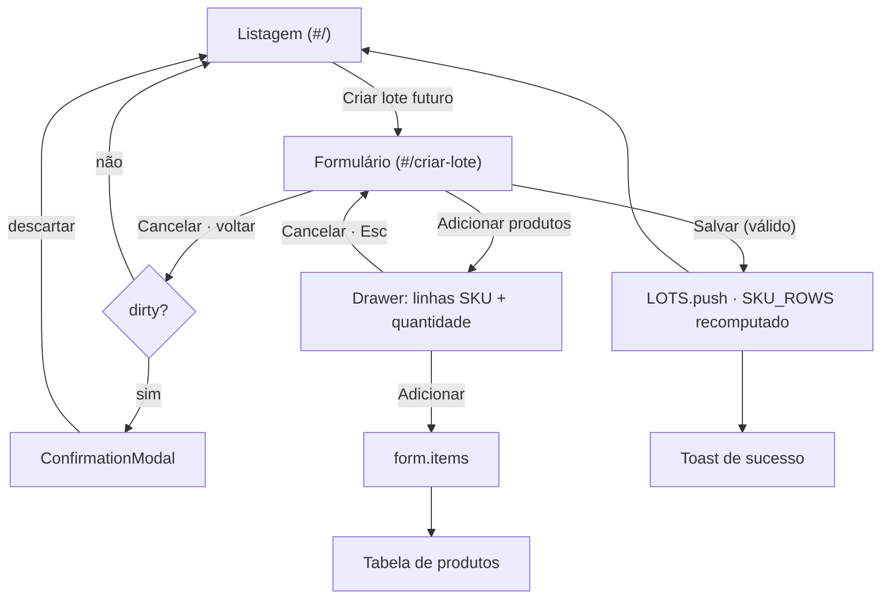

# Future Inventory — Lot Creation Form (Prototype)

> **Status**: Approved
> **Created**: 2026-08-11
> **Area**: Navigable prototype of the **Inventário futuro** module — the manual lot
> creation form, the third screen after the two listing views
> **Target artifact**: the static prototype
> [`inventario-futuro-listagem.html`](./prototype/inventario-futuro-listagem.html) — a single
> self-contained HTML file. **Not** the Next.js app.
> **Depends on**: [`spec-listagem-por-lote.md`](./spec-listagem-por-lote.md) ·
> [`spec-listagem-por-sku.md`](./spec-listagem-por-sku.md)
> **Product source**: [`specs/002-future-inventory/product-spec.md`](../specs/002-future-inventory/product-spec.md)
> **Primary files**: `prototype/inventario-futuro-listagem.html` · `prototype/README.md`
> **Design**: [Figma — Future inventory, frame `Criação de lote`](https://www.figma.com/design/xLwjBVD8h1llHt7FcW96Fv/Future-inventory?node-id=91-10657)

## Why the prototype is the target

Same reason as the two listing specs: the Next.js module is still a stub, and the only
artifact the team can open and click through is the static prototype. The form is
therefore specified as a **second screen inside the same HTML file**, reachable from the
listing's "Criar lote futuro" button, so the round trip — list, create, save, see the new
lot in the list — can actually be demonstrated.

This document contracts that file. When the module is built, this spec plus the two
listing specs are its behavioural reference, and the data models in §3 are the contract a
future API is expected to honour.

## Decisions agreed with the requester

The clarification rounds were answered on **2026-08-11**. Eleven points are settled and
are not open questions:

| Point | Agreed answer | Key Decision |
| --- | --- | --- |
| Target | A new screen **inside** `inventario-futuro-listagem.html`, not a second file and not the Next.js module. Clicking "Criar lote futuro" navigates to it; saving returns to the listing with the lot in place. | Decision 1 |
| Figma coverage | There is **no drawer frame**. Only the base form exists; the drawer is designed from the Shoreline pattern and from what the listing already uses. | Decision 5 |
| Adding products | The drawer holds **several rows** of SKU + quantity. One "Adicionar" at the end brings them all back to the form. Not one SKU per drawer visit. | Decision 5 |
| Editing an added product | **Quantity is edited inline** in the table cell. The row action is limited to removing. | Decision 7 |
| Duplicate SKU | A SKU already in the lot still **appears** in the drawer's search, **disabled**. It is visible but cannot be picked. | Decision 6 |
| Product list | A plain table that **gains search and pagination only past ten items** — not the full `Collection` the Figma placeholder suggests, and not a bare list either. | Decision 7 |
| Destination fields | **`Combobox` in both**, with search, and Estoque disabled until a Seller is chosen — the `Select` of the Figma contradicts the component's own documentation at 48 destinations. | Decision 8 |
| Availability mode | **Out of this spec.** The product spec requires it per lot (Case 17); the Figma has no such field. Registered as a conflict below, for the requester to settle with the PM. | Conflict 1 |
| Lot ID | **Suggested** with the next sequential number and **editable** — a merchant creating by hand after an integration failure usually has to match an external code. | Decision 3 |
| Arrival date | Minimum is **tomorrow**. A lot dated today was already due to turn into on-hand stock at the last midnight, so it would be born expired. | Decision 4 |
| Quantity | Positive integer, digits only, edited with the same restricted `Input` the quantity filter uses. | Decision 9 |

## Conflict with the product spec

**Conflict 1 — the availability mode has no field.** Item 3 of V1 in
[`product-spec.md`](../specs/002-future-inventory/product-spec.md) requires every lot to
carry an availability mode, **Simultâneo** or **Sequencial**, chosen at registration,
optional, defaulting to Simultâneo (Case 17). The Figma form has no such control, and
neither listing view has a column or filter for it. This spec follows the Figma and
leaves the field out; the lots it creates are implicitly Simultâneo.

Settling it means either adding a fourth section to the form — a `RadioGroup` with the two
modes and Simultâneo pre-selected reads naturally between Produtos and Destino — or
recording in the product spec that the mode is API-only in V1. Both listing views would
need a way to show it afterwards, otherwise a merchant can set a mode and never see it
again.

---

## 1. Business Context

### Problem Statement

A merchant who knows a shipment is coming needs to register it before it arrives. Most
enterprise accounts will do that through the API, from an ERP or a WMS: manual entry is
not the volume path and never will be. But the manual path has to exist, for two
populations the API does not serve:

- **Accounts with an integration that failed.** A batch that did not come through, a
  mapping error, a shipment that changed after the payload was sent. Without a manual
  form, the merchant's only recourse is to wait for the next integration run — while the
  delivery promise shown to shoppers stays wrong.
- **Smaller accounts with no integration at all.** They still have replenishment to
  register, and today they have no surface for it: Supply Lot is API-only and has had no
  Admin UI since 2020.

Registering a lot by hand today means calling an endpoint. That is a developer task, not
an operator task, so the people who actually know the shipment — the inventory operator —
cannot do their own job.

### Goals

1. An operator can register a complete lot — name, ID, arrival date, one or more SKUs with
   quantities, and a destination — without leaving the Admin.
2. Choosing SKUs works at catalogue scale, with search, not by scrolling a list.
3. The form refuses to create a lot that the listing could not represent: a duplicate ID,
   a SKU repeated inside the same lot, a date already past, a lot with no products.
4. The round trip is visible end to end in the prototype: create, save, and find the lot
   in the listing.

### Non-Goals

- Replacing the API path. This is the fallback, and the form is designed for one lot at a
  time, not for bulk entry.
- Editing or deleting an existing lot. See Out of Scope.

### User Stories

**US-1 — Register a lot by hand**

> As an inventory operator, I want to register an incoming shipment in the Admin, so that
> the delivery promise reflects it without waiting for an integration.

- **Given** the listing, **when** I press "Criar lote futuro", **then** the creation form
  opens with the ID already filled with the next sequential number, the status on
  `Agendado`, and every other field empty.
- **Given** a complete form, **when** I press "Salvar", **then** the lot is created with the
  status the form shows, I am returned to the listing, and a success message names the lot.
- **Given** a lot I do not want counted yet, **when** I set the status to `Inativo` before
  saving, **then** the lot is created inactive and the listing shows it with that tag.
- **Given** the listing after saving, **when** I look for the lot I just created, **then**
  it is there, with the destination, date and total I typed — the total being the sum of
  the SKU quantities, never a number I entered directly.

**US-2 — Put products in the lot**

> As an inventory operator, I want to pick several SKUs and their quantities in one pass,
> so that building a ten-item lot is not ten trips through the same dialog.

- **Given** the Produtos section, **when** I press "Adicionar produtos", **then** a drawer
  opens with one empty row of SKU and quantity.
- **Given** the drawer, **when** I press "Adicionar linha", **then** another empty row
  appears below the last, and there is no cap on how many rows I can add.
- **Given** rows filled in, **when** I press "Adicionar", **then** all of them join the
  form's product table at once and the drawer closes.
- **Given** a SKU already in the lot, **when** I search for it in the drawer, **then** it
  appears in the results but cannot be selected, and the reason is legible.

**US-3 — Correct what I put in**

> As an inventory operator, I want to fix a quantity I typed wrong without redoing the
> whole product.

- **Given** a product in the table, **when** I edit its quantity cell, **then** the lot
  total updates as I type and nothing else in the form is disturbed.
- **Given** a product in the table, **when** I remove it, **then** it leaves the table and
  becomes selectable again in the drawer.

**US-4 — Not lose work by accident**

> As an inventory operator, I want to be warned before I throw away a form I have started.

- **Given** a form with anything filled in, **when** I press "Cancelar" or the back arrow,
  **then** I am asked to confirm before the screen is discarded.
- **Given** an untouched form, **when** I press "Cancelar", **then** I go straight back,
  with no question asked.

**US-5 — Understand what is wrong**

> As an inventory operator, I want the form to tell me what is missing instead of failing
> silently.

- **Given** an incomplete form, **when** I press "Salvar", **then** every offending field
  is marked with its own message, the first one takes focus, and nothing is created.
- **Given** an ID that another lot already uses, **when** I press "Salvar", **then** the ID
  field says so and the rest of the form is left as I typed it.

### Functional Requirements

**Navigation and chrome**

- **FR-1**: The listing's "Criar lote futuro" button — `#btn-create`, inert until now —
  and the same action in the empty state navigate to the creation screen. The route is
  `#/criar-lote`; the listing keeps the empty hash.
- **FR-2**: The creation screen renders **without the sidebar**, as the Figma frame does,
  keeping the topbar and its hamburger. The form is a 720px column centred in the content
  area.
- **FR-3**: The page header carries a back `IconButton` with `IconArrowLeft`, the title
  "Criar lote futuro", and two large buttons: "Cancelar" (secondary) and "Salvar"
  (primary).
- **FR-4**: Leaving the form — back arrow, "Cancelar", browser back, or a successful save
  — returns to the listing **with its state intact**: search term, filters, view and page
  are the ones the operator left behind.

**Section "Sobre o lote"**

- **FR-5**: Four fields in two rows of 350px columns with a 20px gap: **Nome** (`Input`)
  beside **Status** (`Select`), then **ID** (`Input`) beside **Data de chegada**
  (`DatePicker`).
- **FR-6**: **Nome** is required and free text.
- **FR-6a**: **Status** is a `Select` whose options are the same `Tag`s the listing's Status
  column shows, and the closed trigger carries the chosen tag rather than its bare label —
  the field shows what the row will show after saving. It offers **Agendado** and
  **Inativo** only, and opens on **Agendado** (INV-6). It is never empty, so it has no
  required state and no error message.
- **FR-7**: **ID** opens filled with the next free sequential, zero-padded to three digits
  — `075` when 74 lots exist — and is editable. It is required. A leading `#` typed by the
  operator is stripped. It must not collide with an existing lot code, compared
  case-insensitively.
- **FR-8**: **Data de chegada** is required and must be **tomorrow or later**. It is the
  same `DatePicker` composition the arrival filter already uses.

**Section "Produtos"**

- **FR-9**: The section shows its title, the description "Informe os SKUs e as quantidades
  que vão chegar neste lote", and a secondary "Adicionar produtos" button carrying
  `IconPlus`. With no products yet, that button is the whole section — as in the Figma.
- **FR-10**: With at least one product, a table appears under the button with three
  columns: **Produto** (thumbnail, name, SKU id), **Quantidade** (editable), and a row
  action to remove. The table keeps Shoreline's default density — 12px of cell padding,
  the same the listing uses. Rows land on **68px** rather than the listing's 64px because
  the tallest cell here is a 44px `Input`, not two lines of text; `Input` has a single
  fixed height in 1.12.13, so 64px would only be reachable by hand-tuning the padding.
- **FR-11**: The **Quantidade** cell is an `Input` restricted to digits, minimum 1. A cell
  emptied or zeroed is invalid and blocks saving, with the message on the cell.
- **FR-12**: The table gains a **search field and pagination only past ten products**;
  below that it is a plain table. Search matches product name and SKU id. Page size is 10.
- **FR-13**: The section footer states the lot total — the sum of the quantities — and
  updates as quantities change. The total is never typed.
- **FR-14**: At least one product is required to save.

**The drawer**

- **FR-15**: "Adicionar produtos" opens a **medium** `Drawer` titled "Adicionar produtos",
  with a dismiss button in the header and, in the footer, "Cancelar" and "Adicionar" —
  cancel to the left of the submit, as the component prescribes.
- **FR-16**: The drawer content is a list of rows. Each row is a **SKU `Combobox`** and a
  **quantity `Input`**, plus a remove control from the second row onward. It opens with one
  empty row.
- **FR-17**: "Adicionar linha" appends an empty row. There is no limit.
- **FR-18**: The SKU `Combobox` searches the product catalogue by **name and SKU id**,
  accent-insensitive, and shows at most 10 matches at a time.
- **FR-19**: A SKU that is **already in the lot** — in the form's table or in another row
  of the same drawer — is rendered **disabled** in the results, with the reason on the
  item. It is never hidden.
- **FR-20**: "Adicionar" appends every valid row to the form's table and closes the
  drawer. A row left entirely empty is discarded without complaint; a row with only one of
  the two fields filled blocks the submit and is marked.
- **FR-21**: "Cancelar", the dismiss button, `Esc` and a click outside all discard the
  drawer's rows without touching the form. When rows have been filled in, that discard is
  confirmed first.

**Section "Destino"**

- **FR-22**: The section shows its title, the description "Defina em qual seller e estoque
  esses itens vão estar disponíveis", and two 350px fields side by side: **Seller** and
  **Estoque**.
- **FR-23**: Both are `Combobox`es with search over the destination catalogue. Both are
  required.
- **FR-24**: **Estoque** is disabled until a Seller is chosen, and lists only the
  warehouses of that seller. Changing the Seller clears the Estoque.

**Saving**

- **FR-25**: "Salvar" validates the whole form. Every invalid field gets its own
  `FieldError`; the first one in document order receives focus; nothing is created.
- **FR-26**: A valid save creates a lot with the **status chosen in the field**, the typed
  ID as its code, and the products as its items. It joins the in-memory fixture, both views
  are recomputed, and the listing total goes from 74 to 75.
- **FR-27**: After saving, the operator lands on the listing with a success `Toast`
  naming the lot.
- **FR-28**: "Cancelar" and the back arrow ask for confirmation **only when the form is
  dirty**, through a `ConfirmationModal`. An untouched form leaves silently.

### Non-Functional Requirements

- **Fidelity**: Every control is a real Shoreline composition against the pinned
  `@vtex/shoreline@1.12.13` CSS. No hand-rolled inputs, no browser-drawn widgets — the
  rule Decisions 16 and 17 of the SKU spec established for the filters holds here too.
- **Accessibility**: Each field has a real `<label>` bound to its control. Errors are
  announced through `role="alert"` and tied to the field with `aria-describedby` and
  `aria-invalid`. The drawer traps focus while open, returns it to the trigger on close,
  and closes on `Esc`. A disabled combobox item states why it is disabled, so the reason
  reaches a screen reader and not only the eye.
- **Keyboard**: The form is completable without a mouse, including the date segments and
  both comboboxes.
- **Determinism**: The product catalogue is a fixture generated in the file. The same
  options appear in the same order on every load.
- **Self-containment**: Still one HTML file, still no build step, still deployable by
  copying it to `index.html`.

### Out of Scope

- **Editing an existing lot** and the row actions of the listing — inactivate, cancel,
  mark as received. V1 of the product spec asks for editing; it is a sibling screen and
  deserves its own spec, reusing this form.
- **The availability mode** (Conflict 1).
- **Bulk creation** by spreadsheet or CSV — "Later" in the product spec (Case 16).
- **Franchise destinations** from a main account (Case 19). The destination catalogue here
  is flat.
- **Real persistence**. The lot lives in memory and dies with the page reload, like every
  other piece of state in the prototype.
- **Any Catalog integration**. The SKU catalogue is fixture data, not a product search
  against a real API.

### Key Scenarios

| # | Type | Pre-conditions | Steps | Expected result |
| --- | --- | --- | --- | --- |
| S-1 | Happy path | 74 lots exist | Open the form; type "Reposição de setembro"; keep the ID `075`; set the date to 30/09/2026; add two SKUs with 10 and 5; pick Seller and Estoque; Salvar | The listing shows 75 lots, the new one with total 15, status Agendado, and a toast names it |
| S-2 | Happy path | Drawer open with one empty row | Fill the row; "Adicionar linha" twice; fill both; "Adicionar" | Three products join the table in the order they were typed; the drawer closes; the section total is their sum |
| S-3 | Error | Form filled, ID typed as `012`, which lot `#012` already uses | Salvar | Nothing is created; the ID field reads "Já existe um lote com este ID" and takes focus; everything else stays typed |
| S-4 | Error | Form filled except products | Salvar | Nothing is created; the Produtos section reads "Adicione ao menos um produto"; the "Adicionar produtos" button takes focus |
| S-5 | Error | Drawer with a row that has a SKU and an empty quantity | Adicionar | The drawer stays open; the quantity cell of that row reads "Informe uma quantidade"; the valid rows are not added yet |
| S-6 | Edge | SKU `#204` already in the table | Open the drawer and search "Nike" | `#204` appears in the results, disabled, stating it is already in the lot; the other Nike SKUs are selectable |
| S-7 | Edge | Form with a name typed | Press the back arrow | A confirmation asks before discarding; cancelling it keeps the form exactly as it was |
| S-8 | Edge | Untouched form | Press Cancelar | Straight back to the listing, no question, listing state intact |
| S-9 | Edge | Two products in the table | Empty the quantity cell of the first and press Salvar | Nothing is created; the cell is marked; the section total ignores the invalid cell rather than showing `NaN` |
| S-10 | Edge | Date field set to today | Salvar | Nothing is created; the field reads "A chegada precisa ser a partir de amanhã" |
| S-11 | Edge | Seller chosen, Estoque chosen, then the Seller is changed | Observe Estoque | Estoque is cleared and re-populated with the new seller's warehouses; saving without re-picking it is refused |
| S-12 | Happy path | Form filled | Open Status, pick `Inativo`, Salvar | The closed field carries the grey tag; the created lot shows `Inativo` in the listing, which keeps it visible because the default filter marks agendado and inativo |

---

## 2. Arch Decisions

### Proposed Solution

The prototype grows a **second screen** rather than a second file. `#app` gains a sibling
container for the form; a tiny hash router shows one and hides the other. Nothing about
the listing's state is torn down when the form opens, which is what makes FR-4 free: the
listing is still in the DOM, with its filters and page, waiting.

The form itself is three sections of Shoreline fields. Two pieces carry real behaviour:

**The drawer** is a repeater. Its state is an array of `{ skuId, quantity }` rows, seeded
with one empty row when it opens and discarded when it closes. Only "Adicionar" commits
it into the form. Keeping the drawer's rows separate from the form's items is what lets
`Esc` be a true cancel, and what lets FR-19 compute its disabled set from two sources —
the committed items and the uncommitted rows — without either of them contaminating the
other.

**The product table** is the listing's table at a smaller scale, with the same 64px rows
and the same thumbnail treatment. It crosses into search-and-pagination at eleven items,
reusing the pagination markup the listing already emits.

Both comboboxes — SKU and destination — are the same composition, differing only in their
source and in the disabled predicate. That is deliberate: the destination filter built in
the previous round already searches and pages a 48-item catalogue, and its shape carries
over.

### Architecture Overview



The data flows one way: drawer rows → form items → table and total → lot on save. Nothing
reads back up the chain, which is why the total can never disagree with the items.

### Alternatives Considered

| Alternative | Pros | Cons | Verdict |
| --- | --- | --- | --- |
| A screen inside the same file (chosen) | The whole round trip is demonstrable; the listing's state survives untouched; one deploy artifact | The file grows past 3.000 lines | **Accepted** |
| A second HTML file | Smaller diffs; no router | "Criar lote futuro" would leave the page, so the listing's filters and page would be lost on return, and the saved lot could not appear in a fixture that no longer exists | Rejected |
| One SKU per drawer visit | The simplest drawer; matches the component's "list to select a single option" note | Ten SKUs means ten open-and-close cycles — the requester rejected it once the cost was explicit | Rejected |
| Picking SKUs in the drawer and typing quantities only in the table | The drawer is a pure picker | Splits one decision into two screens: the operator knows the quantity at the moment they pick the SKU | Rejected |
| The full `Collection` from the Figma placeholder, always | Faithful to the frame | Search and pagination over three items is furniture; the placeholder is a generic component instance, not a considered design | Rejected in favour of the threshold in Decision 7 |
| `Select` for Seller and Estoque, as drawn | Faithful to the frame | The component's own documentation caps `Select` at seven options and sends anything larger to `Combobox`; the catalogue has 48 | Rejected — see Decision 8 |

### Risks & Mitigations

| Risk | Impact | Mitigation |
| --- | --- | --- |
| The file grows to the point of being hard to navigate | Medium | Section banner comments, as the file already uses; the form's code lives in one contiguous block, not interleaved with the listing's |
| The listing and the form drift on shared helpers — dates, quantities, thumbnails | Medium | The form reuses `formatDate`, `isoParts`, the `DatePicker` builders, `THUMB` and the digit-only handler instead of copying them |
| A saved lot breaks the listing's invariants — duplicate code, SKU twice in a lot, quantity of zero | High | Every invariant in §3 is enforced at save time, and the three that the listing depends on are the ones FR-7, FR-11 and FR-19 guard |
| `SKU_ROWS` is computed once at load, so a new lot would be invisible in the SKU view | High | Saving recomputes it — an explicit step in the implementation plan, and an invariant in §3 |
| The catalogue used by the listing is too small for the combobox | Low | Decision 10 keeps the drawer catalogue at 40 products while the lots use a 15-product pool |

### Key Decisions

#### Decision 1: The form is a screen in the same file, behind a hash route

- **Status**: Accepted
- **Context**: The prototype has no routing at all: one screen, one DOM. A creation form is
  a second screen, and the requester wants the round trip — list, create, save, see it in
  the list — to work.
- **Decision**: Add a two-entry hash router. `#/criar-lote` shows the form and hides the
  listing; anything else shows the listing. Both stay in the DOM.
- **Consequences**: The browser's back button works, and the form can be linked directly
  for review. Because the listing is only hidden, its search, filters, view and page
  survive by construction — FR-4 needs no code. The `<title>` and the page header change
  with the route; the sidebar is hidden on the form, as the Figma shows.

#### Decision 2: The lot's total is derived, never entered

- **Status**: Accepted
- **Context**: The listing already holds this invariant — a lot's quantity is the sum of
  its SKUs, never a stored number.
- **Decision**: The form has no total field. The Produtos section prints the sum, and the
  created lot carries only items.
- **Consequences**: A lot with no products would have a total of zero, which is why FR-14
  requires at least one. Editing a quantity cell updates the total on `input`, not on
  blur, so the number the operator sees is always the one they typed.

#### Decision 3: The ID is suggested, not imposed

- **Status**: Accepted
- **Context**: The Figma shows the field pre-filled with `001`, which could mean either a
  read-only generated code or a suggestion. Manual creation exists mostly as a fallback
  when an integration fails, and in that case the lot usually has to carry a code that a
  system outside VTEX already assigned.
- **Decision**: Pre-fill with the next free sequential and let it be edited. Required,
  unique against existing codes, with a leading `#` stripped.
- **Consequences**: Uniqueness has to be checked at save (FR-7), which is a validation the
  read-only variant would not need. The sequential is computed from the current fixture,
  so it is `075` today and moves as lots are created.

#### Decision 4: Arrival is tomorrow at the earliest

- **Status**: Accepted
- **Context**: Case 13 of the product spec converts a lot into on-hand stock at 00:00 of
  its arrival date, in the account's timezone. A lot registered with today's date has
  already missed that moment.
- **Decision**: The minimum is tomorrow, enforced on save and reflected in the calendar,
  which renders earlier days as disabled.
- **Consequences**: The prototype's fixture, dated from August 2026, stays consistent with
  a "today" of August 2026. Should the file be opened much later, every fixture lot reads
  as past — a known and accepted property of a static prototype.

#### Decision 5: The drawer is a repeater, not a picker

- **Status**: Accepted
- **Context**: The Figma has no drawer at all, so its content is ours to design. The
  first proposal — one SKU per visit — was rejected by the requester once the ten-visit
  cost was spelled out; the agreed shape is several rows of SKU and quantity committed by
  one action.
- **Decision**: `DrawerProvider > DrawerPopover[size="medium"]` with header, content and
  footer. The content is a list of rows, each a SKU `Combobox` plus a quantity `Input`,
  with "Adicionar linha" below and a remove control from the second row on. The footer is
  "Cancelar" and "Adicionar", in that order, both `size="large"`.
- **Consequences**: Medium is 35rem — 560px — which fits a combobox and a quantity field
  side by side without crowding. The title obeys the component's rule for form drawers,
  an infinitive verb plus an object in at most three words, and repeats the label of the
  trigger. Because rows are uncommitted state, `Esc` and the dismiss are real cancels; the
  guard in FR-21 is what keeps that from being destructive.

#### Decision 6: A SKU already in the lot is shown disabled, not hidden

- **Status**: Accepted
- **Context**: Both listing specs fixed that a SKU appears at most once per lot — the pair
  (lot, SKU) is the row identity of the SKU view, so a repeat would render two identical
  rows. The form has to enforce it. Three ways were offered: refuse on submit, merge the
  quantities, or keep the option visible but unusable.
- **Decision**: Keep it visible and disabled, with the reason on the item. The disabled set
  is the union of the committed items and the SKUs picked in other rows of the open
  drawer.
- **Consequences**: An operator searching for a SKU always finds it, which is the point —
  absence would read as "this SKU does not exist" rather than "you already added it".
  `ComboboxItem` takes a `disabled` prop, so this is the component's own behaviour and not
  a custom state. Removing a product from the table returns it to the selectable set.

#### Decision 7: The product table earns search and pagination at eleven items

- **Status**: Accepted
- **Context**: The Figma drops a generic `Collection` instance into the section — search,
  checkbox column, pagination, a row reading "Catalog viewer" — which is the untouched
  component placeholder, not a design. A lot of three items does not need a search field;
  a lot of sixty does.
- **Decision**: A plain table up to ten products. From eleven, the section grows the
  listing's search field and pagination, with a page size of 10.
- **Consequences**: One rendering path with a flag, not two components. The checkbox column
  of the placeholder is dropped entirely — there is no bulk action on a lot being written,
  and the only row action is removal. Quantity being editable inline (the requester's
  choice) is what keeps the row menu down to a single item.

#### Decision 8: Seller and Estoque are `Combobox`es, against the Figma

- **Status**: Accepted
- **Context**: The frame uses `Select` for both. The component's documentation is explicit:
  `Select` "opens a dropdown with between five and seven values… use a Combobox for more
  items". The destination catalogue built in the previous round holds 48 entries.
- **Decision**: `Combobox` in both, with search. Estoque is disabled until a Seller is
  picked and then lists only that seller's warehouses.
- **Consequences**: A deliberate deviation from the frame, recorded here and in the
  README. The dependency between the two fields is new — the destination filter treats a
  destination as one opaque string, whereas the form has to split seller from warehouse.
  §3 derives both lists from the same catalogue so the two surfaces cannot disagree.

#### Decision 9: Quantity reuses the restricted `Input`, not `type="number"`

- **Status**: Accepted
- **Context**: Decision 16 of the SKU spec established that Shoreline ships no number
  input, and that a numeric field is an `Input` with `inputmode="numeric"` plus a
  digit-only handler. The form has quantity in two places: the drawer rows and the table
  cells.
- **Decision**: Both reuse that exact composition and the delegated handler already in the
  file, which also restores the caret position.
- **Consequences**: No browser spinner anywhere, consistent with the quantity filter. Zero
  and empty are possible states while typing, so they are validated at save rather than
  prevented at the keystroke — preventing them would fight the operator clearing a cell to
  retype it.

#### Decision 10: The SKU catalogue grows to 40, without touching the six the lots use

- **Status**: Accepted
- **Context**: `PRODUCTS` holds the item pool used by the lots. A combobox over only the
  products visible in the current page demonstrates nothing, and the requester already
  chose the analogous shape for destinations: a catalogue larger than what the fixture
  consumes.
- **Decision**: Keep `PRODUCTS` as the lot fixture's 15-product pool, and keep
  `PRODUCT_CATALOG` at 40 products as the drawer's source.
- **Consequences**: The listing fixture remains the shared source: 231 SKU rows, the same Produto
  column width, and the same product pool used by the lot list. A lot created through the form may hold a product no
  other lot has, which is correct — the catalogue is the account's, not the page's. The
  new names stay within the width the Produto column already measures.

#### Decision 11: Status is chosen at creation, among two of the four

- **Status**: Accepted
- **Context**: The form used to hardcode `scheduled`, which read as "every lot is born
  scheduled". But a lot registered in advance and not meant to count yet has a state of its
  own — `inactive` — and without a field the operator would have to create it scheduled and
  fix it afterwards, in a screen that does not exist in this scope. The other two statuses
  are different in kind: `received` is what happens when the shipment lands, `cancelled`
  when it is called off. Neither is a choice made at creation.
- **Decision**: Add a `Select` beside Nome offering `Agendado` and `Inativo`, opening on
  `Agendado`. The options are the listing's own `Tag`s, and the closed trigger shows the
  chosen tag instead of its label. INV-6 widens from "always scheduled" to "scheduled or
  inactive".
- **Consequences**: The listing needs nothing: its default status filter already marks
  agendado and inativo, so a lot created inactive is visible where it was created. Showing
  the tag in the trigger means the field and the row it will produce look the same, which is
  the point of a status that is drawn, not written — and it costs a `--min-width: 100%`
  override on the trigger, since Shoreline's button is 20rem wide by default and the form's
  columns are 350px. A lot's later transitions still have no screen: the row menu's "Marcar
  como recebido" remains inert (002.1 FR-14a).

### Implementation Plan

1. **Router** — add `showScreen(route)` reading `location.hash`, wire `hashchange`, and
   split the current markup into `#screen-listing` and `#screen-create`. The sidebar is
   hidden on the create route. Verify the listing's state survives a round trip.
2. **Fixture** — add `PRODUCT_CATALOG` (Decision 10) and derive `SELLERS` and
   `warehousesOf(seller)` from `DESTINATIONS`. Confirm the listing's shape is unchanged:
   74 lots, 231 SKU rows, 15 lot products, 48 destinations.
3. **Page header** — the create variant, with the back `IconButton`, the title and the two
   large actions. `IconArrowLeft` is extracted from the package, not drawn.
4. **Form shell** — the three sections with their titles and descriptions, the 720px
   column, 64px between sections, 20px between fields. Fields as `Field` > `Label` +
   control, exactly as the filter popovers were rebuilt.
5. **Combobox** — one builder used by three fields: SKU, Seller and Estoque. Search,
   keyboard navigation, disabled items, empty state.
6. **Drawer** — the repeater, its rows, "Adicionar linha", the footer actions, the
   confirmation on discard, focus trap and restore.
7. **Product table** — rows, inline quantity, removal, the total, and the threshold that
   brings in search and pagination.
8. **Validation and save** — per-field errors, focus on the first, lot creation,
   `SKU_ROWS` recomputation, navigation and the toast.
9. **Verify in the browser** — walk every scenario in the table above with the CDP script
   harness the previous rounds used, including the keyboard-only path.
10. **Document** — the README gains the form's section: the router, the drawer, the two
    deviations from the Figma (Decision 8 and the `Collection` placeholder), and the
    catalogue split.

---

## 3. Technical Contract

### Data Models

```ts
/** A product in the account's catalogue. The drawer's source. */
type FutureInventoryProduct = {
  /** `#123`. Unique in the catalogue. */
  skuId: string
  name: string
}

/** One row of the drawer, uncommitted. */
type DrawerRow = {
  /** Row identity, so removing a row does not re-key the others. */
  id: string
  /** `null` until a SKU is picked. */
  skuId: string | null
  /** Raw field content, so `''` while the operator clears it. */
  quantity: string
}

/** One product committed to the lot being written. */
type FormItem = {
  skuId: string
  name: string
  /** Raw field content — validated to a positive integer at save. */
  quantity: string
}

/** The whole form. Mirrors FutureInventoryLot minus what is derived. */
type CreateLotForm = {
  name: string
  /** Digits only, without the `#`. */
  code: string
  /** `'scheduled'` or `'inactive'`, never empty. Starts on `'scheduled'`. */
  status: 'scheduled' | 'inactive'
  /** ISO `YYYY-MM-DD`, or `null` while empty. */
  arrivalDate: string | null
  items: FormItem[]
  seller: string | null
  warehouse: string | null
}

/** What a successful save produces — the shape the listing already consumes. */
type FutureInventoryLot = {
  id: string
  /** `#075` — the form's `code` with the `#` restored. */
  code: string
  name: string
  destination: { seller: string; warehouse: string }
  arrivalDate: string
  /** `'scheduled'` or `'inactive'` at creation, by INV-6. */
  status: FutureInventoryStatus
  items: Array<{ id: string; skuId: string; name: string; quantity: number }>
}
```

The lot has **no** `quantity` field, by Decision 2, and **no** availability mode, by
Conflict 1.

### Derivations

| Value | Rule |
| --- | --- |
| Suggested code | `String(Math.max(...LOTS.map(numeric code)) + 1).padStart(3, '0')` |
| Lot total | `items.reduce((sum, i) => sum + (Number(i.quantity) || 0), 0)` |
| Minimum arrival | `today + 1 day`, as an ISO string, compared lexicographically |
| Disabled SKUs in the drawer | `new Set([...form.items.map(skuId), ...rows.map(skuId)])` minus the row being edited |
| Seller options | `[...new Set(DESTINATIONS.map((d) => d.seller))]`, alphabetical |
| Estoque options | `DESTINATIONS.filter((d) => d.seller === form.seller).map((d) => d.warehouse)` |
| New lot id | `` `lot-${LOTS.length + 1}` `` |
| Item id | `` `${lot.id}-item-${n}` `` — the convention `buildLots` already uses |

### Interfaces

**Fixture and catalogue**

| Symbol | Status | Contract |
| --- | --- | --- |
| `PRODUCTS` | unchanged | The six the lots draw from |
| `PRODUCT_CATALOG` | **new** | `PRODUCTS` plus 34, alphabetical — the drawer's source (Decision 10) |
| `SELLERS`, `warehousesOf(seller)` | **new** | Derived from `DESTINATIONS`; the destination catalogue stays the single source |
| `LOTS`, `SKU_ROWS` | **extended** | Mutable at runtime: a save pushes a lot and recomputes the rows |

**Router**

| Symbol | Status | Contract |
| --- | --- | --- |
| `ROUTES` | **new** | `{ listing: '', create: '#/criar-lote' }` |
| `showScreen()` | **new** | Reads `location.hash`, toggles `#screen-listing` / `#screen-create` and the sidebar, sets the page header and `document.title` |
| `goTo(route)` | **new** | Sets `location.hash`; the `hashchange` handler does the rest, so browser back behaves like the back arrow |

**Form state and validation**

| Symbol | Status | Contract |
| --- | --- | --- |
| `form` | **new** | The `CreateLotForm` object; `formPristine` snapshots it on open so FR-28 can tell dirty from untouched |
| `renderForm()` | **new** | Renders the three sections from `form`; called on open and after any structural change (items added or removed) |
| `renderItems()` | **new** | The product table, the total, and the search-and-pagination threshold of Decision 7 |
| `validateForm()` | **new** | `() => Array<{ field: string; message: string }>` — pure; the caller paints the errors and focuses the first |
| `saveLot()` | **new** | Validates, builds the lot, pushes it, recomputes `SKU_ROWS`, navigates and raises the toast |
| `resetForm()` | **new** | Back to an empty form with a freshly suggested code |

**Drawer**

| Symbol | Status | Contract |
| --- | --- | --- |
| `drawer` | **new** | `{ open: boolean; rows: DrawerRow[] }` |
| `openDrawer()`, `closeDrawer({ force })` | **new** | Open seeds one empty row; close confirms first when any row is filled, unless forced |
| `addDrawerRow()`, `removeDrawerRow(id)` | **new** | Row management; the first row has no remove control |
| `commitDrawer()` | **new** | Discards empty rows, blocks on half-filled ones, appends the rest to `form.items`, closes |
| `renderDrawer()` | **new** | Header, rows, "Adicionar linha", footer |

**Combobox**

| Symbol | Status | Contract |
| --- | --- | --- |
| `comboboxHtml(id, { value, placeholder, disabled })` | **new** | The `data-sl-combobox-input` composition inside a `Field` |
| `comboboxOptions(id, matches, { disabledSet, reason })` | **new** | Renders `data-sl-combobox-item`s, marking the disabled ones with their reason (FR-19) |
| `matchProducts(term)`, `matchSellers(term)`, `matchWarehouses(seller, term)` | **new** | Accent-insensitive search through `norm`, the helper the listing already has |

**Reused unchanged**

`norm`, `formatDate`, `isoParts`, `daysInMonth`, the `DatePicker` builders and their
keyboard handlers, the digit-only `input` handler, `THUMB` / `PRODUCT_THUMB`, `icon()`,
`hydrateIcons()`, the pagination markup, and `escapeHtml`.

### Integration Points

| Point | Contract |
| --- | --- |
| Listing → form | `#btn-create` and the empty state's action call `goTo(ROUTES.create)` |
| Form → listing | `goTo(ROUTES.listing)` after a save, a cancel or the back arrow; the listing re-renders from its untouched state |
| Form → fixture | The only writer of `LOTS` in the file. Everything else reads |
| Form → SKU view | `SKU_ROWS` is rebuilt from `LOTS` after every save |
| Future API | `POST /future-inventory/lots` with the `FutureInventoryLot` shape above minus `id`, which the server assigns. The uniqueness of `code` is a server concern too; the form's check is a courtesy, not the authority |

### Invariants & Constraints

- **INV-1**: A lot's quantity is the sum of its items. There is no stored total.
- **INV-2**: A SKU appears at most once in a lot — enforced in the drawer by Decision 6,
  and unrepresentable in `form.items` because the disabled set covers both committed and
  uncommitted rows.
- **INV-3**: Every item quantity is an integer of 1 or more at save time.
- **INV-4**: A lot code is unique across `LOTS`, compared case-insensitively and without
  the `#`.
- **INV-5**: `arrivalDate >= today + 1`, as ISO strings.
- **INV-6**: A created lot's status is `scheduled` or `inactive` — the two states a lot can
  be born in, and the only two the Status field offers. `received` and `cancelled` are
  transitions in a lot's life, reached by what happens to the lot, so the form cannot
  produce them.
- **INV-6a**: Every item of a created lot starts with `reserved: 0`. A lot that has just
  been created has no sales; reservations only grow when an order consumes units of it.
- **INV-7**: `destination.seller` and `destination.warehouse` are always a pair that
  exists in `DESTINATIONS` — the two comboboxes cannot compose a destination the catalogue
  does not have.
- **INV-8**: `SKU_ROWS` is consistent with `LOTS` after every save; the SKU view never
  shows a stale count.
- **INV-9**: The drawer never mutates `form.items`. Only `commitDrawer()` does.
- **INV-10**: Leaving the form never mutates the listing's query state.
