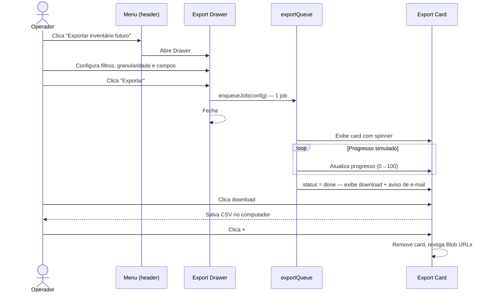

# Future Inventory — Export Flow

**Status**: Approved
**Repository**: `vertical-distributed-order-management-dom`
**Prototype**: [`inventario-futuro-listagem.html`](./prototype/inventario-futuro-listagem.html)
**Created**: 2026-09-01
**Updated**: 2026-09-02 — Drawer refinements applied to the prototype (FR-2 to FR-9, FR-22 to FR-24)

---

## 1. Business Context

### Problem

Merchants need to extract future inventory data for reporting, reconciliation and
planning outside the Admin. A naive "export everything" button is impractical because
large operations may have thousands of lots and SKUs, making the file heavy and of
little analytical value. Without a scoped export flow, operators either export too much
(slow, noisy) or manually copy data (error-prone).

### Goals

- Guide the user to scope the export before triggering it (filters + field selection).
- Provide clear async feedback so the user is not blocked while the file is generated.
- Allow up to three **in-flight** exports in a sequential queue without interrupting the
  listing workflow — the cap protects processing capacity, so finished exports do not count
  against it (FR-15).
- Guarantee the file is also delivered by e-mail, so the user can recover it without
  staying on the page.

### Requirements

#### Functional

- **FR-1** The export action lives in the page-header actions menu as
  **Exportar inventário futuro**, between **Importar lotes via planilha** and
  **Histórico de alterações**. **Importar lotes via planilha** stays non-functional here;
  **Histórico de alterações** is a link that opens the Admin's Audit module in another tab
  (`002.1`, FR-14c) — which is also why an export in flight is safe: the operator consulting
  history never leaves the page holding the queue.
- **FR-2** Clicking the action opens a Shoreline `Drawer` anchored to the right, at
  `data-size="small"`.
- **FR-2a** The Drawer closes only through an **explicit action** — the dismiss `×`,
  **Cancelar**, or **Exportar**. A click outside the panel does nothing. The Drawer holds a
  configuration the user assembled by hand (granularity, filters, field selection), and a
  stray click on the listing behind it must not throw that away.
- **FR-3** The Drawer body is divided into three sections in this order:
  **Exportar por** (always expanded) → **Filtros** (collapsible) → **Campos** (collapsible).
  Both collapsible sections **default to collapsed** on every open, so the granularity
  choice — the decision that drives the other two sections — is what the user sees first.
  Each collapsible section is a bordered card whose header holds a chevron to the left of a
  `display3` title (chevron points right when collapsed, down when expanded); the
  open/close transition is animated with `grid-template-rows` (`0fr` ↔ `1fr`).
- **FR-4** The **Exportar por** section contains two `Radio` options laid out
  **side by side**, **Lote** and **SKU**. Default: **Lote**. Uses Shoreline `Radio`
  (`data-sl-radio` / `data-sl-radio-input` / `data-sl-label`), with the option name
  clickable through the label's `for`/`id` association and `--sl-space-5` between options.
- **FR-5** The **Filtros** section exposes the same four filters available in the listing:
  Destino, Data de chegada, Quantidade and Status. All filters start empty (no
  pre-selection from the listing state). Filters use the Shoreline `Filter` component in its
  **trigger + popover** form (`data-sl-filter-trigger` / `data-sl-filter-popover`), the same
  as the listing, wrapping to the next line instead of overflowing the available width:
  - **Destino**: popover with a `data-sl-search` input above a `data-sl-filter-list`
    holding the same **seller → estoque tree** as the listing (`002.1`, FR-7a; `002.2`,
    Decision 20) — tri-state seller checkbox, chevron between the checkbox and the seller
    name, sellers collapsed on open. The list is limited to **20 sellers**, each carrying
    its own estoques; there is no paging on scroll here.
  - **Data de chegada**: two `DatePicker` fields (De / Até) using `data-sl-date-picker`.
    Same rule as the listing's arrival filter, through the same function: the two fields
    **bound each other in both directions** — a start date is the **Até** picker's minimum
    and an end date is the **De** picker's maximum, applied live while the popover is open,
    with an empty field bounding nothing. An empty calendar opens on its own bound's month
    rather than on today's, so it never renders a fully disabled grid (`002.1`, FR-8b).
    Typed dates still go through the range validation, showing
    **"A data final não pode ser anterior à data inicial."** on **Aplicar**.
  - **Quantidade**: two `Input` fields (Mínima / Máxima) using `data-sl-input`. Both bounds
    must be greater than zero, since a lot never holds zero units (`002.1`, INV-12): a `0`
    is rejected on **Aplicar** with **"A quantidade precisa ser maior que 0."**, and a
    minimum above the maximum with **"A quantidade mínima não pode ser maior que a
    quantidade máxima."**
  - **Status**: `data-sl-filter-list` with `data-sl-filter-item` for each of the four
    statuses (Agendado, Inativo, Recebido, Cancelado).

  Each popover holds a **pending** selection that is only committed to the applied filter
  state on **Aplicar** (**Limpar** resets it), mirroring the listing's behaviour. Popovers
  are positioned with `position: fixed` computed in JS, because the section card
  (`overflow: hidden`) and the Drawer's own scroll would otherwise clip them.
- **FR-5b** In an account whose stock lives only in its own warehouses, the **Destino**
  popover lists **estoques directly** — no seller rows, no chevrons, no tri-state — and its
  search reads **"Buscar estoque"**. It is the same shape decision as the listing
  (`002.1`, FR-7c), taken **once per account**, so the Drawer and the listing behind it can
  never show two different shapes of the same filter. Two levels stay the default; the
  collapse waits on the signal engineering still owes (`002.1`, Decision 7).
- **FR-6** When the Filtros section is **collapsed** and at least one filter is active, a
  **count badge** appears in the section header, right-aligned: `--sl-bg-base-strong`
  background, number in `--sl-text-action-font` and `--sl-fg-base`, fully rounded. Shoreline
  1.12.13 ships no Badge component, so it is composed from those tokens. The number counts
  **filters, not values**: Destino and Status count once regardless of how many options are
  selected, and Data de chegada and Quantidade count once even with both ends filled — so
  the badge reads 1 to 4. Screen readers get the whole phrase ("3 filtros aplicados")
  instead of a bare digit.
- **FR-7** The **Campos** section exposes a **field-selection checklist** for the selected
  granularity, rendered as a **single column** (one checkbox per line). All fields are
  checked by default; the user may uncheck anything that is not part of the required
  minimum (FR-22). Uses Shoreline `Checkbox` (`data-sl-checkbox`). Switching granularity
  re-renders the checklist from scratch, with every field checked again.

  | Granularity | Fields, in display order |
  |-------------|--------------------------|
  | Lote | Lote ID · Data de chegada · Nome do lote · Status · Quantidade · Reservas · Destino (seller + estoque) |
  | SKU | SKU ID · Lote ID · Data de chegada · Nome do lote · Nome do produto · Status do lote · Quantidade · Reservas · Destino (seller + estoque) |

  The display order is also the column order of the generated CSV.

- **FR-8** The Campos section header contains a **select-all** `Checkbox`, right-aligned and
  **without a visible text label** (the accessible name is kept for screen readers only). It
  toggles every non-required field checkbox at once and shows the indeterminate state when
  only some fields are checked. The whole header row — including the checkbox — is the
  hover target, while the chevron button remains the collapse toggle.
- **FR-9** The **Exportar** button in the Drawer footer is disabled while no field is
  checked. With FR-22 in place this state is unreachable through the UI — the required
  minimum always keeps at least two fields checked — so the guard stays only as a safety net.
- **FR-10** Clicking **Exportar** closes the Drawer and enqueues one export job. The job
  occupies an in-flight slot only while it is `pending` or `running`; once it finishes or
  fails it releases the slot and stops counting against the limit (FR-15, Decision 3a).
- **FR-11** A **floating export card** anchored to the bottom-right of the viewport
  appears on the first job and persists until the user dismisses it. The card follows
  Shoreline's Card and Stack tokens: elevation from **`--sl-shadow-1`**, the status icons
  from the semantic **`--sl-fg-success`** and **`--sl-fg-critical`**, and no colour written
  outside a token. The card had drifted from this — a hand-written `box-shadow` that was
  `--sl-shadow-1` with a different alpha, and palette steps with hex fallbacks for the
  status icons (`002.2`, Decision 21).
- **FR-11a** The card **never overlaps an open Drawer**. While one is open, the card
  **slides left** by the panel's width plus the 24px gutter, and slides back when it
  closes, over the same 220ms as the panel itself. The two are not competing for the same
  corner: the Drawer's footer actions sit exactly where the card lives. Putting the card
  *behind* the Drawer would also stop the overlap, but the Drawer is opaque and 400px wide,
  so it would swallow the card whole — and what the card carries is export progress, which
  is precisely what the operator wants in view while assembling the next one. The offset is
  **measured on the panel** at open time rather than written as a constant, since each
  Drawer size has its own width and the sizes are Shoreline's to change. It applies to any
  right-anchored Drawer, so starting an export and then opening "Adicionar produtos" moves
  the card just the same.
- **FR-12** The card header shows **"Exportações (N)"** — the count in parentheses, N being
  the current number of jobs — over a `bg-base-soft` background, with a chevron toggle and a
  dismiss `×` IconButton. The card itself carries `--sl-border-base` as its border.
  **The header has no bottom border of its own**: the rule below it is the first job row's
  `border-top`. With both, the two 1px strokes met at the same coordinate and read as a
  single 2px line — thicker than any border in the design system.
- **FR-12b** The two header buttons are the **same size, with same-size icons**. Both are
  `data-size="normal"` IconButtons (36px) carrying 20px icons: `caret-up` / `caret-down` and
  `x`. The chevron used the 16px `Small` variants against a 20px `×`, which made the pair
  look lopsided.
- **FR-12a** The chevron points at **what the click will do**, not at the current state:
  **down** while the card is expanded (there is something to collapse) and **up** while it
  is collapsed (there is something to open). Its accessible name follows the same reading —
  "Recolher" and "Expandir".
- **FR-13** When collapsed, only the header is visible. When expanded (default), each
  job is rendered as a row showing, in this order: the **formatted start timestamp**, the
  **file label**, and — when done — the e-mail notice of FR-17; alongside them, the status
  icon/spinner and the download IconButton (when done) or the retry Button (on error). The
  timestamp sits **above** the filename, as an eyebrow, leaving the notice as the only line
  under it.
- **FR-13c** A job **waiting its turn is not drawn as a job being processed**. While
  `pending`, the row reads **"Na fila"** in place of the timestamp and shows **no Spinner** —
  the Spinner belongs to the job actually being processed, and with a sequential queue at
  most one row can show it. It follows that `startedAt` is **null until the job starts**:
  the moment the user asked for the export is `queuedAt`, and "Iniciado às" would otherwise
  report a start that had not happened. Rows with no status element render without the
  status container at all, so the filename gets the full width.
  **The row does not report how many rows were exported.** At SKU granularity the count
  reaches five digits, and the card has a fixed width — the number pushed the status icon
  and the download button out of the row. The count is in the file, which is one click away.
- **FR-13a** The card is re-rendered **only when what it displays changes**, never on
  progress ticks. `renderExportCard()` replaces the host's `innerHTML`, so calling it on
  every 100ms tick destroyed and recreated the Spinner ten times a second: its animation
  restarted at 0° after turning 45°, which reads as a Spinner that freezes and shudders,
  and a click on the header could land on a button replaced between `mousedown` and
  `click`. The guard is a signature of the rendered state (`exportCardSignature()`) that
  deliberately excludes `job.progress`, since no surface shows it. Any percentage indicator
  added later has to enter the signature, or it will not update.
  - `pending` and `running` are **distinct** in the signature, because FR-13c gives them
    different rows. While they drew the same Spinner the signature fused them, so that the
    start of a job would not rebuild the card and restart the animation for nothing; the
    note survives as the rule to apply if two states ever render identically again.
- **FR-13a2** The status icon and the download button are **vertically centred on the
  filename**, not aligned to the top of the row — top alignment sat them against the
  timestamp line and read as a misalignment against the filename, which is the subject of
  the row. This works out of plain centring on the text block, and only because the lines
  flanking the filename are **symmetric**: the timestamp and the e-mail notice are both
  11px, separated by the same gap. The notice therefore carries **no `margin-top` of its
  own** — it used to, which added 2px on one side only and pushed the centre below the
  filename. In the two-line states (processing and error, where there is no notice) the
  status centres on the row instead, since there is no third line to balance against.
- **FR-13b** Every Button and IconButton in the card is `data-size="normal"`. **Shoreline's
  Button has only `normal` and `large`** — there is no `small`. The card's four buttons were
  written as `data-size="small"`, which matches no rule in the theme, so they rendered as
  bare 16–20px icons with no element height, no padding, no hover and no focus ring: they
  looked like decorations rather than controls. `normal` gives the 36px box
  (`--sl-element-height: 2.25rem`) with `space-2` padding, which in turn is what makes a
  20px icon the right size. **Anything reaching for a smaller button in this prototype is
  reaching for a size the design system does not have.** The cost is that the error row's
  **Tentar novamente** now takes more width, so the filename beside it truncates earlier —
  acceptable, since the filename already truncates with a `title` fallback and the retry
  action is the point of that row.
- **FR-14** The card expands **upward** (stack grows toward the top of the viewport),
  newest job on top. It holds the **whole session's history**, not just the in-flight jobs:
  since the cap of FR-15 releases a slot as soon as a job finishes, a session can
  accumulate any number of finished rows. The body therefore has a **maximum height of
  ~4.5 rows and scrolls internally** — without it the card would grow out of the viewport.
  Nothing is dropped; the history is cleared by the `×`, which is also what revokes the
  Blob URLs.
- **FR-15** The cap of **3 counts only in-flight jobs** — `pending` (waiting its turn) or
  `running`. While three are in flight, the **Exportar inventário futuro** menu item is
  disabled; **finished and failed jobs do not count**, so three completed exports sitting
  in the card do not stop a fourth. The cap's purpose is to protect processing capacity,
  and a job that has already been processed consumes none of it — its row stays in the card
  as history, not as an occupied slot.
  - **This is only meaningful because the queue is sequential** (Decision 3): three in
    flight means one processing and two waiting. A cap that counted three *simultaneous*
    exports would be permitting exactly the load it exists to prevent.
  - **The client-side counter is UX, not enforcement.** It lives in one page's memory, so
    two tabs give the same user six in-flight jobs, and a reload resets it. The real cap
    has to be **server-side, per account**, which also decides what the API answers when it
    is exceeded (reject with a code the UI can explain, or accept and queue). Open with
    engineering.
- **FR-15b** **Capacity is not the only reason the menu item is disabled.** `syncExportItem()`
  also disables **Exportar inventário futuro** while the listing is still loading and when the
  current filters return **no rows at all**: an export of zero rows would produce a CSV with a
  header and nothing under it, which reads as a broken file rather than as an empty result.
  The three conditions are independent — `isLoading || total === 0 || !hasExportCapacity()` —
  and the item is re-evaluated on every listing render and on every job completion.
- **FR-15a** The queue is **serialised in the prototype, not merely described as such**.
  `pumpQueue()` starts the oldest `pending` job only when no job is `running`, and is
  called on every enqueue and on every completion. Before it, `runJob` fired on enqueue and
  three exports ran in parallel — Decision 3 claimed sequential execution that the code
  never performed, which would have made the FR-15 cap meaningless.
- **FR-16** On success: the job row shows a green check icon and a download button that
  triggers a `Blob` save. The download is a Shoreline **tertiary IconButton at
  `data-size="normal"`** — see FR-13b for why the size is not a free choice. `job.rowCount` is still computed and kept in the job — the CSV
  needs it, and a future surface may want it — it is simply not rendered in the row (FR-13).
- **FR-17** On success: the job row shows the informational text
  **"Também será enviado por e-mail."** as the last line of the row, below the filename.
- **FR-18** On error: the job row shows a red warning icon and a **Tentar novamente**
  secondary button. Clicking it re-runs the same job (same config) **in the same row**,
  which returns to `pending` and waits its turn like any other job.
  **The retry goes through the same capacity test as a new export** (FR-15): a failed job
  holds no slot, so putting it back in flight is an admission like any other. Without the
  test, three in-flight jobs plus a retry would make four. While there is no capacity the
  button renders **disabled**, explaining itself through its `title` —
  **"Aguarde as exportações em andamento terminarem"** — rather than failing
  silently on click. It re-enables on its own when a slot frees up, since the queue's
  statuses are part of the card's render signature (FR-13a).
- **FR-19** Export file format: **CSV** (UTF-8, comma-separated, header row included).
  Four details of the file are contract, not accident, and the prototype already fixes all
  four:
  - **UTF-8 BOM** (`\ufeff`) prefixes the payload. Without it, Excel on Windows opens the
    file in the system's legacy code page and every accented product name arrives corrupted
    — and this report is read in Excel far more often than in anything else.
  - **Dates are written `DD/MM/YYYY`**, the same format the screen shows, not ISO. The file
    is read by people in the same locale as the listing, and a date that differs between
    screen and file invites the reader to distrust one of the two.
  - **Status is written as its label** (`Agendado`, `Recebido`, `Cancelado`, `Inativo`), not
    as the internal id, for the same reason.
  - **Quoting follows RFC 4180**: a cell is wrapped in double quotes when it contains a
    comma, a quote or a line break, and inner quotes are doubled. Rows end with `\n`.
- **FR-20** Filename pattern: `inventario-futuro-por-lote-YYYY-MM-DD.csv` or
  `inventario-futuro-por-sku-YYYY-MM-DD.csv`.
- **FR-21** Export scope: all rows matching **the Drawer's filters**, ignoring pagination.
  If no filter is applied in the Drawer, every lot/SKU is exported.
  - **The listing's search term and the listing's own filters are not carried in.** The
    Drawer starts empty and states its whole scope by itself: what you see in the file is
    what the Drawer says, never what the screen behind it happened to be showing. The gain
    is that the file is explained entirely by the Drawer that produced it; the cost is that
    an operator who searched `Reposição de agosto`, saw fifteen rows and then exported gets
    the full inventory instead.
  - **Decided: the Drawer keeps its independence and says so out loud.** A note under the
    header reads **"O arquivo considera apenas os filtros desta janela. A busca e os filtros
    da listagem não são aplicados."** Inheriting the listing's scope was the alternative, and
    it loses on a property worth more than the convenience: a file that is explained
    entirely by the window that produced it. Silence was the only option ruled out — it let
    the operator infer an inheritance that never existed.
- **FR-22** Each granularity has a **required minimum set of fields** — the ones that
  identify the exported row and say when the lot arrives. They render checked and
  **disabled** (Shoreline's disabled `Checkbox` state, label included) and are skipped by
  the select-all checkbox of FR-8, so they can never be removed from the file:

  | Granularity | Required fields |
  |-------------|-----------------|
  | Lote | Lote ID · Data de chegada |
  | SKU | SKU ID · Lote ID · Data de chegada |

  Switching granularity recalculates the set: `SKU ID` is only locked while exporting by
  SKU, and is not part of the Lote checklist at all.

- **FR-23** **Destino** is a single checkbox labelled **"Destino (seller + estoque)"** that
  controls two CSV columns at once, `Seller` and `Estoque` — matching the grouped Destino
  column of the listing. The UI presents one option; the CSV keeps the two columns with
  their own headers.
- **FR-23a** In an account whose stock lives only in its own warehouses (`002.1`, FR-7c),
  the checkbox reads **"Destino (estoque)"**: with one seller, naming it in the label
  describes a choice the operator does not have. Like FR-5b, this waits on the account
  signal (`002.1`, Decision 7); until then the prototype always reads
  **"Destino (seller + estoque)"**. **The CSV, however, keeps both `Seller` and
  `Estoque` columns in every account** — the file's header row never changes shape. This is
  the one place where the report deliberately diverges from the screen, because the two have
  different audiences: the Drawer is read by an operator who can see for themselves that
  there is one seller, while the file is read by spreadsheets, scripts and BI jobs that
  break when a column disappears. A `Seller` column repeating one value costs nothing; a
  schema that varies per account costs a re-integration on the merchant's side the day they
  connect their first seller. Decided with the requester on 2026-09-02.
- **FR-24** When a filter trigger's selected value is wider than the available space, the
  value is **truncated with an ellipsis** instead of overflowing the card or the Drawer, and
  hovering it opens a Shoreline `Tooltip` (`data-sl-tooltip-popover`) with the full value.
  The Tooltip is only shown when the text is in fact truncated, and the behaviour applies to
  both the Drawer and the listing filters.

#### Non-functional

- **NFR-1** The Drawer must not block the listing — the user can scroll and interact
  with the table while the Drawer is open.
- **NFR-2** The floating card must not overlap the page-header CTA buttons, nor an open
  Drawer's panel and footer actions (FR-11a).
- **NFR-3** In the prototype, async processing is simulated with a configurable delay
  (~1.5 s) and fake incremental progress to allow UX review.

### Constraints & Dependencies

- Target: static HTML prototype (`inventario-futuro-listagem.html`); no real backend.
- File generation uses `Blob` + temporary `<a>` element, same pattern as the current
  CSV export already in the prototype.
- Depends on the filter and data-fixture infrastructure already in the prototype.

### User Stories

#### Story 1: Configure and trigger an export (P1)

As an operator, I want to choose filters, granularity and fields before exporting, so
that the resulting file contains only the data I need.

**Acceptance Criteria**

1. **Given** the listing is loaded, **when** I open the header actions menu and click
   **Exportar inventário futuro**, **then** a Drawer opens titled
   **"Exportar inventário futuro"** without changing the listing state.
2. **Given** the Drawer is open, **when** I look at the body, **then** **Exportar por** is
   expanded with **Lote** selected, and **Filtros** and **Campos** are collapsed.
3. **Given** the Drawer is open, **when** I expand the sections, apply filters and adjust
   the field selection, **then** the **Exportar** button stays active — the required
   minimum fields guarantee the file always has content.
4. **Given** I try to uncheck every field, **when** I inspect the checklist, **then** the
   required minimum fields for my granularity remain checked and disabled, and the
   select-all checkbox shows the indeterminate state.
5. **Given** I switch **Exportar por** from Lote to SKU, **when** I inspect the checklist,
   **then** it is re-rendered with the SKU fields, all checked, and `SKU ID`, `Lote ID` and
   `Data de chegada` locked.
6. **Given** the queue already holds 3 jobs, **when** I open the actions menu, **then**
   the export item is shown as disabled and the Drawer does not open.

#### Story 2: Track export progress (P1)

As an operator, I want to see a progress indicator while my export is being generated,
so that I know the system is working and do not feel the need to re-trigger it.

**Acceptance Criteria**

1. **Given** a job is enqueued, **when** it starts running, **then** the card appears
   (or becomes visible) and shows a Spinner alongside the job's label and start time.
   The Spinner is Shoreline's own (`data-sl-spinner`, with the theme's
   `sl-animation-rotate` and `sl-animation-dash`), and it **spins continuously** —
   see FR-13a.
2. **Given** the card is visible, **when** I collapse it, **then** only the header
   line is shown; **when** I expand it again, **then** all job rows reappear.
3. **Given** a second job is enqueued while the first is running, **when** I look at
   the card, **then** the second row appears **above** the first — the body is laid out
   `column-reverse`, so the newest job is always the one in sight (FR-14) — and the header
   count updates to `Exportações (2)`.

#### Story 3: Download the exported file (P1)

As an operator, I want to download the generated CSV when it is ready, so that I can
use it in my reporting tools.

**Acceptance Criteria**

1. **Given** a job finishes, **when** I look at its row, **then** I see a green check
   icon, the e-mail notice, and an enabled tertiary download IconButton at
   `data-size="normal"` — and no row count, which would break the row's width at SKU
   granularity (FR-13).
2. **Given** I click the download button, **when** the browser processes the action,
   **then** the CSV file is saved to my device with the correct filename and the
   download button is not disabled or removed.
3. **Given** the card is dismissed with ×, **when** I look at the card, **then** it
   disappears and the blob URL is revoked to release memory.

#### Story 4: Recover from a failed export (P2)

As an operator, I want to retry a failed export without reconfiguring it, so that
transient errors do not force me to restart the whole flow.

**Acceptance Criteria**

1. **Given** a job fails, **when** I look at its row, **then** I see a red warning
   icon and a **Tentar novamente** button; **the slot is released** — the failed job no
   longer counts against the cap (FR-15).
2. **Given** I click **Tentar novamente**, **when** a slot is free, **then** the same row
   goes back to the queue and follows the normal success/error path; **when** three jobs
   are already in flight, **then** the button is disabled until one of them finishes.

### Key Scenarios

| ID | Type | Pre-conditions | Steps | Expected Result |
|----|------|----------------|-------|-----------------|
| KS-01 | Happy path | Listing loaded, queue empty | Open menu → click Exportar → choose granularity → apply filters → select fields → click Exportar no Drawer | Drawer closes, card appears, job progresses, download button enabled |
| KS-02 | Error + retry | Job fails during generation | Wait for error state → click Tentar novamente | Row returns to `pending` and reads "Na fila" with no spinner; it starts spinning when `pumpQueue` gives it the turn, then succeeds (FR-13c, FR-18) |
| KS-03 | Queue limit | 3 jobs in flight (1 running + 2 pending) | Open actions menu | Export item is disabled; Drawer cannot be opened |
| KS-03a | Finished jobs do not occupy slots | 3 finished exports in the card | Open actions menu | Export item is **enabled**; a fourth export is queued and the card shows four rows (FR-15) |
| KS-03b | Sequential processing | Three exports queued in a row | Watch the rows, or time the completions | One Spinner at a time and completions ~1.5s apart, not all at once (FR-15a) |
| KS-03c | Waiting is not processing | Three exports queued in a row | Read the two rows that are not being processed | Both read "Na fila" with no Spinner and no start time (FR-13c) |
| KS-03d | Retry with no capacity | One failed job plus three in flight | Look at **Tentar novamente**, then click it | Disabled, with a title explaining why; the click admits nothing and the job stays failed (FR-18) |
| KS-03e | Session history scrolls | More finished exports than fit the card | Inspect the card | It stops growing at ~4.5 rows and scrolls internally, staying inside the viewport (FR-14) |
| KS-04 | Edge — user tries to remove every field | Drawer open, Campos expanded | Uncheck each optional field (or use the select-all checkbox) | Required fields stay checked and disabled; select-all shows indeterminate; Exportar stays enabled |
| KS-05 | Edge — no results | Filters produce 0 rows | Export anyway | CSV generated with header row only; the job row reports success without a count |
| KS-06a | Scope is stated, not inherited | Listing searched down to 15 rows | Open the export Drawer | The note under the header says the file uses only this window's filters; exporting with no filter set produces the full inventory, as announced |
| KS-06 | Dismiss while running | 1 job running, others pending | Click × on card | Card removed; the running job's `timer` is cleared so it stops mid-flight, pending jobs are dropped, blob URLs revoked, and the menu item is re-enabled (FR-15b) |
| KS-07 | Filter badge | Filters section open; user applies Destino with three options and a Data de chegada range, then collapses the section | Inspect section header | Badge reads `2` — one per filter, not per value |
| KS-08 | Select all fields | Campos expanded, some fields unchecked | Click the select-all checkbox | All fields checked; select-all leaves indeterminate and shows the checked state |
| KS-09 | Deselect all fields | Campos expanded, all fields checked | Click the select-all checkbox | Optional fields unchecked; required fields still checked and disabled; select-all shows indeterminate; Exportar stays enabled |
| KS-10 | Granularity switch relocks fields | Campos expanded, granularity Lote, some fields unchecked | Select **SKU** in Exportar por | Checklist re-rendered with SKU fields, all checked; `SKU ID`, `Lote ID` and `Data de chegada` locked |
| KS-11 | Long filter value | Drawer open, several destinations selected | Inspect the Destino trigger, then hover its value | Value truncated with ellipsis inside the card; Tooltip shows the full value on hover |
| KS-12 | Sections collapsed on reopen | Drawer previously opened with both sections expanded | Close the Drawer and open it again | Filtros and Campos are collapsed again; filters and fields reset |
| KS-13 | Destino column group | Drawer open, Destino field checked | Export and inspect the CSV header | Two separate columns, `Seller` and `Estoque` |
| KS-14 | Date range guard | Data de chegada popover open | Fill **De** with a date, then open the **Até** Calendar | Every day before the start date is disabled; typing an earlier date instead shows the range error on Aplicar |
| KS-14a | Date range guard, reversed | Data de chegada popover open | Fill **Até** first, then open the **De** Calendar | Every day after the end date is disabled, and the calendar opens on the end date's month rather than today's |
| KS-15 | Zero quantity bound | Quantidade popover open | Type `0` in Mínima (or Máxima) and click Aplicar | Filter not applied, "A quantidade precisa ser maior que 0." shown, popover stays open |
| KS-15a | Card beside the Drawer | An export finished, card visible; open the Drawer again | Inspect the card and click the Drawer's footer buttons | Card slid left by the panel's width + 24px, does not overlap the panel, and Cancelar/Exportar receive the click; closing the Drawer slides it back |
| KS-15b | Card header | Card visible with one job | Inspect the header, then collapse and expand it | Reads "Exportações (1)" on `bg-base-soft`; chevron points down while expanded and up while collapsed, in the same 36px button and 20px icon as the `×` |
| KS-15d | One stroke, not two | Card visible, expanded | Inspect the boundary between header and first row | A single 1px `--sl-border-base` rule: the header contributes no bottom border (FR-12) |
| KS-15d2 | Status centred on the filename | A finished job in the card | Compare the vertical centres of the check icon, the download button and the filename's line box | All three coincide (within sub-pixel rounding), in every row of the queue (FR-13a2) |
| KS-15e | Buttons are real buttons | Card visible with a finished job | Hover the download button | It has a 36px box with `space-2` padding and shows the tertiary hover background — the proof that the Shoreline size token matched (FR-13b) |
| KS-15c | Spinner runs continuously | A job is running | Watch the Spinner for a second, or sample its animation `currentTime` | It advances monotonically and never restarts: the card is not rebuilt on progress ticks (FR-13a) |
| KS-16 | Destination tree | Destino popover open | Expand a seller, check one estoque, then check the seller itself | The seller goes from dash to check and all of its estoques end up checked |
| KS-17 | Click outside the Drawer | Drawer open with filters and fields configured | Click the listing behind the Drawer | The Drawer stays open with the configuration intact |

---

## 2. Arch Decisions

### Proposed Solution

The export flow is implemented entirely client-side inside the existing prototype HTML.
The Drawer reuses the existing filter infrastructure (`filterItemHtml`, `datePickerHtml`,
`fieldHtml`, `inputHtml`) rendering filters with the same **trigger + popover** pattern as
the listing, backed by a pending-selection buffer that is committed on **Aplicar**.
The floating card is a `position: fixed` Shoreline Card rendered outside the main layout
flow, managed by an `exportQueue` array in the page's script state.

### Alternatives Considered

| Alternative | Why rejected |
|-------------|--------------|
| Pre-fill Drawer filters from the listing state | Creates confusion: the user might export less than what they see without noticing. Starting fresh is safer and matches the "guided" goal. |
| Single card row replacing itself on each export | Loses visibility of past exports. The queue card matches the mental model of a download manager. |
| Modal instead of Drawer | Drawer allows more vertical space for the filter + field-selection sections without scrolling the overlay. |

### Risks & Mitigations

| Risk | Mitigation |
|------|------------|
| Large fixture producing a slow client-side "export" | Simulate delay with `setTimeout`; real limit only matters in production |
| Fixed card overlapping page footer or CTA | Use `bottom: 24px; right: 24px` with `z-index` above overlays but below modals |
| Memory leak from revoked Blob URLs | Revoke all URLs when the card is dismissed (×) |

### Key Decisions

#### Decision 1: Drawer filters start empty (not synced from listing)

- **Context**: The listing may have filters applied. Carrying them over could mislead the user into exporting an already-scoped slice when they want a different one.
- **Options**: Pre-fill from listing state | Always start empty
- **Chosen**: Always start empty. Matches the pattern of most export flows and is safer for operators running batch exports.

#### Decision 2: One CSV file per export job

- **Context**: Each export produces a single CSV file for the chosen granularity (`Lote` or `SKU`).
- **Options**: Offer both granularities in a single export | One file per export
- **Chosen**: One file per export. Keeps the flow simple — the user chooses the granularity once and gets one file. If they need both views, they can trigger two separate exports.

#### Decision 3: Queue cap of 3 disables the menu item

- **Context**: The cap exists to keep a user from overloading processing — with simultaneous
  exports or with a long stack of queued ones. Exports run sequentially: one job is processed
  at a time and the others wait as `pending`. In the prototype that was true of the spec long
  before it was true of the code (FR-15a).
- **Options**: Block at Drawer level (open but Exportar disabled) | Block at menu level (item disabled before Drawer opens)
- **Chosen**: Block at menu level. Cleaner: no empty Drawer, clearer affordance.

#### Decision 3a: The cap counts in-flight jobs, not rows in the card

- **Context**: The first implementation counted `exportQueue.length`, so three *finished*
  exports still blocked a fourth. The queue array doubles as the card's history, and the two
  had been conflated.
- **Options**: Count every job in the card | Count only `pending` + `running` | Count only `running`
- **Chosen**: **`pending` + `running`.** What the cap protects is processing capacity, and a
  finished or failed job consumes none — the system already did its part. Counting only
  `running` would be too loose in the other direction: with a sequential queue that would
  mean a cap of one processing job and an unbounded backlog behind it, which is the stack the
  cap exists to prevent. Requested on 2026-09-03: *"o limite só vale para exportações em
  andamento… se já tem uma em andamento ele só pode enfileirar mais duas depois dessa"*.
- **What it costs**: the card's history is no longer bounded by the cap, so it needed its own
  bound — max height plus internal scroll (FR-14) — and the retry needed its own capacity
  test (FR-18). Both follow from separating "occupies a slot" from "appears in the card".

#### Decision 4: Field checklist shown for the selected granularity only

- **Context**: Since the export produces one file for a single granularity, showing fields for the other granularity would be irrelevant and add noise to the UI.
- **Options**: Always show both checklists | Show only the checklist matching the selected granularity
- **Chosen**: Show only the matching checklist. Switching the granularity selector replaces the visible checklist.

#### Decision 5: Field checklist defaults to all checked

- **Context**: The export is opt-out (reduce noise) rather than opt-in (build from scratch). Users who want everything get it without interaction; power users uncheck what they don't need.
- **Options**: All checked by default | All unchecked by default
- **Chosen**: All checked. Aligns with the product goal of being a reporting export, not a data-mapping tool.

#### Decision 6: Drawer sections are collapsible and start collapsed

- **Context**: The Drawer body has three sections (Exportar por, Filtros, Campos). All three expanded at once creates a long scroll in a `small` Drawer, and pushes the granularity choice — the decision that determines which filters and fields even make sense — out of focus.
- **Options**: Always expanded | Collapsible, default-open | Collapsible, default-collapsed | Tabs
- **Chosen**: Collapsible, **default-collapsed**. The user first picks the granularity, then opts into narrowing the scope. Nothing is hidden at a cost: the defaults (no filters, all fields) are the safe ones, and the filter badge of Decision 7 plus the select-all checkbox keep the collapsed headers informative.

#### Decision 7: Filter badge replaces filter summary when section is collapsed

- **Context**: When the Filtros section is collapsed, the user must know at a glance whether any filter is active without reopening it.
- **Options**: Show filter count | Show dot indicator | No indicator
- **Chosen**: **Filter count**, as a badge in `bg-base-strong` with the number in `text-action` / `fg-base`. A dot shipped first, on the argument that its minimal footprint matched the listing's filter chips — but the collapsed header is the only place the scope of the export is visible, and "some filter is on" is a weaker answer than "two filters are on" for the same pixels. The count is over filters rather than values, since a Destino with eight estoques is still one narrowing of the scope, and the number would otherwise grow without saying anything about how much of the export is being cut.

#### Decision 8: A minimum set of fields cannot be unchecked

- **Context**: FR-7 lets the user trim columns, but a file without a row identifier or without the arrival date is useless for reporting, and an empty selection would produce a header-only CSV.
- **Options**: Allow any selection and disable the Exportar button | Validate on submit with an error message | Lock the identifying fields
- **Chosen**: Lock them. The required fields render as disabled checkboxes, so the constraint is visible up front instead of surfacing as an error after the user has already made a choice. The set is granularity-aware: `SKU ID` is the row identifier when exporting by SKU, so it joins `Lote ID` and `Data de chegada` in that mode.

#### Decision 9: Destino is one checkbox controlling two CSV columns

- **Context**: Seller and Estoque are separate columns in the file, but the product treats them as one thing — the listing shows them stacked in a single "Destino" column.
- **Options**: Two independent checkboxes | One grouped checkbox, two columns | One merged CSV column
- **Chosen**: One grouped checkbox, two columns. The UI speaks the product's language while the CSV stays machine-friendly with atomic columns. A field definition may therefore declare `keys` (plural) plus `columnLabels`, instead of a single `key`.

#### Decision 10: Drawer filters use trigger + popover, not inline controls

- **Context**: The first implementation rendered the four filters inline inside the section. In a `small` Drawer that made the section very tall and diverged from how filters look everywhere else in the module.
- **Options**: Inline controls | The same trigger + popover `Filter` component used in the listing
- **Chosen**: Trigger + popover. It reuses the listing's mental model and code, and keeps the section compact enough to be collapsed by default. Cost: popovers must be positioned with `position: fixed` computed in JS, since the card's `overflow: hidden` and the Drawer's scroll would clip a normally positioned popover.

### Implementation Plan

1. Add `exportQueue` state array and queue-management helpers (`enqueueJob`, `pumpQueue`, `runJob`, `retryJob`, `dismissCard`), plus the capacity helpers (`inFlightCount`, `hasExportCapacity`). Declare the capacity helpers **next to `exportQueue`**, not in the export section further down: `syncExportItem` calls them during the listing's first render, and as `const` declarations further down the file they sat in the temporal dead zone.
2. Build the Drawer HTML with three sections (Exportar por, Filtros, Campos). Implement `openExportDrawer()` to reset state and populate the Drawer on each open: collapse both cards, reset granularity to `lots`, build the four filter popover bodies (`buildExportFilterBodies()`, which uses `fieldHtml`/`datePickerHtml`/`inputHtml` and `renderExportPopoverDestList()`), and render the field checklist (`renderExportFields(granularity)`).
3. Implement the collapsible card toggle: clicking the header chevron button toggles `data-open` on the card, flips the chevron rotation, animates `grid-template-rows` from `0fr` to `1fr`, and calls `syncExportFilterBadge()`. Keep the collapse animation free of padding on the animated wrapper, otherwise the card never closes fully.
4. Implement `syncExportFilterBadge()`: shows the count badge in the Filtros header when at least one filter is active and the section is collapsed.
5. Implement `syncExportSelectAll()`: manages the header select-all checkbox state (checked / indeterminate), ignoring the required fields, and injects/removes the check and minus SVGs inside `data-sl-checkbox-input`.
6. Wire Drawer open/close to the **Exportar inventário futuro** menu item; disable the item when there is no capacity (FR-15). `syncExportItem` remembers the last row **total** so a job's completion can re-evaluate the item without knowing the listing's result — it must *not* remember `isLoading`, which is a condition of the moment: caching it left the item disabled after the first render.
7. Implement `exportToCsv(job)` — filter data, build rows, generate `Blob`, attach URL to job.
8. Build `renderExportCard()` — fixed-position card with per-job rows, chevron toggle, × dismiss — plus `syncExportCardOffset()`, which keeps it clear of an open Drawer (FR-11a).
9. Wire download button, retry button, and × dismiss with correct state transitions.
10. Simulate async with `setInterval` progress increments. `renderExportCard()` may be called on each tick — the signature guard of FR-13a makes it a no-op unless the rendered state changed.
11. Position filter popovers with `position: fixed` computed from the trigger's `getBoundingClientRect()`, and close them on outside click, `Escape` and scroll.
12. Wire the truncation Tooltip (FR-24): delegated `mouseover`/`mouseout` on `[data-sl-filter-value]`, shown only when `scrollWidth > clientWidth`, positioned like the popovers and dismissed on scroll.



---

## 3. Technical Contract

### Interfaces

#### `ExportJob`

State object for each queued export job.

- **Purpose**: Tracks lifecycle of one CSV generation task.
- **Created by**: `enqueueJob(config, granularity)`
- **Consumed by**: `pumpQueue`, `runJob`, `retryJob`, `renderExportCard`, `dismissCard`

#### `hasExportCapacity()`

- **Purpose**: Whether another export can be admitted — `inFlightCount() < 3`, where in-flight
  means `pending` or `running` (FR-15).
- **Inputs**: current `exportQueue` array
- **Outputs**: `boolean`
- **Consumed by**: `syncExportItem` (menu item), the **Exportar** click handler, `retryJob`
  and `jobRowHtml` (the retry button's disabled state)
- **Declaration site matters**: it must be declared beside `exportQueue`, since
  `syncExportItem` runs on the listing's first render, well before the export section of the
  file executes.

#### `pumpQueue()`

- **Purpose**: Serialises the queue — starts the oldest `pending` job, and only when no job
  is `running` (FR-15a).
- **Inputs**: current `exportQueue` array
- **Outputs**: may call `runJob`; no return value
- **Called by**: the **Exportar** click handler (after a 250ms pause, so the `pending` row is
  seen), `runJob` on completion, and `retryJob`

#### `openExportDrawer()`

- **Purpose**: Resets Drawer state and populates all sections (granularity back to `lots`, filter popover bodies, field checklist), collapses the Filtros and Campos cards, and opens the Drawer.
- **Inputs**: none (reads `exportQueue` to check availability)
- **Outputs**: DOM mutations; side-effect: Drawer becomes visible
- **Errors**: no-op without capacity (FR-15); the caller is disabled before this is called

#### `buildExportFilterBodies()`

- **Purpose**: Renders the body of the four filter popovers (Destino, Data de chegada, Quantidade, Status) with their `Aplicar` / `Limpar` footers.
- **Inputs**: reads `exportDrawerSelection`
- **Outputs**: DOM mutation of each `.export-filter-item [data-sl-filter-popover]`

#### `renderExportPopoverDestList(term)`

- **Purpose**: Renders up to 20 destination options matching `term` into the Destino popover list.
- **Inputs**: `term: string` (search query; empty string = all)
- **Outputs**: DOM mutation of the list element; reads `exportPendingSelection.destinations`

#### `applyExportFilter(name, node)`

- **Purpose**: Commits the popover's pending selection (or input values) into `exportDrawerSelection` and closes the popover.
- **Inputs**: `name: 'dest' | 'arrival' | 'quantity' | 'status'`, `node: HTMLElement` (the filter element)
- **Outputs**: mutates `exportDrawerSelection`; calls `syncExportFilterTriggers()` and `syncExportFilterBadge()`

#### `syncExportFilterTriggers()`

- **Purpose**: Updates each filter trigger's label/value and `data-sl-filter` active state from `exportDrawerSelection`. Values wider than the trigger are truncated by CSS and covered by the Tooltip of FR-24.
- **Inputs**: reads `exportDrawerSelection`
- **Outputs**: DOM mutation of the triggers

#### `renderExportFields(granularity)`

- **Purpose**: Renders the field checklist for the given granularity into `#export-fields-checklist`, as a single column and in the order declared by `EXPORT_FIELDS_LOTS` / `EXPORT_FIELDS_SKUS`. Every checkbox starts checked; the fields listed in `REQUIRED_EXPORT_FIELDS[granularity]` are additionally rendered `disabled` with `data-required="true"`.
- **Inputs**: `granularity: 'lots' | 'skus'`
- **Outputs**: DOM mutation; calls `syncExportSelectAll()` and `syncExportConfirmButton()`

#### `syncExportFilterBadge()`

- **Purpose**: Shows or hides the count badge in the Filtros section header, and writes the number of active filters into it.
- **Inputs**: reads `exportDrawerSelection` and the card's `data-open`
- **Outputs**: toggles `hidden` on `.export-filter-badge` and rewrites its content (visible digit plus a visually hidden phrase)

#### `syncExportSelectAll()`

- **Purpose**: Updates the header select-all checkbox to reflect the aggregate state of the field checkboxes, ignoring the required (disabled) ones.
- **Inputs**: reads `.export-field-cb` checkboxes
- **Outputs**: sets `data-checked` / `data-indeterminate` / `data-disabled="false"` on the select-all `data-sl-checkbox-input` and swaps its inner SVG between the check and minus icons

#### `showFilterValueTooltip(target)` / `hideFilterValueTooltip()`

- **Purpose**: Shows the shared `#filter-value-tooltip` with the full value of a truncated filter trigger (FR-24), positioned from the target's `getBoundingClientRect()`.
- **Inputs**: `target: HTMLElement` (`[data-sl-filter-value]`)
- **Outputs**: DOM mutation of the tooltip element
- **Errors**: no-op when the target is not actually truncated (`scrollWidth <= clientWidth`)

#### `renderExportCard()`

- **Purpose**: Idempotent render of the floating card into `#export-card-host`. Preserves the
  collapsed state by reading it off the DOM before replacing it, and **skips the DOM write
  entirely when `exportCardSignature()` is unchanged**, which is what keeps the Spinner
  animating (FR-13a).
- **Inputs**: current `exportQueue` array
- **Outputs**: DOM mutation; no return value
- **Errors**: no-op if queue is empty

#### `exportCardSignature()`

- **Purpose**: Returns a string standing for everything the card currently renders — per job:
  id, `status`, filename, `startedAt`. `progress` is excluded — it changes every 100 ms and
  is not rendered — but `pending` and `running` are **distinct** in the signature, because
  they render differently ("Na fila" without spinner vs. spinner, FR-13a/FR-13c).
- **Inputs**: current `exportQueue` array
- **Outputs**: `string`
- **Consumed by**: `renderExportCard`, which compares it against `host.dataset.signature`
  and returns early when unchanged

#### `syncExportCardOffset()`

- **Purpose**: Writes `--export-card-shift` on `#export-card-host` — the width of whichever
  right-anchored Drawer is currently open, plus the 24px gutter, or `0px` when none is
  (FR-11a). The host translates by it, so the card slides aside instead of covering the
  panel.
- **Inputs**: the DOM — any `.drawer-root` / `.export-drawer-root` that is not `hidden` and
  carries `data-enter="true"`
- **Outputs**: sets one custom property; no return value
- **Called by**: `openExportDrawer`, `closeExportDrawer`, `openDrawer`, `closeDrawer`,
  `renderExportCard` (for a card born while a Drawer is already open) and `window.resize`
  (the panel's width is capped relative to the viewport)

#### `exportToCsv(job)`

- **Purpose**: Filters fixture data using `job.filters`, selects `job.fields`, serialises to CSV, creates `Blob` URL.
- **Inputs**: `ExportJob`
- **Outputs**: mutates `job.blobUrl`, `job.rowCount`, `job.status = 'done'`
- **Errors**: catches any serialisation error → sets `job.status = 'error'`, calls `renderExportCard()`

### Models

#### `ExportJob`

| Field | Type | Required | Description |
|-------|------|----------|-------------|
| `id` | `string` | Yes | Unique ID (e.g. `export-1`) |
| `granularity` | `'lots' \| 'skus'` | Yes | Which view is exported |
| `filters` | `ExportFilters` | Yes | Snapshot of Drawer filter state at trigger time |
| `fields` | `string[]` | Yes | Ordered list of column keys to include |
| `status` | `'pending' \| 'running' \| 'done' \| 'error'` | Yes | Lifecycle state |
| `progress` | `number` (0–100) | Yes | Simulated progress percentage |
| `rowCount` | `number \| null` | No | Total rows exported; set on done |
| `filename` | `string \| null` | No | CSV filename; set on done |
| `blobUrl` | `string \| null` | No | Temporary object URL; set on done |
| `queuedAt` | `string` | Yes | ISO timestamp when the user requested the export |
| `startedAt` | `string \| null` | No | ISO timestamp when processing actually began; **null while `pending`** (FR-13c) |
| `completedAt` | `string \| null` | No | ISO timestamp when job reached done/error |

#### `ExportFilters`

| Field | Type | Required | Description |
|-------|------|----------|-------------|
| `destinations` | `string[]` | Yes | Selected destination IDs (empty = all) |
| `arrival` | `{ start: string \| null; end: string \| null }` | Yes | ISO date range |
| `quantity` | `{ min: number \| null; max: number \| null }` | Yes | Quantity range |
| `statuses` | `string[]` | Yes | Selected status IDs (empty = all) |

#### `ExportConfig` (Drawer form state)

| Field | Type | Required | Description |
|-------|------|----------|-------------|
| `granularity` | `'lots' \| 'skus'` | Yes | User selection |
| `filters` | `ExportFilters` | Yes | Current Drawer filter state |
| `fields` | `string[]` | Yes | Checked field keys for the selected granularity; the grouped Destino checkbox contributes two keys (`seller`, `estoque`) |

#### `ExportFieldDef` (checklist entry)

| Field | Type | Required | Description |
|-------|------|----------|-------------|
| `key` | `string` | No | Column key, for single-column fields. Mutually exclusive with `keys` |
| `keys` | `string[]` | No | Column keys, for a grouped field such as Destino (FR-23) |
| `label` | `string` | Yes | Checkbox label shown in the Drawer |
| `columnLabels` | `Record<string, string>` | No | CSV header per key; required when `keys` is used |

The two checklists (`EXPORT_FIELDS_LOTS`, `EXPORT_FIELDS_SKUS`) are ordered arrays of
`ExportFieldDef`, and that order is both the display order and the CSV column order.
`REQUIRED_EXPORT_FIELDS` maps each granularity to the keys that cannot be unchecked
(FR-22): `lots → ['loteId', 'dataChegada']`, `skus → ['skuId', 'loteId', 'dataChegada']`.
A checklist entry is treated as required when any of its keys is in that list.

### Boundaries

- **In scope**: Drawer UI, filter configuration, field selection, job queueing, progress card, CSV generation, download trigger, email notice copy.
- **Out of scope**: Real async backend jobs; actual email delivery; XLSX format; import flow; history flow.
- **Integration points**:
  - Reads from `LOTS` and `SKU_ROWS` fixtures (same source as the listing table).
  - Reuses existing filter predicate functions (`matchesFilters` or equivalent).
  - Reuses `Blob` + `<a>` download pattern already implemented in the prototype.
  - Floating card host `#export-card-host` is a `<div>` appended to `<body>`, outside the `.shell` layout.

### Contracts

```typescript
type ExportGranularity = 'lots' | 'skus'
type ExportJobStatus   = 'pending' | 'running' | 'done' | 'error'

interface ExportFilters {
  destinations: string[]
  arrival:      { start: string | null; end: string | null }
  quantity:     { min: number | null;   max: number | null }
  statuses:     string[]
}

interface ExportJob {
  id:          string
  granularity: ExportGranularity
  filters:     ExportFilters
  fields:      string[]
  status:      ExportJobStatus
  progress:    number          // 0–100, nunca renderizado (FR-13a)
  rowCount:    number | null   // contado na geração; deixou de ser exibido (FR-13)
  filename:    string | null
  blobUrl:     string | null
  queuedAt:    string          // ISO-8601 — quando o usuário pediu
  startedAt:   string | null   // ISO-8601 — null enquanto `pending` (FR-13c)
  completedAt: string | null
  timer:       number | null   // id do setInterval enquanto processa; cancelado no dismiss (KS-06)
}

interface ExportFieldDef {
  key?:          string                       // single-column field
  keys?:         string[]                     // grouped field (Destino) — FR-23
  label:         string
  columnLabels?: Record<string, string>       // CSV header per key, when `keys` is used
}

// State held in the page script
declare const exportQueue: ExportJob[]   // sem teto: guarda o histórico da sessão (FR-14).
                                         // O limite de 3 é sobre jobs em voo (FR-15)
declare const exportDrawerState: { open: boolean; granularity: ExportGranularity }

// Applied filter state (committed on "Aplicar")
declare const exportDrawerSelection: {
  destinations: Set<string>
  statuses:     Set<string>
  arrival:      { start: string | null; end: string | null }
  quantity:     { min: number | null;   max: number | null }
}

// Pending state while a filter popover is open
declare const exportPendingSelection: {
  destinations: Set<string>
  statuses:     Set<string>
}

// Field checklists, in display / CSV column order
declare const EXPORT_FIELDS_LOTS: ExportFieldDef[]
declare const EXPORT_FIELDS_SKUS: ExportFieldDef[]

// Fields that cannot be unchecked, per granularity — FR-22
declare const REQUIRED_EXPORT_FIELDS: Record<ExportGranularity, string[]>

// Core helpers
declare function enqueueJob(filters: ExportFilters, granularity: ExportGranularity, fields: string[]): ExportJob
declare function inFlightCount(): number                         // pending + running
declare function hasExportCapacity(): boolean                    // inFlightCount() < 3
declare function pumpQueue(): void                               // starts the next pending job, one at a time
declare function runJob(job: ExportJob): void                    // async via setInterval
declare function retryJob(jobId: string): void                   // no-op without capacity
declare function dismissCard(): void                             // clears queue, revokes URLs
declare function renderExportCard(): void                        // idempotent
declare function exportToCsv(job: ExportJob): void               // mutates job in place

// Drawer helpers
declare function openExportDrawer(): void
declare function closeExportDrawer(): void
declare function buildExportFilterBodies(): void
declare function renderExportPopoverDestList(term: string): void
declare function exportFilterNode(name: string): HTMLElement | null
declare function applyExportFilter(name: string, node: HTMLElement): void
declare function closeAllExportFilters(): void
declare function renderExportFields(granularity: ExportGranularity): void
declare function syncExportFilterTriggers(): void
declare function syncExportFilterBadge(): void
declare function syncExportSelectAll(): void
declare function syncExportConfirmButton(): void

// Truncated filter values — FR-24
declare function showFilterValueTooltip(target: HTMLElement): void
declare function hideFilterValueTooltip(): void
```
