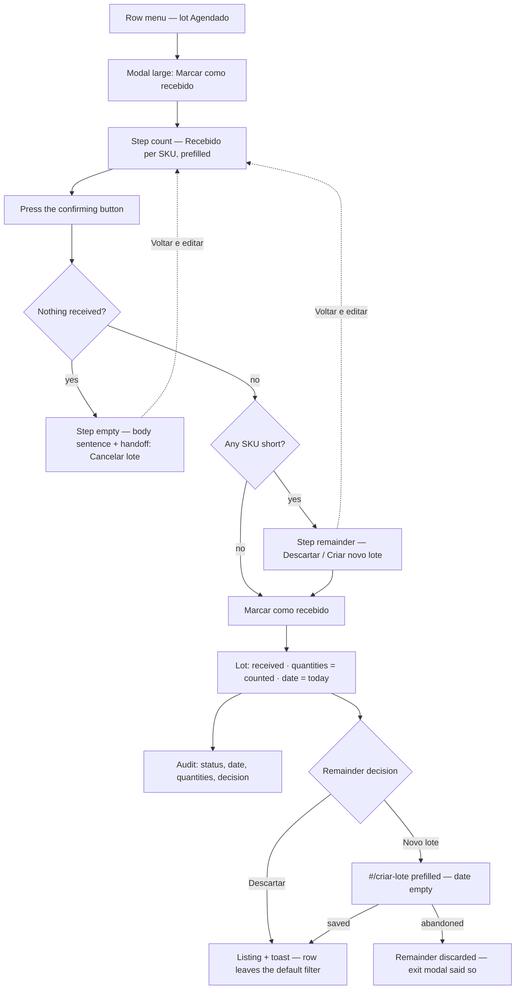

# Future Inventory — Mark a Lot as Received (Prototype)

> **Status**: Approved
> **Created**: 2026-09-04
> **Spec**: **002.5** — UI contract under [`002-future-inventory`](./product-spec.md)
> **Area**: Admin — Inventário Futuro, lot listing (`/admin/future-inventory`, section
> `products`, subsection `inventory`)
> **Prototype**: [`prototype/inventario-futuro-listagem.html`](./prototype/inventario-futuro-listagem.html)
> — implemented
> **Product source**: [`product-spec.md`](./product-spec.md)
> **Siblings**: [`002.1`](./002.1-listagem-por-lote.md) · [`002.2`](./002.2-listagem-por-sku.md) ·
> [`002.3`](./002.3-criacao-de-lote.md) · [`002.4`](./002.4-exportacao.md)
> **Design**: Figma — [step 1, the conference](https://www.figma.com/design/xLwjBVD8h1llHt7FcW96Fv/Future-inventory?node-id=248-2596)
> · [step 2, the remainder](https://www.figma.com/design/xLwjBVD8h1llHt7FcW96Fv/Future-inventory?node-id=248-12232)
> **Amends**: `002.1` FR-14a (when the menu item is offered) · `002.1` FR-4a and `002.2`
> FR-6a (the reservation invariant, and who owns the number) · `002.3` FR-28 (exit
> confirmation when the form was opened by a receipt).
> See [Amendments to sibling specs](#amendments-to-sibling-specs).

---

## 1. Business Context

### Problem Statement

Receiving a lot is normally **not** a decision anyone makes in the Admin. The platform flips
a lot to `Recebido` on its own: either the scheduled arrival date comes, or the ERP sends a
trigger before it. Two situations leave the merchant with no way out of the automatic path:

1. **There is no integration.** Accounts without an ERP trigger depend entirely on the
   scheduled date. Goods that arrive four days early sit on the shelf while the platform
   still promises the original date.
2. **The integration failed.** The trigger did not arrive, arrived for the wrong lot, or the
   ERP is down. The date has passed and the lot is still `Agendado`.

In both cases the cost is the same and it compounds daily: **stock that physically exists
keeps being sold with the future SLA**, so the merchant delivers on a promise worse than
their own reality, and the physical count diverges from what the platform believes.

Marking a lot as received manually is the escape hatch. It carries two properties that
shape the entire flow:

- **It cannot be undone.** Units move into physical inventory and the lot leaves future
  inventory for good. There is no un-receive.
- **What arrived is not always what was expected.** The operator counting the pallet is the
  only person who knows that 80 of the 100 units came. If the flow only accepts "everything
  arrived", it either forces a lie into the inventory or pushes the operator to edit the lot
  first and receive it second — two records of the same event, in the wrong order.

### Scope of this Specification

This spec covers **the manual receipt of one lot from the listing**: the menu item, the
confirmation modal, the count of what actually arrived, the decision about units that did
not arrive, and the effects of confirming.

It does **not** specify the automatic transition (scheduled date or ERP trigger), the
mechanics of writing into physical inventory, the reallocation of orders left uncovered, or
the cancellation flow — it only specifies the **handoff** to that flow.

### Goals

- Turn the existing **"Marcar como recebido"** row item — inert since `002.1` FR-14a — into
  a working flow that starts and ends in the listing.
- Be **transparent about irreversibility without alarming**: the effect is stated as a fact
  about the lot, in plain body text above the count, and the confirming button is `primary`,
  not `critical`. Nothing here failed and nothing is being destroyed by mistake.
- Let the operator **count what arrived inside the flow**, so a partial receipt never
  requires editing the lot first.
- **Never silently discard units.** When something is missing, the decision between
  discarding and rescheduling is explicit and has no preselected answer.
- Keep **Audit as the only history** (`002.1` FR-14c): every quantity, date and status
  change this flow produces is recorded there and nowhere else.

### Non-Goals

- **Automatic receipt.** Date-driven and ERP-driven receipt are platform behavior; this flow
  is the manual override for when they are unavailable.
- **Receiving from the "Por SKU" view.** That view has no row menu (`002.2` FR-4b) and a
  receipt is a decision about a lot, not about a SKU inside it.
- **Receiving several lots at once.** A bulk receipt would ask one count for many pallets,
  which is the opposite of what the conference is for.
- **Reallocating orders** left uncovered by a short receipt.
- **The cancellation flow**, beyond the handoff of FR-8.
- **Un-receiving.** A lot marked by mistake is corrected outside this module.

### User Stories

#### US-1: Receive a lot that arrived complete

- **Story**: As an operations manager whose ERP has no trigger, I want to mark a lot as
  received the day it lands, so that the units start selling with the normal SLA instead of
  waiting for a date that no longer reflects reality.
- **Acceptance Criteria**:
  - **Given** a lot with status `Agendado`, **when** I open its row menu, **then**
    **"Marcar como recebido"** is offered.
  - **Given** the modal is open, **when** it renders, **then** every SKU of the lot is
    listed with the received quantity **prefilled with the scheduled one**, so a complete
    receipt is one click on the confirming button.
  - **Given** every quantity is untouched, **when** I press **"Marcar como recebido"**,
    **then** the lot becomes `Recebido`, its arrival date becomes today, a success `Toast`
    names the lot, and the row leaves the listing because the default filter does not
    include received lots.

#### US-2: Count what actually arrived

- **Story**: As the person who conferred the pallet, I want to say how many units of each
  SKU arrived, so that the inventory records what I counted and not what was ordered.
- **Acceptance Criteria**:
  - **Given** the modal is open, **when** I change a SKU's received quantity to a number
    below the scheduled one, **then** the confirming button becomes **"Continuar"** — the
    receipt now has a remainder to route, and the second step is where that is decided.
  - **Given** a SKU that did not arrive at all, **when** I type `0` in its received
    quantity, **then** the row reads as nothing arrived for that product and the rest of the
    lot is unaffected.
  - **Given** more units arrived than expected, **when** I type a number above the scheduled
    one, **then** it is accepted with no warning and no ceiling, the button stays
    **"Marcar como recebido"**, and the lot's quantity becomes what I typed.
  - **Given** a lot with more SKUs than fit on one screen, **when** the modal opens, **then**
    a **"Buscar SKU"** field filters the rows by product name or SKU id, and a filtered-out
    row keeps the number I typed in it.

#### US-3: Reschedule what did not arrive

- **Story**: As a merchant whose supplier split the shipment, I want the missing units to
  stay in future inventory under a new date, so that they keep selling forward instead of
  disappearing.
- **Acceptance Criteria**:
  - **Given** at least one SKU received less than expected, **when** I press
    **"Continuar"**, **then** the modal moves to a second step that asks what to do with the
    units that were left over, with **no option preselected** and the confirming button
    unavailable until I choose one.
  - **Given** the second step, **when** I press **"Voltar e editar quantidades"**, **then**
    the conference comes back with every number I typed and the option I had chosen intact.
  - **Given** I chose **"Criar um novo lote com uma nova data de chegada"**, **when** I confirm, **then**
    the receipt is applied and the creation form opens with the missing products, their
    missing quantities and the origin lot's destination already filled in, and the arrival
    date empty.
  - **Given** the prefilled form, **when** I save it, **then** a second lot exists with the
    missing units and both lots' histories are in Audit.

#### US-4: Discard what did not arrive

- **Story**: As a merchant whose supplier cancelled the rest of the shipment, I want the
  missing units out of the lot, so that future inventory stops promising stock nobody is
  going to send.
- **Acceptance Criteria**:
  - **Given** the second step, **when** I read it, **then** the question names what is at
    stake — the units left over by the quantities I changed — before either option is
    available to pick.
  - **Given** I chose **"Descartar"**, **when** I confirm, **then** the lot's quantities are
    the received ones, the discarded units exist nowhere, and the change is in Audit.

#### US-5: Know that a short receipt drives Disponíveis negative

- **Story**: As an operations manager, I want to know when I am receiving fewer units than
  are already reserved, so that I confirm knowing the product ends up negative in
  **Disponíveis** and that orders already placed will be left without stock.
- **Acceptance Criteria**:
  - **Given** a SKU whose received quantity is below its reservations, **when** the quantity
    changes, **then** its **Reservas** number turns critical in the conference table — the
    comparison is right there, in the two columns being compared.
  - **Given** that SKU, **when** I press **"Continuar"**, **then** the second step carries a
    `warning` `Alert` naming the product, **the negative balance it lands on**, and that the
    affected orders are left without stock coverage.
  - **Given** that warning, **when** I read it, **then** it does not claim to know **which**
    orders those are, nor how many: the module has reservations in units and nothing else.
  - **Given** that warning, **when** I press the confirming button, **then** the receipt
    goes through: the goods arrived short, and refusing to record it does not make them
    arrive.

#### US-6: Find out that nothing arrived is not a receipt

- **Story**: As an operator who opened the modal for a lot that turned out to be empty, I
  want the interface to tell me where that case belongs, so that I do not create a received
  lot with zero units.
- **Acceptance Criteria**:
  - **Given** every SKU set to `0`, **when** I press the confirming button, **then** the
    modal moves to a step of its own that says nothing will be transferred, asks whether I
    want to cancel the lot and states that cancelling cannot be undone, with
    **"Cancelar lote"** as the action that answers it.
  - **Given** that step, **when** I press **"Voltar e editar quantidades"**, **then** the
    conference comes back untouched — a lot zeroed by mistake costs one click, not a
    reopening.

### Key Scenarios

| ID | Scenario | Pre-conditions | Steps | Expected Result |
|---|---|---|---|---|
| **S-1** | Complete receipt (happy path) | Lot `#001`, `Agendado`, 3 SKUs, 100 units | Row menu → "Marcar como recebido" → confirm | Lot is `Recebido`, arrival date is today, 100 units transferred, toast names the lot, row leaves the default view |
| **S-2** | Partial receipt, remainder discarded | Lot `#002`, 100 expected | Change one SKU from 40 to 25 → "Continuar" → choose "Descartar" → confirm | Lot is `Recebido` with 85 units, the 15 missing exist nowhere, Audit records the quantity change |
| **S-3** | Partial receipt, remainder rescheduled | Lot `#003`, 2 SKUs short | Adjust quantities → "Continuar" → choose "Criar um novo lote com uma nova data de chegada" → confirm | Receipt applied; creation form opens prefilled with the 2 SKUs, missing quantities and inherited destination, arrival date empty |
| **S-4** | Prefilled form abandoned | S-3 up to the form | Press back arrow → confirm the exit | The receipt stands and the missing units are discarded — the exit modal says so in those words before it happens |
| **S-5** | Short against reservations (error-adjacent) | SKU with 40 units, 40 reserved | Type 30 received → "Continuar" | The SKU's **Reservas** number is critical in the conference; the second step carries a `warning` `Alert` naming the product, the `-10un` it lands on, and that the affected orders are left without stock coverage; confirming is still allowed |
| **S-6** | Over-delivery (edge) | SKU expecting 50 | Type 60 received | Accepted with no warning, and the button stays "Marcar como recebido" — there is no remainder, so no second step; the lot's quantity for that SKU becomes 60; Audit records expected 50 → received 60 |
| **S-7** | Nothing arrived (edge) | Any scheduled lot | Set every SKU to `0` → press the confirming button | The modal moves to the nothing-received step: `body` text states that nothing will be transferred, asks whether to cancel the lot and notes that cancelling cannot be undone; focus lands on that text, **"Cancelar lote"** answers it, and "Voltar e editar quantidades" returns to the count |
| **S-8** | Modal dismissed mid-count (edge) | Quantities already edited | Press `Esc` | The modal closes and the count is discarded with no confirmation; the lot is untouched; a click on the backdrop would not have closed it |
| **S-9** | Inactive lot (edge) | Lot with status `Inativo` | Open the row menu | **"Marcar como recebido"** is not in the menu — the item is absent, not disabled |
| **S-10** | Lot received elsewhere while the modal was open (error) | Modal open; the automatic process receives the lot | Press "Marcar como recebido" | Nothing is written twice: the modal closes and a message states the lot was already received |
| **S-11** | Mixed lot (edge) | 3 SKUs: one short, one exact, one over | Adjust the three → "Continuar" → choose a remainder decision → confirm | The remainder decision applies only to the short SKU; the exact and the over-delivered ones are written as counted |
| **S-12** | Long lot searched (edge) | Lot with more than 8 SKUs | Type part of a product name in "Buscar SKU" | Only matching rows are listed; quantities typed in hidden rows are kept and still committed; a search matching nothing shows "Nenhum produto encontrado" |

### Functional Requirements

**The entry point**

- **FR-1**: **"Marcar como recebido"** — the row item of `002.1` FR-14a, with its `check`
  icon, between **Editar** and **Histórico de alterações** — stops being inert and opens the
  receipt modal for that lot. Its label does not change: the modal's title repeats it, so
  the action the operator picked is the action they are looking at.
- **FR-1a**: The item is offered **only for lots whose status is `Agendado`**. It is
  **absent** — not disabled — for `Recebido`, `Cancelado` **and `Inativo`**. An inactive lot
  is stock the operation deliberately parked, and receiving it would push units into
  physical inventory that nobody meant to sell yet; the way in is to make it `Agendado`
  through **Editar** first. This **narrows** `002.1` FR-14a, which omits the item for
  `received` and `cancelled` only.
- **FR-1b**: The flow exists in the **"Por lote"** view only. The SKU view has no row menu
  (`002.2` FR-4b) and this spec does not add one.

**The modal**

- **FR-2**: The flow is a `Modal[size="large"]` with `ModalHeader`, `ModalContent` and
  `ModalFooter`. **Large** — 50rem, 800px — is the width at which the product name and the
  three number columns coexist without the numbers being narrower than the comparison they
  ask for. A **modal, not a drawer**: conferring a pallet is a count, and a drawer leaves
  the listing in view offering everything that takes attention away from it (Decision 1a).
- **FR-2a**: The modal closes through the dismiss button, **"Cancelar"**, `Esc`, or a
  confirmed receipt. **A click on the backdrop does not close it** — the rule `002.3` FR-21
  and `002.4` FR-2a already share, and it matters more here: a stray click would cost a
  count taken off a physical pallet.
- **FR-2b**: Closing **discards the count with no confirmation modal**, even when
  quantities were edited. This is a deliberate divergence from `002.3` FR-21, which confirms
  the discard of filled drawer rows: there, the rows were typed from nothing and the
  confirmation protects work that has no other source; here the modal opens prefilled from
  the lot, nothing has been created, and the count can be retaken from the same pallet. A
  second dialog on the way out of a flow whose whole point is one calm confirmation would
  spend the operator's attention on the wrong question.
- **FR-2c**: The modal is a **three-step machine**, and each step remounts the content
  **and** the footer — the footer changes actions, not only labels (FR-15):

  | Step | When | Content |
  |---|---|---|
  | **`count`** | Always, on open | The effect sentence of FR-4, the optional search of FR-5b, the conference table of FR-5 |
  | **`remainder`** | From `count`, when at least one line is short and at least one unit was received (FR-11) | The remainder question and its two options, plus the `warning` `Alert` of FR-10 when it applies |
  | **`empty`** | From `count`, when no unit at all was received (FR-8) | The nothing-received sentence, in `body` text, and the handoff to cancellation |

  Steps `remainder` and `empty` are reached by the same button — the operator confirms once
  and the modal takes them to whichever question their numbers raised. Both offer
  **"← Voltar e editar quantidades"**, which returns to `count` with every typed number and
  the chosen option intact: going back is navigation, not a reset.
- **FR-3**: The lot lives in the **modal's title**: **"Marcar como recebido | {name} {code}"**
  — the name the operator recognizes plus the code that identifies it, the same pair the
  listing's first column shows. It answers "which pallet am I acting on" without spending a
  line of content, and the part before the separator repeats the menu item just picked.
  There is **no identity block** — seller, warehouse and expected date are one click away in
  the row that opened the modal, and repeating them here would push the count below the
  fold. Composing a title from an action and a subject is a **deviation** from Shoreline's
  guidance on short, uncomposed headings, agreed with the requester and taken from the Figma
  frames.
- **FR-4**: The content opens with the effect, in **plain `body` text** — not an `Alert`:
  **"Ao marcar um lote como recebido, as unidades serão transferidas para o inventário
  físico e passam a ser vendidas com o SLA normal. Esse processo não pode ser desfeito.
  Confira as quantidades abaixo:"**
  - **The absence of a variant is the requirement, not a detail.** `warning` and `critical`
    carry urgency this moment does not have — nothing failed and nothing is at risk of being
    lost by accident. Even `informational` frames a routine receipt as a notice; body text
    states a consequence and then gets out of the way.
  - **Irreversibility is phrased as a fact about the process**, not as a threat to the
    operator, and the sentence ends by handing the work over — "confira as quantidades
    abaixo" — so the paragraph leads into the table instead of standing between the operator
    and it.
  - It sits at the **top**, before the count: what marking does has to be known before the
    numbers are typed, not after.

**The conference**

- **FR-5**: A table lists every SKU of the lot with four columns:
  | Column | Content |
  |---|---|
  | **Produto** | thumbnail, product name, SKU id — the composition of the listing's expanded row |
  | **Agendado** | the lot item's `quantity`, read-only |
  | **Reservas** | the item's `reserved`, read-only |
  | **Recebido** | `Input` with the received quantity |
  The three quantity columns are **left-aligned and adjacent**, so they read as a set to
  compare per row. This is the rule `002.1` FR-4b already set for the listing's quantity
  columns — numbers read one row at a time are not right-aligned — and `002.3` FR-10
  confirmed for a column whose cell holds an `Input`.
  - **There is no checkbox column.** An earlier draft of this spec had one, prechecked, as
    the way to say a product did not arrive. It bought nothing the number does not already
    say — `0` in **Recebido** is the same statement, in the column the operator is already
    typing in — and it cost a column of width plus a second source of truth for the same
    fact.
  - **Reservas earns its column** because it is the other half of the comparison FR-10 is
    about. Without it the operator would confirm a shortfall against reservations they never
    saw.
- **FR-5a**: When a row's **Recebido** falls **below its Reservas**, the **Reservas** number
  turns `$fg-critical` and gains the weight of `$text-action`. Colour carries no meaning on
  its own, so the same cell also holds a `VisuallyHidden` note — **", acima do recebido:
  -{D}un disponíveis"** — and the number is stated again in the warning of FR-10 on the next
  step. The highlight marks **which** rows; the warning says **what it means**.
  - The note uses **the same signed figure and the same words as FR-10's warning**. Two
    surfaces describing one number in two phrasings would make a screen reader announce what
    sounds like two different facts.
- **FR-5b**: A **"Buscar SKU"** `Input`, with a `search` icon, appears above the table
  **only when the lot has more than 8 items**. It filters rows by product name or SKU id.
  - **The threshold is the requirement.** A three-SKU lot with a search field above it is a
    control that will never be used taking the place of the first row; a fifteen-SKU lot
    without one makes the operator scroll a modal to find the one product that came short.
  - **Filtering never edits.** A row hidden by the search keeps the quantity typed into it
    and is committed with the rest (INV-18). A search that matches nothing shows the same
    `EmptyState` composition the listing uses for its own no-results case (`002.1` FR-11) —
    **"Nenhum produto encontrado" / "Tente outros termos"** — so the operator is never left
    with a table that looks like an empty lot.
- **FR-6**: Every SKU opens with **Recebido** prefilled with **Agendado**. The common
  case — the pallet came whole — is then a single click, and the operator edits only what
  diverged.
- **FR-7**: **Recebido** accepts **digits only**. It has **no ceiling**: a number above
  **Agendado** is accepted with no warning, and the lot's quantity for that SKU becomes the
  number typed. Supplier over-delivery is a real event, and refusing to record it would send
  the operator to edit the lot before receiving it — the sequence this flow exists to avoid.
  Emptying the field is treated as `0` on blur, so an empty cell never blocks the count.
- **FR-7a**: **`0` is how the operator says a product did not arrive.** It needs no separate
  control: the field is already where the count is being typed, the row stays visible with
  its scheduled quantity beside it, and the remainder of FR-11 picks the units up like any
  other shortfall.
- **FR-8**: **At least one SKU has to be received with a quantity above `0`.** A receipt
  where every line is `0` is not a receipt — it is a cancellation, and cancellation has its
  own flow. So when every received quantity is `0`, the confirming button of FR-15 takes the
  operator to the **`empty` step**, whose entire content is **plain `body` text**: **"Você
  zerou as quantidades de todos os produtos, então nenhuma unidade será transferida para o
  inventário físico. Deseja cancelar o lote? Esta ação não poderá ser desfeita."**
  - **The irreversibility note comes after the question, not before it.** "Esta ação"
    has to resolve to **cancelling the lot**, and the nearest action named before the
    question is the transfer that is *not* going to happen. Moving the note ahead of the
    question would point it at the wrong antecedent.
  - **It is not a duplicate of FR-4's.** Step 1 states that *the receipt* cannot be undone;
    this states that *the cancellation* cannot. Two different irreversible actions, one per
    step, each declared on the screen that offers it.
  - **`body` text, not an `Alert`** — the reasoning FR-4 applies to step 1, applied again
    here. Nothing failed and nothing is at risk of being lost: the step is the arithmetic
    consequence of numbers the operator just typed. An `informational` variant would frame
    it as a notice the platform is issuing rather than a statement about their own count,
    and it would make the flow change voice between its first screen and its last.
  - **It names what the operator did before what follows from it**, the shape step 2's
    question already uses — "Você alterou algumas quantidades previstas, …". The sentence
    starts from the action, not from the platform.
  - **It funnels to cancellation, and that is a deliberate narrowing.** An earlier version
    offered a diagnosis instead — "Se o lote ainda vem, remarque a data em Editar; se não
    vem mais, cancele o lote" — which named the rescheduling path for the common case of a
    shipment that is merely late. The question now asks about cancellation only. The way
    back to rescheduling is still there, but carried by the footer — **"Voltar e editar
    quantidades"** and then **Editar** in the row menu — rather than by the sentence.
  - **The question is answered by a flow that does not exist yet.** "Deseja cancelar o
    lote?" is a direct question, and in the prototype the button that answers it only closes
    the modal. Sharper copy than the old pointer, and a sharper dependency: see the last
    bullet.
  - **It is a step, not a disabled button.** Blocking the button and explaining beside it
    would leave the operator on a screen whose only remaining move is to close it. Making it
    a step gives the case somewhere to go — cancellation — and a way back to the count for a
    lot zeroed by mistake.
  - **The remainder question and the negative-Disponíveis warning are both absent from this
    step.** There is no partial receipt to route and no receipt to drive **Disponíveis**
    negative: both would be describing a confirmation that is not on offer here. With the
    explanation now in `body` text, **this step holds no `Alert` at all** — the `warning` of
    FR-10 is the flow's only one.
  - **The cancellation flow is an open dependency.** It is inert today (`002.1` FR-14a) and
    unspecified. Until it exists, **"Cancelar lote" closes the modal and returns the
    operator to the listing**, where cancellation sits in the row menu. It is a handoff to a
    destination that does not exist yet, and the prototype does not fake one.
- **FR-9**: **There is no summary line.** What confirming will do is stated by the effect
  sentence of FR-4 — the transfer, the SLA, the irreversibility — and by how many units
  each row is being received with; what happens to the remainder is the question of FR-11,
  which is the whole content of the step it is asked on. A recomputed sentence restating
  those numbers under the table would be a third voice saying what the table and the
  question already say, on the screen where the operator is counting.
  - **Each option's consequence is carried by its own help text** (FR-11c), not by a
    summary. An earlier draft put those consequences in the summary because `Radio`'s
    guidance keeps labels short. A help text per option answers the same need in the place
    the component's own guidance points to — beside the control that selects it.
- **FR-9a**: **Removed.** It pinned a decision zone — warning, remainder question and
  summary — above the footer of the drawer. With the flow split into steps, the question and
  the warning are the content of their own step, so there is nothing to pin: `Modal` already
  keeps its header and footer fixed while the content scrolls, and the only step that
  scrolls is the conference, which has nothing below it to hold in view.
- **FR-10**: On the **`remainder` step**, when a SKU's received quantity is **below its
  reservations**, a **`warning` `Alert`** sits below the two options. It is **two short
  sentences with no personal pronoun**, in sentence case: where the balance lands, then what
  that costs the orders.
  | Situation | Copy |
  |---|---|
  | One SKU short of its reservations | **"{produto} ficará com -{D}un disponíveis. Os pedidos afetados perdem a cobertura de estoque."** |
  | More than one | **"{K} produtos ficarão com unidades disponíveis negativas. Os pedidos afetados perdem a cobertura de estoque."** |
  - **Two sentences, not one.** The component's guidance asks for *a* brief and direct
    sentence, capped at 240 characters. Coordinating both consequences into one sentence put
    the same verb at each end — "{K} produtos **ficarão** … os pedidos afetados **ficarão**
    sem cobertura" — and the rhyme made the second half read as an echo of the first rather
    than as a second, separate cost. Splitting them costs one period, stays near 105
    characters, and lets each consequence be scanned on its own. The rules that carry the
    component's intent — brief, direct, sentence case, no personal pronouns, no technical
    language — all hold.
  - **The received-against-reserved comparison is deliberately left out.** An earlier draft
    opened with it — "Você está recebendo {V} unidades e {R} estão reservadas" — which spent
    a personal pronoun and the whole first sentence restating arithmetic the operator had
    just performed: **Agendado**, **Reservas** and **Recebido** are three adjacent columns
    on the step before, and FR-5a had already marked the rows where they disagree. Spending
    the opening on the cause buried the number the operator acts on.
  - The single-SKU form **names the product**: by the time the warning is read the table is
    on the previous step, so a warning that said "este produto" without saying which would
    send the operator back to find out. The plural form gives the **count** only — naming
    five products would outgrow the brevity the component asks for, and FR-5a marked which
    rows they are.
  - **The negative figure is written as the inventory shows it**, `-{D}un`, rather than
    spelled out as "{D} unidades negativas": the operator will meet that same signed number
    on the inventory table.
  - **The link to the inventory screen is carried by the signed number, not by the column
    name.** An earlier draft capitalised **Disponíveis** to quote the inventory table's own
    header verbatim, on the reasoning that a synonym would make the operator work out that
    the two are the same thing. The copy now says "disponíveis" in lower case, as an
    ordinary word: `-2un disponíveis` is recognisable on that table without the sentence
    having to read as a reference to a column. What the spec no longer claims is that the
    warning quotes the header.
- **FR-10a**: **The warning never counts or identifies orders.** The module holds
  reservations in **units** (`002.1` FR-4a) and has no link to the orders behind them —
  neither which they are nor how many. What it states is exactly what it can derive: the
  negative **Disponíveis** the receipt lands on. Naming a number
  of orders would be inventing a figure at the moment the operator most needs to trust the
  screen, and naming the orders themselves is not this module's job — that lives in order
  management.
  - **The negative balance is the concrete consequence, so it is what the warning leads
    with.** `disponíveis = recebido - reservado`, per SKU **in the lot's destination
    warehouse** — the granularity the inventory table shows: 30 received against 40 reserved
    leaves **-10**. It is the number the operator will read on that table, and it needs no
    data this module does not already have.
  - **The orders are mentioned without being quantified.** "Os pedidos afetados ficarão sem
    cobertura de estoque" is true and actionable — it says the consequence reaches orders and
    that the next step is outside this module — while promising no count the interface cannot
    back. **"Afetados"** carries the whole hedge: it asserts that some orders are, without
    claiming to know which.
- **FR-10b**: **Negative Disponíveis is a condition the operation already knows, and this
  flow is a new cause of it.** Reservations exceeding what is available happens today
  without future inventory — an inconsistency between the ERP and VTEX is the usual
  suspect — and it is the operation's to resolve either way. What future inventory adds is
  a **second cause**: a lot that had reservations against it received fewer units than were
  programmed.
  - **This is why the warning is worth its space.** An operator who later finds a SKU
    negative on the inventory table has, from now on, two candidate causes. Announcing this
    one at the moment it is created — and recording it in Audit (FR-19) — is what keeps the
    new cause diagnosable instead of turning every negative into an ERP investigation.
  - It also sets the warning's register: it describes a known operational condition and its
    cause, not a platform failure. Nothing here is broken, and the copy does not imply it.
- **FR-10c**: **It warns and never blocks.** The pallet already came short; refusing the
  record does not refill it, and it would leave the platform selling the original quantity
  with the original date — a worse lie than the one the warning describes.
  - `warning` is the variant, and this is the one place in the flow that earns it: a SKU
    going negative is "something to be cautious about" in Shoreline's own terms, with a
    consequence outside the module.
  - The receipt is not what oversold the SKU — the reservations were taken against a lot
    that came short. The warning attributes nothing to the operator; it states where the
    inventory lands.
  - **It is absent from the `empty` step** (FR-8), the critical **Reservas** highlight of
    FR-5a included. With no units received there is no receipt to land negative, and the two
    `Alert`s would stack to say that a confirmation which is not on offer would cause
    something.

**The units that did not arrive**

- **FR-11**: When at least one SKU received **less** than scheduled — and at least one unit
  was received, so FR-8 does not apply — pressing the confirming button opens the
  **`remainder` step**. It asks **"Você alterou algumas quantidades previstas, o que devemos
  fazer com as unidades que restaram?"** in **`body`**, and offers a `RadioGroup` with two
  options, in this order: **"Descartar"** and **"Criar um novo lote com uma nova data de
  chegada"**.
  - **The question is the group's accessible name** (`aria-labelledby`). A separate
    `RadioGroup` label would read out, to a screen reader, the sentence already on screen.
  - **It is `body`, not a display variant.** The question is the content of this step, not a
    heading over it — the modal's own title already holds the heading weight, and a second
    one would make the step read as a new screen instead of the next beat of the same flow.
- **FR-11c**: **Each option carries a help text**, one line, in the `FieldDescription`
  composition — `caption-2` in `$fg-base-soft`, aligned under its own label with **no gap**
  between the two, so each pair reads as one unit against the `$space-4` that separates the
  options:
  | Option | Help text |
  |---|---|
  | Descartar | **"As unidades serão removidas do lote"** |
  | Criar um novo lote com uma nova data de chegada | **"Você será redirecionado para a criação do novo lote com as unidades restantes"** |
  - **`Radio`'s guidance asks for help text exactly here**: "only for critical choices where
    the consequences of choosing the option need to be explained in more detail". One option
    destroys units the merchant paid for and the other opens a form — the consequences are
    the whole decision.
  - Both complete the frame the component asks for — "if you check this option, **you or the
    system** will…" — run to one sentence, carry no final punctuation and stay parallel to
    each other. The **label says what the option is, the help says what it does**, which is
    what keeps the labels short.
  - **The second one names the navigation**, which is the fact the operator cannot recover
    from being surprised by: choosing it takes them off this screen and into the creation
    form (FR-13). Describing it as "opens the form" left ambiguous whether it opened over the
    modal or replaced it.
  - **Shoreline's `Radio` exposes `description` on the group, not on the option**, so the
    per-option help is composed here from `[data-sl-field-description]`. The control, the
    label, the focus ring and the typography are all the component's; what is local is a
    two-column grid inside `[data-sl-radio]` that puts the help under the label while
    keeping both as direct children, so none of Shoreline's own selectors stop matching.
  - **Only a shortfall opens this step.** Over-delivery changes a quantity too, but it
    leaves no units behind to route (FR-7), so the button commits directly and its label
    says so (FR-15a).
- **FR-11a**: **No option is preselected**, and the confirming button stays unavailable
  until one is chosen. Shoreline preselects an option only when the choice does not need to
  be conscious; discarding units the merchant paid for is the opposite of that, and a
  default of "Descartar" would destroy them on the strength of a click meant for something
  else.
  - The button is `aria-disabled`, not `disabled`, so clicking it explains itself instead of
    doing nothing — the rule `002.3` FR-20 set for "Adicionar". It paints a `FieldError`
    under the options and moves focus to the first one.
- **FR-11b**: The decision is **one for the whole remainder**, not one per SKU. A pallet
  that came short came short for one reason, and asking the same question three times on one
  screen buys flexibility the operation has not asked for at the cost of the flow's rhythm.
  A merchant who genuinely needs to split the treatment discards here and creates the lot
  they want afterwards.
- **FR-12**: **"Descartar"** removes the missing units from the record: the lot's quantities
  become the received ones and nothing is scheduled for them. Audit carries the before and
  after (FR-19).
- **FR-13**: **"Criar um novo lote com uma nova data de chegada"** applies the receipt and
  then navigates to the creation screen (`#/criar-lote`, `002.3` FR-1) **prefilled**:
  | Field | Opens with |
  |---|---|
  | **Nome** | the origin lot's name, editable — the code is what identifies a lot, and the familiar name is what the operator recognizes in the listing |
  | **Status** | **Agendado**, the form's default (`002.3` FR-6a) |
  | **ID** | the next free sequential, unchanged from `002.3` FR-7 |
  | **Data de chegada** | **empty** — the new date is the whole reason the lot exists and has to be chosen, under the "tomorrow or later" rule of `002.3` FR-8 |
  | **Produtos** | only the SKUs that came short, each with **expected − received** as its quantity |
  | **Destino** | the origin lot's seller and estoque, editable |
  The form is **dirty from the moment it opens**, so its exit guard applies immediately.
- **FR-14**: **The receipt is already committed when the form opens**, and the form's exit
  confirmation says what leaving costs. Replacing the copy of `002.3` FR-28 when the form
  was opened by a receipt:
  - Title: **"Descartar as unidades que não chegaram?"**
  - Body: **"O lote {code} já foi marcado como recebido. Se você sair agora, as {R}
    unidades que não chegaram serão descartadas."** — and, when `R` is `1`, the sentence
    goes singular: **"…, a unidade que não chegou será descartada."** A count of one is
    spelled out rather than written as "1 unidade(s)", the rule this prototype follows
    wherever it prints a quantity in prose.
  - Destructive button: **"Descartar e sair"** · secondary: **"Continuar editando"**
  The generic **"Sair da edição"** modal would be a lie in this context: the information at
  risk is not the form's, it is the units'.

**Confirming**

- **FR-15**: The footer is **rebuilt per step**, and holds different actions in each:
  | Step | Left | Right |
  |---|---|---|
  | **`count`** | — | **"Cancelar"** `secondary` · the confirming button `primary` |
  | **`remainder`** | **"← Voltar e editar quantidades"** `tertiary` | **"Cancelar"** `secondary` · **"Marcar como recebido"** `primary` |
  | **`empty`** | **"← Voltar e editar quantidades"** `tertiary` | **"Fechar"** `secondary` · **"Cancelar lote"** `critical` |
  Every button is `size="large"`. The confirming button is **`primary`**, not `critical`:
  the operator is recording something that happened, and the destructive variant would frame
  a routine receipt as damage.
  - **"Cancelar lote" is the one `critical` button in the flow**, and it is not a receipt:
    it is the entry to a flow that destroys a lot. It is also the only step where the
    primary position holds an action that leaves this spec's scope — which is the honest
    reading of a lot where nothing arrived.
  - **"Cancelar" is `secondary`**, following `002.3` FR-15 — and the Figma frames, which
    render it that way. `002.4` renders it `tertiary`; the divergence between the product's
    dialogs is real and worth resolving across all of them at once, and this spec does not
    resolve it, it follows the precedent of the flow it shares a form with.
  - **"Voltar e editar quantidades" sits on the left.** Going back is navigation, not one of
    the actions being chosen between: grouped with them on the right it would read as a
    third option for the same decision. `ModalFooter` aligns its children to `flex-end`, and
    the back button reaches the opposite edge through an **auto margin** — the alignment is
    not overridden, so the actions stay grouped on the right exactly as the component lays
    them out.
  - The **`←` in this table is the `arrow-left` icon** inside the button's content, not a
    literal character in the label.
- **FR-15a**: On the `count` step the confirming button's **label follows the numbers**:
  **"Marcar como recebido"** when nothing is short, so the button names the action it
  performs; **"Continuar"** the moment any line falls below its scheduled quantity, because
  what the click delivers is then a question, not the receipt. Promising the action and
  handing over a question is the friction the label exists to avoid.
  - The label changes **per keystroke**, without remounting the footer or the table, so the
    field being typed in keeps focus and its caret.
- **FR-16**: Confirming writes, in one operation:
  1. `status` becomes **`received`**;
  2. each item's `quantity` becomes its **received** quantity;
  3. items received with `0` are **removed** from the lot (INV-6);
  4. `arrivalDate` becomes **the date of the receipt** — today.
- **FR-17**: **The actual date replaces the expected one.** A lot scheduled for 20/09 and
  received on 04/09 shows **04/09** in **Chegada** from then on, and Audit holds the
  substitution. The column's meaning follows the lot's status, which the tag beside it
  already states: for a scheduled lot it is a promise, for a received one it is a record.
  Keeping 20/09 would leave the listing asserting a future for a lot that is already on the
  shelf.
- **FR-18**: **Reservations are not this module's data.** They are made by **physical
  inventory**, and future inventory only **mirrors** them: the number sits beside the lot so
  the operator can read the coverage without opening the inventory screen and doing the
  subtraction in their head. This flow never writes `reserved`, and no flow here changes an
  existing reservation — the creation form only ever writes it to be born at zero (`002.1`
  FR-4a). A reservation is **immutable with respect to the
  lot's life**: editing, cancelling or receiving a lot does not change it, which is what
  `002.1` FR-4a already observes for a cancelled lot without saying why.
  - This is also why a received lot can carry `reserved > quantity` (INV-10, Decision 8):
    **Quantidade** is ours and the receipt changed it; **Reservas** is not ours and did not
    change. The two crossing is not corrupt data, it is two owners disagreeing — which is
    the operator's problem to resolve, and the reason the flow warns before confirming.
- **FR-18a**: **Removing an item removes the mirror, not the reservation.** FR-16.3 drops an
  item received with `0` from the lot, and a lot's **Reservas** is derived from its items
  (`002.1` FR-4) — so a lot that loses a SKU holding 11 reservations shows 11 fewer.
  - **Read as a reservation being destroyed, that would be alarming. It is not one.** Those
    11 units stay sold and stay reserved in physical inventory, where they were made. What
    changed is that this lot no longer promises that SKU, so it has no coverage left to
    display against it — and a lot row is the wrong place to keep asserting a number about
    a product the lot no longer carries.
  - **The units surface where they belong.** With nothing arriving to cover them they show
    in physical inventory as **-11 in Disponíveis**, which is exactly what FR-10's warning
    announces before the operator confirms — the maximal form of the message, with the
    whole reservation as the negative. Audit holds the removal on top of that (FR-19).
  - **This flow therefore releases, transfers and recalculates nothing.** It cannot: the
    reservation is not its to move. What the platform does with the **attribution** — a
    reservation is made against a SKU, and which lot it is shown against is a platform
    decision — is **Open Dependency 8**.
- **FR-19**: Everything this flow changes is recorded in **Audit** and nowhere else, per
  `002.1` FR-14c. One receipt produces, at minimum: the status transition
  `Agendado → Recebido`; the date substitution; one entry per item whose quantity changed,
  with expected and received; the removal of items received with `0`; the remainder decision
  taken; and, when a new lot was created, the link between the two lots. **The event shape is
  an open dependency on the Audit team** — the module does not keep a second history to
  disagree with theirs.
- **FR-20**: After a confirmed receipt the operator lands back on the listing with a success
  `Toast` naming the lot — **"Lote {code} marcado como recebido"** — for the 6 seconds the
  prototype's toast already uses.
  - **The row leaves the view, and that is accepted.** The default `Status` filter is
    `Agendado + Inativo` (`002.1` FR-7d), so a received lot is out of it by construction. The
    toast is the confirmation; the flow does not rewrite the operator's filters to chase the
    lot, and it does not keep a stale row on screen pretending the lot is still scheduled.
    Whoever wants to see it opens the `Status` filter, where **Recebido** has always been.
  - Totals and pagination recompute; a page emptied by the departure behaves as it does after
    any filter change.
  - When FR-13 was chosen, this toast fires over the **creation form**, since the receipt is
    already committed. The form's own success toast (`002.3` FR-27) follows on save.
- **FR-21**: **A lot that stopped being `Agendado` while the modal was open is not received
  twice.** On confirmation the flow revalidates the status; if it changed — the automatic
  process got there first — nothing is written, the modal closes, and a message states the
  lot was already received. This is a requirement for the real module; the prototype has no
  concurrent writer and satisfies it by construction.

### Non-Functional Requirements

- **Fidelity**: every control is a real Shoreline composition against the pinned
  `@vtex/shoreline@1.12.13` CSS — `Modal`, `Alert`, `Input`, `Search`, `RadioGroup`,
  `Table`, `EmptyState`, `Button`, `Toast`, `VisuallyHidden`, `FieldDescription`,
  `FieldError`. No hand-rolled inputs and no
  browser-drawn widgets, the rule `002.2` Decisions 16 and 17 set for the filters and
  `002.3` carried into the form.
- **Accessibility**: the modal traps focus while open and returns it to the row menu's
  trigger on close — or, when the confirmed receipt removed that row from the listing, to
  the table itself, never to `<body>`. Each step places focus deliberately: the first
  quantity field on `count`, the first option on `remainder`, and on `empty` **the sentence
  itself**, through `tabindex="-1"`. Focusing text rather than a button does two jobs at
  once there: it reads out **why the screen changed**, which a step whose content is one
  paragraph would otherwise announce to nobody, and it keeps **"Cancelar lote"** off the
  Enter key of someone who only changed step.
  Each row's quantity field is labelled with the product it belongs to — `"Unidades
  recebidas de {produto}"` — because a bare number field in a table row says nothing on its
  own. The critical **Reservas** number carries its meaning in `VisuallyHidden` text
  (FR-5a), never in colour alone. The **`FieldError`** of the undecided remainder is the one
  `role="alert"` in the flow: it appears in response to a press. The `warning` `Alert` of
  FR-10 is **not** a live region — it is already present when its step mounts, and what
  announces it is the focus move into that step. The confirming button is `aria-disabled`
  with an explanation, never a dead control.
- **Copy**: interface strings are pt-BR, written directly in the components as `002.1`
  FR-13 and `002.2` FR-16 establish; no `react-intl` in the prototype.
- **Density**: the table keeps Shoreline's 12px cell padding; rows land on **68px** for the
  same reason `002.3` FR-10 documents — the tallest cell is a 44px `Input`. That 68px is the
  **padding box**, the figure `002.3` FR-10 and `002.2` Decision 13 also quote
  (`12 + 44 + 12`); measured as a border box the step between rows is **69px**, which is the
  number the prototype's own scroll-height math uses. The listing's rows are the same pair
  one thumbnail smaller: 64px and 65px.

### Interface copy (pt-BR)

| Surface | String |
|---|---|
| Row menu item | Marcar como recebido |
| Modal title | Marcar como recebido \| `{name}` `{code}` |
| Effect (body text, step 1) | Ao marcar um lote como recebido, as unidades serão transferidas para o inventário físico e passam a ser vendidas com o SLA normal. Esse processo não pode ser desfeito. Confira as quantidades abaixo: |
| Search field | Buscar SKU |
| Search empty state | Nenhum produto encontrado / Tente outros termos |
| Table headers | Produto · Agendado · Reservas · Recebido |
| Quantity field label (`VisuallyHidden`) | Unidades recebidas de `{produto}` |
| Critical **Reservas** note (`VisuallyHidden`) | , acima do recebido: -{D}un disponíveis |
| Footer, step 1 | Cancelar · Marcar como recebido / Continuar |
| Remainder question (step 2) | Você alterou algumas quantidades previstas, o que devemos fazer com as unidades que restaram? |
| Options | Descartar · Criar um novo lote com uma nova data de chegada |
| Help, Descartar | As unidades serão removidas do lote |
| Help, novo lote | Você será redirecionado para a criação do novo lote com as unidades restantes |
| Undecided error | Escolha o que fazer com as unidades que não chegaram |
| `Alert` warning (one SKU) | `{produto}` ficará com -{D}un disponíveis. Os pedidos afetados perdem a cobertura de estoque. |
| `Alert` warning (vários) | {K} produtos ficarão com unidades disponíveis negativas. Os pedidos afetados perdem a cobertura de estoque. |
| Footer, step 2 | ← Voltar e editar quantidades · Cancelar · Marcar como recebido |
| Nothing received (body text, step 3) | Você zerou as quantidades de todos os produtos, então nenhuma unidade será transferida para o inventário físico. Deseja cancelar o lote? Esta ação não poderá ser desfeita. |
| Footer, step 3 | ← Voltar e editar quantidades · Fechar · Cancelar lote |
| Success toast | Lote {code} marcado como recebido |
| Exit modal (from a receipt) | Descartar as unidades que não chegaram? / O lote {code} já foi marcado como recebido. Se você sair agora, as {R} unidades que não chegaram serão descartadas. / Descartar e sair · Continuar editando |
| Already received (FR-21) | Este lote já foi marcado como recebido. |

---

## 2. Arch Decisions

### Proposed Solution

One modal does three jobs that the requester's description keeps separate: it **confirms** an
irreversible transition, it **collects** the count of what arrived, and it **routes** the
units that did not arrive. Keeping them in a single surface is what keeps the flow calm — a
separate dialog for each would raise the stakes of a receipt that is, most of the time,
routine.

It is a **modal, not a drawer**, because conferring a pallet is a count: the operator is
reading numbers off a physical shipment and typing them, and a drawer leaves the listing —
its filters, its rows, its export card — lit up beside the one table that matters.

The first step opens in the state of the common case: every quantity equal to what was
scheduled. From there the flow reacts to divergence, but it **does not rearrange the screen
while the operator types**. The one live reaction is a **Reservas** number turning critical,
which marks a row without moving anything. Everything else waits for the confirming button
and is answered on a **step of its own**: units left over get the remainder question,
nothing received gets the handoff to cancellation. The button's label says which of the two
the click will deliver, so the operator is never promised an action and handed a question.

Confirming is one write on the lot — status, quantities, date — plus, when the operator chose
to reschedule, a navigation to the creation form carrying the missing units. The receipt is
committed **before** that navigation, which makes the form's abandonment a real branch: the
spec answers it in FR-14 by changing the exit modal's words rather than by pretending the
receipt can be rolled back.

### Architecture Overview



### Alternatives Considered

| Alternative | Why it was attractive | Why it was rejected |
|---|---|---|
| A **drawer**, as the first draft of this spec had it | It is the product's established surface: `002.3` and `002.4` both use one, so the flow would inherit their geometry for free | A drawer covers part of the screen and leaves the rest working — the listing's filters, its rows, its export card. Counting a pallet is exactly the task that should not compete with them, and at `medium` the panel was already narrower than the three number columns wanted (Decision 1a) |
| A `ConfirmationModal` before writing, on top of the modal | Matches the "tem certeza?" the requester asked for, and the product already has that modal in `002.3` FR-28 | Two dialogs for one decision. The modal already holds the effect and the count — a second one would repeat a question the operator just answered with a full conference, and turn a routine receipt into an alarm |
| A radio "Recebi tudo / Recebi parte" gating the table | Keeps the common case to one click and hides the count until it is needed | It asks the operator to classify the receipt before they read it. Prefilled quantities deliver the same one-click path while showing what will be transferred; and the "tudo" option would have to be re-answered the moment a quantity changes |
| A **checkbox per SKU** to say a product did not arrive, prechecked — the first draft's answer | Unchecking is one click, where typing a zero is a few keystrokes, and a disabled field states "nothing arrived" unambiguously | Two controls for one fact, and a column of width spent on the redundant one. `0` in **Recebido** says the same thing in the column the operator is already typing in, and the remainder picks the units up like any other shortfall (FR-7a) |
| Revealing the remainder question **inline**, as the first draft did | No step change: the operator sees the consequence of the quantity they just typed, immediately | The screen rearranges itself under the operator's hands mid-count, and the question competes with the table for the same attention. Answering it on its own step, after the count is done, is what the two-step Figma frames propose and what the count deserves (Decision 12) |
| Editing the remainder's date inline in the modal | No navigation, the flow ends where it started | A new lot is not a date: it is a name, an ID, a destination and a set of products, all of which `002.3` already validates. An inline date field would either create lots the form would have rejected or grow into a second copy of the form inside a modal |
| Blocking the receipt when it falls below the reservations | Protects the orders already sold | The units are already short on the dock. Blocking keeps the platform selling the original quantity for the original date, which harms the same orders it claims to protect, and leaves the operator with no way to record reality |
| Keeping the received row visible in the listing until the next filter change | The operator sees the result of their action | It would show a lot that the active filter excludes, so the listing would contradict its own filters, and the row would have to lie about being scheduled or introduce a state no filter can reach |
| A **search field always present** above the conference | One less conditional rule, and the operator learns one layout | On a three-SKU lot the field takes the place of the first row to filter a table already fully in view. The threshold of FR-5b costs one condition and buys the short lot its space back |
| A ceiling on the received quantity to catch typos | A `600` typed for `60` is a plausible slip | Every ceiling is arbitrary and over-delivery is real. The number sits beside the scheduled one in the row that holds it, and Audit keeps expected and received side by side |

### Risks & Mitigations

| Risk | Mitigation |
|---|---|
| An irreversible action taken by accident | The effect is stated before the count (FR-4), the modal removes the listing from the operator's field of attention (Decision 1a), the confirming button's label says whether the click commits or asks (FR-15a), and the remainder decision has no default (FR-11a). What is deliberately **not** used is a second modal — friction that trains the operator to click through |
| Orders left uncovered by a short receipt | The critical **Reservas** number marks the rows during the count (FR-5a) and the warning states the negative **Disponíveis** and that orders are affected, on the step before confirmation (FR-10); Audit records received against expected. It deliberately claims no count: reallocation is out of scope and so is identifying the orders |
| The shortfall marked only by colour, invisible to a screen reader or to colour-blind eyes | The critical **Reservas** cell also carries `VisuallyHidden` text with the negative figure, and the numbers are stated in full on the next step (FR-5a) |
| A negative SKU blamed on the ERP when the receipt caused it | The warning names the cause when it is created and Audit keeps the trace (FR-10b, FR-19), so future inventory becomes a **checkable** second cause instead of an invisible one |
| The remainder silently lost when the creation form is abandoned | The exit modal names the units at risk instead of the form (FR-14) |
| The receipt count taken from a stale expectation | The modal opens from the lot's current items and revalidates the status on confirmation (FR-21) |
| A count lost by going to the second step and back | The step machine holds the draft: going back restores every typed number and the option already chosen (FR-2c) |
| A quantity typed into a row the search then hides, silently dropped | The search filters what is rendered, never the draft: hidden rows are committed with the rest (INV-18) |
| The lot's **Reservas** dropping after a receipt reads as reservations being destroyed | They are not: reservations belong to physical inventory and are immutable with respect to the lot, and what the removal takes away is the mirrored number on a lot that no longer carries that SKU (FR-18, FR-18a). The units surface as negative **Disponíveis**, which FR-10's warning announces before the operator confirms |
| Audit's event shape unknown, so the history may not show quantity changes | FR-19 states the minimum set of events as a requirement on the Audit integration, and the module keeps no local history to compensate |
| `reserved > quantity` after a short receipt, which the current specs declare impossible | The invariant is narrowed to scheduled lots (Decision 8) and the amendment is registered below, so the listing tolerates the gap the warning already announced |

### Key Decisions

#### Decision 1: The modal is the confirmation

- **Context**: The requester asked for a confirmation before an irreversible transition, and
  explicitly asked for it not to read as danger.
- **Options**: the surface plus a `ConfirmationModal`; the surface plus an acknowledgement
  checkbox; the surface alone.
- **Decision**: The surface alone. Body text carries the effect (FR-4), the confirming
  button's label says whether it commits or asks (FR-15a), and the remainder question is
  answered before anything is written.
- **Consequences**: One dialog, one decision. The only `critical` buttons in reach are
  "Cancelar lote" on the nothing-received step — the entry to a flow that destroys a lot —
  and the destructive button of the form's exit modal, which belongs to `002.3`.

#### Decision 1a: A modal, not a drawer

- **Context**: The first approved draft of this spec specified a `medium` drawer, following
  `002.3` FR-15 and `002.4` FR-2. Implementing it made the cost visible.
- **Options**: keep the drawer for consistency with the product's two other panels; a
  `Modal[size="large"]`.
- **Decision**: `Modal[size="large"]`. **Focus is the reason**: a drawer leaves the listing
  working beside it — filters, rows, the floating export card — and counting a pallet is the
  task least able to share attention with them. **Width is the confirmation**: at 35rem the
  drawer squeezed the product name to fit the number columns; 50rem holds `Produto`,
  `Agendado`, `Reservas` and `Recebido` without either side giving way.
- **Consequences**: A third dialog geometry in the product, which is a real inconsistency and
  is recorded as such. It buys the flow the one thing it needs most — the operator's
  undivided attention on a count they cannot undo — and it made **Reservas** affordable as a
  column, which is what turned FR-10's warning from a claim into a comparison the operator
  can see. Two prototype-level consequences follow: the `Modal` header needs the same
  `z-index` fix the drawer header already had, and the export card has to be pushed behind
  any open modal.

#### Decision 2: Prefilled quantities instead of an "all or part" question

- **Context**: The operator has to be able to say that only part of the lot arrived.
- **Options**: a radio gating the table; a table always editable with prefilled quantities;
  a checkbox per SKU, prechecked, with an editable quantity.
- **Decision**: A table always editable, each row's **Recebido** prefilled with **Agendado**.
  The checkbox column of the first draft is **removed**.
- **Consequences**: The complete receipt stays one click while the count is always visible.
  `0` is how a product that did not arrive is recorded (FR-7a) — one control, one source of
  truth, and a column of width returned to the comparison the numbers are there for.

#### Decision 3: The remainder decision has no default

- **Context**: One of its two options destroys units.
- **Decision**: Nothing is preselected, and the confirming button waits — `aria-disabled`,
  so pressing it points at the unanswered question instead of doing nothing.
- **Consequences**: A short receipt costs one extra click. Shoreline's guidance on
  preselection — only when the choice need not be conscious — points the same way.

#### Decision 4: The new lot goes through the creation form

- **Context**: The remainder can be rescheduled, which means a new lot with a new date.
- **Decision**: Confirming navigates to `#/criar-lote` prefilled (FR-13). The date opens
  empty.
- **Consequences**: The new lot inherits every validation `002.3` already owns — unique ID,
  date in the future, destination pair — and the operator can adjust anything before saving.
  The cost is leaving the listing mid-flow, which Decision 5 answers.

#### Decision 5: The receipt is committed before the form opens

- **Context**: If the operator abandons the prefilled form, either the receipt stands or it
  has to be rolled back.
- **Options**: commit on confirmation; treat receipt and new lot as one transaction; hold the
  remainder as a resumable pending item.
- **Decision**: Commit on confirmation. Abandoning the form discards the remainder, and the
  exit modal says so in those words (FR-14).
- **Consequences**: The physical fact — the pallet arrived — is never held hostage to a form.
  A pending item, the third option, would invent a state no listing filter can show and no
  status can name.

#### Decision 6: Received quantity has no ceiling

- **Context**: Suppliers over-deliver.
- **Decision**: A number above the expected one is accepted with no warning and no cap, and
  becomes the lot's quantity (FR-7).
- **Consequences**: The lot records what arrived. Audit keeps expected against received, so
  the divergence is auditable without the interface arguing about it at the moment of typing.

#### Decision 7: A short receipt against reservations warns and never blocks

- **Context**: A lot can arrive with fewer units than were already sold against it. The
  question is what the interface is entitled to say about it.
- **Options**: name the affected orders; count them; state the negative **Disponíveis** and
  say that orders are affected without quantifying them.
- **Decision**: The third. The `warning` `Alert` gives received against reserved, the units
  the product goes negative in **Disponíveis** — the inventory table's own column — and the
  fact that orders already placed are left without stock. The receipt goes through
  (FR-10 to FR-10c).
- **Consequences**: Every number in the warning is derived from data the module already
  holds, so nothing here waits on an API. Naming or counting the orders is **out of scope
  and unavailable**: future inventory has reservations in units and no link to the orders
  behind them. Reallocation stays with order management, and the spec says so rather than
  implying this flow handles it. The flow also becomes a **named second cause** of a
  negative SKU, alongside ERP inconsistency (FR-10b) — which is what the warning and the
  Audit trail together buy the operation.
- **Where it is said** follows Decision 12: the count marks the rows (FR-5a), the second
  step states the numbers (FR-10). Splitting it that way keeps the table from rearranging
  itself while the operator types, and puts the sentence with numbers in it on the screen
  where the operator has stopped counting and started deciding.

#### Decision 8: The actual date replaces the expected one, and the reservation invariant is narrowed

- **Context**: A manual receipt happens on a date that is, by definition, not the scheduled
  one. And a short receipt can leave an item with more reservations than quantity — which
  `002.1` FR-4a and `002.2` FR-6a declare impossible.
- **Decision**: **Chegada** shows the receipt date once the lot is received (FR-17), and
  `reserved ≤ quantity` is an invariant **of scheduled lots**, not of every lot.
- **Consequences**: Two amendments to `002.1`, registered below. The listing has to render
  `reserved > quantity` without treating it as corrupt data — it is the recorded trace of a
  shipment that came short, which the operator was warned about before confirming. The cap
  could only ever have been a **coincidence of the two numbers agreeing**, never an
  invariant the module enforces: **Quantidade** belongs to the lot and this flow rewrites
  it, while **Reservas** is owned by physical inventory and immutable with respect to the
  lot (FR-18). A rule binding a value we own to one we only mirror had nothing holding it
  up; a short receipt is simply the first case that makes the two cross.

#### Decision 9: `Inativo` loses the menu item

- **Context**: `002.1` FR-14a omits the item for received and cancelled lots only, so it is
  offered on inactive ones today.
- **Decision**: Offer it for `Agendado` only (FR-1a).
- **Consequences**: An inactive lot is received in two deliberate steps — activate in
  **Editar**, then receive — which is the right shape for stock the operation parked on
  purpose.

#### Decision 10: Closing the modal asks nothing

- **Context**: `002.3` FR-21 confirms the discard of filled drawer rows.
- **Decision**: This modal closes silently, even with edited quantities (FR-2b).
- **Consequences**: A divergence between two dialogs of the same product, taken knowingly:
  one protects rows typed from nothing, the other holds a count that opens prefilled and can
  be retaken from the pallet.

#### Decision 11: The remainder options carry help text, not a card frame

- **Context**: Two options of very unequal weight — discarding units the merchant paid for,
  or rescheduling them. The Figma frame drew each one inside a bordered card, and the first
  implementation followed it.
- **Options**: the bordered card of the Figma frame; Shoreline's plain stacked `Radio`s;
  plain `Radio`s with a help text per option.
- **Decision**: **Plain `Radio`s with a help text per option** (FR-11c). The card gave each
  option visual weight but said nothing about what it does, and it was a frame Shoreline's
  `Radio` has no variant for. The help text spends the same vertical space on the sentence
  the operator actually needs.
- **Consequences**: The deviation shrinks from a whole visual variant to a composition
  question — `Radio` puts `description` on the group, and this needs it on the option
  (Open Dependency 7). Everything visible is the component's: control, label, focus ring,
  and the `caption-2`/`$fg-base-soft` of `FieldDescription`. Vertical spacing between options
  is `$space-4`, which is what `RadioGroup`'s own `Stack` uses.

#### Decision 12: Divergence is answered on a step, not inline

- **Context**: The first draft revealed the remainder question and the warning inside the
  same panel, pinned above the footer, as soon as a quantity went short. The requester's
  Figma proposes a second screen instead.
- **Options**: reveal inline, as the first draft did; a second step reached by the confirming
  button.
- **Decision**: A second step — and a third for the nothing-received case (FR-8), which the
  requester asked for by the same reasoning.
- **Consequences**: The count stops rearranging itself under the operator's hands: the only
  live reaction left is a number turning critical, which moves nothing. Each question gets a
  whole screen, and the pinned decision zone of FR-9a becomes unnecessary — `Modal` already
  holds its footer while the content scrolls. The costs are one extra click on a short
  receipt and a confirming button whose label has to change with the numbers (FR-15a), so it
  never promises an action and delivers a question. Going back is free and lossless, which is
  what makes the extra click acceptable.

### Amendments to sibling specs

These follow from the decisions above and need to land in the sibling documents. They are
listed here so nothing is changed silently in an approved spec.

| Spec | Item | Amendment |
|---|---|---|
| `002.1` | FR-14a | **"Marcar como recebido"** is offered for `Agendado` only; the item is also absent for `Inativo` (Decision 9) |
| `002.1` | FR-4a **and the `reserved` field's doc comment** in Data Models | `reserved ≤ quantity` holds **while the lot is scheduled**. A received lot can carry more reservations than quantity. The visible pt-BR help text of FR-4c — "Unidades já vendidas em pedidos e reservadas neste lote." — never asserted the cap, so **no copy changes**: what changes is FR-4a's wording, its claim that the `ContextualHelp` says so, and the type's `"Never greater than quantity"` comment, which asserted the cap unconditionally (Decision 8) |
| `002.1` | FR-3 (arrival date) | For a received lot the **Chegada** column shows the receipt date, not the expected one (FR-17) |
| `002.3` | FR-28 | When the form was opened by a receipt, the exit modal's title, body and destructive label are the ones in FR-14 |
| `002.3` | FR-1 | The creation route is also reachable prefilled, from a receipt (FR-13) |
| `002.2` | FR-6a | Same narrowing as `002.1` FR-4a, in the SKU view |
| `002.1` | FR-4a **and** `002.2` FR-6a, plus both `reserved` doc comments | **Who owns the number.** Reservations are made in **physical inventory** and only mirrored by this module — read-only, never written by any flow here, and **immutable with respect to the lot's life**. Both specs described the column without naming its owner, which left `reserved ≤ quantity` looking like an invariant the module enforces and FR-4a's "independent of status" looking like a special case instead of a consequence (FR-18) |

### Implementation Plan

1. **Menu** — make **"Marcar como recebido"** functional and restrict it to `scheduled`
   (FR-1, FR-1a). Verify the item is absent, not disabled, on the other three statuses.
2. **Modal shell** — `Modal[size="large"]`, the composed title of FR-3, dismiss, a footer
   rebuilt per step, the close rules of FR-2a and the silent discard of FR-2b.
3. **Step machine** — the three steps of FR-2c, the transitions the confirming button makes,
   the back action, and focus placement per step.
4. **Conference table** — the four columns of FR-5, prefilled quantities, and the quantity
   rules of FR-7 and FR-7a. Then the conditional search of FR-5b, with its threshold, its
   empty state, and the guarantee that hidden rows keep their numbers.
5. **Confirming button's label** — the per-keystroke swap of FR-15a, applied without
   remounting the table.
6. **Negative Disponíveis** — the critical **Reservas** number of FR-5a with its hidden note,
   then the `warning` `Alert` of FR-10 in both its forms, one SKU and several. No new fixture
   data: the numbers come from `reserved`.
7. **Nothing received** — the `empty` step of FR-8: the `body` sentence and its focus
   target, the cancellation handoff, the way back.
8. **Remainder** — the `remainder` step of FR-11: the question in `body`, the two options
   with their help text (FR-11c) and no default, the `aria-disabled` button and its
   `FieldError`.
9. **Write and toast** — the single write of FR-16, the date substitution of FR-17, the
   removal of zero items, and the toast of FR-20. Confirm the row leaves the default filter
   and that totals and pagination recompute.
10. **Prefilled form** — the navigation and prefill of FR-13, the immediate dirty state, and
    the exit modal copy of FR-14.
11. **Document** — the prototype's README gains this flow: the modal, its three steps, the
    two remainder paths, and what remains inert (cancellation).

---

## 3. Technical Contract

### Data Models

The lot and item types of `002.1` are **unchanged** — this flow adds no field to them. The
warning of FR-10 is derived from `reserved`, which already exists, and the receipt itself is a
transient object that never persists.

```ts
export type FutureInventoryLotItem = {
  id: string
  skuId: string
  productName: string
  imageUrl: string
  quantity: number
  /**
   * Units already sold in orders. **Read-only here**: owned by physical inventory and
   * mirrored by this module, never written by any flow in it (FR-18). `<= quantity`
   * **while the lot is scheduled**, not after a short receipt (INV-10).
   * Units only: the module has no link to the orders behind them (FR-10a).
   */
  reserved: number
}

/** One row of the conference. Lives while the modal is open and is never persisted. */
export type ReceiptLine = {
  itemId: string
  /**
   * Digits only, `>= 0`, no ceiling — may exceed `expected`. `0` means it did not arrive.
   *
   * The **prototype holds this as a `string`** while the modal is open: a field cleared to
   * be retyped is `''`, and `''` is not `0`. It is read through `Number(v) || 0` and only
   * becomes a number at commit — the same choice `002.3` makes for the form's quantity
   * fields. A typed implementation is free to model it as a string in the draft and a
   * number in the result.
   */
  received: number
  expected: number
}

export type RemainderDecision = 'discard' | 'new-lot'

/** Which question the modal is on (FR-2c). */
export type ReceiptStep = 'count' | 'remainder' | 'empty'

export type ReceiptDraft = {
  lotId: string
  step: ReceiptStep
  lines: ReceiptLine[]
  /** Required when any line is short; `null` until chosen (FR-11a). */
  remainder: RemainderDecision | null
  /** FR-5b. Filters what is rendered, never the draft (INV-18). */
  search: string
}

/** What the modal commits. The lot's own fields are derived from it. */
export type ReceiptResult = {
  lotId: string
  receivedAt: string // ISO `YYYY-MM-DD`, becomes the lot's `arrivalDate`
  /** Items received with 0 are absent — they are removed from the lot (INV-6). */
  items: Array<{ itemId: string; quantity: number }>
  /** Present only when `remainder === 'new-lot'`. */
  carriedOver: Array<{ skuId: string; quantity: number }> | null
}
```

**Derived values, never stored**

| Value | Rule |
|---|---|
| Units to transfer | `lines.reduce((t, l) => t + l.received, 0)` |
| Products to transfer | `lines.filter(l => l.received > 0).length` |
| Remaining units | `lines.reduce((t, l) => t + Math.max(0, l.expected - l.received), 0)` |
| Line is short | `l.received < l.expected` |
| **Disponíveis** after the receipt | per item, `l.received - item.reserved` — negative is the shortfall FR-5a marks and FR-10 names |
| Items driven negative | `lines.filter(l => l.received < itemOf(l).reserved).length` |
| Decision required | `lines.some(l => l.received < l.expected)` |
| Next step from `count` | `unitsToTransfer === 0 ? 'empty' : decisionRequired ? 'remainder' : commit` |
| Confirming label on `count` | `remainingUnits > 0 ? 'Continuar' : 'Marcar como recebido'` (FR-15a) |
| Confirmation allowed | `unitsToTransfer > 0 && (!decisionRequired \|\| remainder !== null)` |
| Rows rendered | `lines.filter(l => matches(itemOf(l), search))` — presentation only |

### Interfaces

**Prototype**

| Symbol | Status | Responsibility |
|---|---|---|
| `openReceiptModal(lotId)` | **new** | Builds the `ReceiptDraft` from the lot's current items with `received = expected`, `step = 'count'`, and opens the modal |
| `renderReceipt()` | **new** | Mounts the title, the body and the footer of the current step (FR-2c). Called on open, on a step change and on a search — never per keystroke, which would remount the table and take focus off the field in use |
| `setReceiptStep(step)` | **new** | Moves between the three steps and places focus: the first quantity field on `count`, the first option on `remainder`, the sentence itself on `empty` |
| `advanceReceipt()` | **new** | What the confirming button does on `count`: `empty` when nothing was received, `remainder` when units are short, commit otherwise |
| `syncReceiptFeedback()` | **new** | The per-keystroke updates that must not remount anything: the critical **Reservas** cells of FR-5a and the button label of FR-15a |
| `negativeOf(line)` | **new** | The shortfall against reservations, `max(0, reserved - received)` — the units by which the receipt drives **Disponíveis** negative, which is the figure both FR-5a's hidden note and FR-10's `Alert` print. It is the **magnitude**, not the signed balance of the Derived values table: the two surfaces that show it already write the sign |
| The modal's `input` and `focusout` listeners | **new** | The quantity rules of FR-7, with **no named setter**: digits only through the shared `bindDigitsOnly`, no ceiling, the draft written straight from the event, and an emptied field committed as `0` on blur. A keystroke costs one `syncReceiptFeedback()` and no re-render |
| `commitReceipt()` | **new** | Revalidates the status (FR-21) and applies FR-16. It **takes no argument** — the draft lives in module scope, so every step's footer can call it |
| `applyReceiptPrefill()` | **new** | FR-13 — fills the creation form from `receiptOrigin`, the carried-over units held across the navigation. `commitReceipt()` is what sets `receiptOrigin` and then routes to `#/criar-lote` |
| `rowMenuItems(lot)` | **changed** | Offers "Marcar como recebido" for `scheduled` only (FR-1a) |
| `requestLeave()` | **changed** | Uses the copy of FR-14 when `receiptOrigin` is set, and the generic `002.3` FR-28 copy when it is not |

**Planned module** (following the file layout of `002.1`)

```
components/future-inventory/ReceiptModal/ReceiptModal.tsx
components/future-inventory/ReceiptModal/ReceiptCountStep.tsx
components/future-inventory/ReceiptModal/ReceiptRemainderStep.tsx
components/future-inventory/ReceiptModal/ReceiptEmptyStep.tsx
components/future-inventory/ReceiptModal/useReceiptDraft.ts
hooks/useMarkLotAsReceived.ts
```

### Integration Points

| System | What crosses the boundary | Status |
|---|---|---|
| **Physical inventory** | The received units, per SKU and destination warehouse, debiting the reservations already held against the lot. The write itself is the platform's, not this module's | Out of scope here; the flow's only contract is the quantity per SKU |
| **Reservations / physical inventory** | Reservations are made and owned there and only mirrored in this module, immutable with respect to the lot's life (FR-18). A short receipt leaves them standing while the lot's quantity falls, which is what surfaces as negative **Disponíveis**; a removed item takes the mirror, not the reservation (FR-18a). The orders behind them are neither counted nor identified here (FR-10a), and reallocating them belongs to order management | Read-only, by definition. The consequence is announced in the warning; the per-lot attribution after a removal is **Open Dependency 8** |
| **Inventory's Disponíveis** | A short receipt lands as a **negative Disponíveis** on the SKU — `recebido - reservado` — which is the number FR-10 states in advance, under the same name the inventory table uses | Out of scope to write; in scope to announce |
| **Audit** | The event set of FR-19, and the deep link of `002.1` FR-14c | **Open** — event shape and deep-link parameters to be confirmed with the Audit team |
| **Creation form** (`002.3`) | The prefill of FR-13 and the amended exit copy of FR-14 | Specified here, to be applied in `002.3` |
| **Cancellation flow** | The handoff of FR-8 | **Open** — inert and unspecified (`002.1` FR-14a) |
| **Automatic receipt** (date / ERP trigger) | The same transition this flow performs manually, and the concurrency of FR-21 | Out of scope; platform behavior |

### Invariants & Constraints

- **INV-1**: Only a lot whose status is **`scheduled`** can be received through this flow
  (FR-1a), and the status is revalidated at commit time (FR-21).
- **INV-2**: A receipt is **irreversible**. No interface in this module returns a received lot
  to `scheduled`.
- **INV-3**: `received` is an **integer `>= 0`** with **no upper bound**; it may exceed
  `expected` (FR-7).
- **INV-4**: A receipt requires **at least one unit** across the lot. Zero everywhere is not a
  receipt (FR-8).
- **INV-5**: After a receipt, each remaining item's `quantity` **equals** its received
  quantity.
- **INV-6**: An item received with `0` is **removed** from the lot — a lot never holds an item
  with quantity `0`, which `002.1` INV-12 already forbids.
- **INV-7**: A lot's total quantity remains the sum of its items' quantities (`002.1` INV-1),
  recomputed after the receipt.
- **INV-8**: `arrivalDate` of a received lot is **the date it was received** (FR-17).
- **INV-9**: `reserved` is **never written** by this flow, or by any flow in this module — it
  is owned by physical inventory and mirrored here, and it is immutable with respect to the
  lot's life (FR-18). What the receipt can change is **where it is displayed**: an item
  removed by INV-6 takes its mirrored number out of the lot's derived total, while the
  reservation itself stands (FR-18a).
- **INV-10**: `reserved <= quantity` holds **while the lot is scheduled**. A received lot may
  carry `reserved > quantity`, and both listings render it (Decision 8).
- **INV-11**: When any line is short, `remainder` must be `'discard'` or `'new-lot'` before
  the receipt can be committed, and it starts as `null` (FR-11a).
- **INV-12**: The remainder decision is **one per receipt**, not one per item (FR-11b).
- **INV-13**: A lot created from a remainder holds **only** the SKUs that came short, each
  with `expected - received` units, and is born `scheduled` with `reserved: 0` (`002.3`
  INV-6a).
- **INV-14**: The two lots are **separate entities**. The new one carries its own code, and
  the link between them lives in Audit, not in the lot.
- **INV-15**: This module keeps **no local history**. Every change is in Audit (FR-19).
- **INV-16**: The interface never states **how many** orders a short receipt affects, nor
  **which** ones. It states the units, the resulting negative **Disponíveis**, and that
  orders are affected (FR-10a).
- **INV-17**: Available units are called **disponíveis** throughout this flow, and the
  shortfall is always written as the **signed figure** `-{D}un` — the same form on the
  conference table's hidden note and in the warning (FR-5a, FR-10). No synonym and no second
  format is introduced.
- **INV-18**: The search of FR-5b filters **what is rendered**, never the draft. A row hidden
  by it keeps the quantity typed into it and is committed with the rest.
- **INV-19**: Moving between steps **loses nothing**: the typed quantities and the remainder
  already chosen survive going back and forward (FR-2c).

### Open Dependencies

| # | Owner | Question |
|---|---|---|
| 1 | Engineering / Platform | Confirm that a short receipt drives **Disponíveis** negative through the same path an ERP inconsistency already does, with the same arithmetic — `recebido - reservado`, per SKU in the lot's destination warehouse. FR-10 announces that figure before the operator confirms, so the number in the modal has to be the number the inventory table will show |
| 2 | Audit team | The **event shape** for a manual receipt — status transition, date substitution, per-item quantity changes, item removals, remainder decision, link to the created lot — and the **deep link** with its parameters (`002.1` FR-14c) |
| 3 | Product | The **cancellation flow** that FR-8 hands off to, still inert and unspecified |
| 4 | Platform | Whether the automatic receipt (date or ERP trigger) writes through the **same** path as this flow, which is what makes FR-21 enforceable |
| 5 | Product / Design | The **`Cancelar` variant** across the product's dialogs — `secondary` in `002.3` FR-15 and here, `tertiary` in `002.4`. One of them is wrong and the fix belongs in a pass over all three |
| 6 | Product / Design | The **dialog geometry** now has three shapes: the `medium` drawers of `002.3` and `002.4` and this `large` modal (Decision 1a). Confirm which flows are counts — and therefore modals — and which are panels beside a working screen, before a fourth shape appears |
| 7 | Design system | `Radio` exposes `description` on the **group**, not on the option, so the per-option help text of FR-11c is composed in this prototype from `FieldDescription`. The component's own content guidance is written for per-option help ("for the value Fragile the help text should be…"), so the slot looks like a gap in the API rather than a deliberate limit |
| 8 | Engineering / Inventory | **Who attributes a reservation to a lot, and what happens to that attribution when a lot line disappears.** A reservation is made in physical inventory against a SKU (FR-18); the number this module shows is per `(lot, SKU)`, so something upstream decides which lot each reservation is displayed against — in the fixture the same SKU carries 21, 3 and 11 across three lots. When a SKU is removed from a lot by a receipt (FR-16.3), confirm whether the platform **re-points** those reservations to another scheduled lot that still promises the SKU, or leaves them **unattributed** as uncovered demand. Nothing in this flow moves them either way; what is undefined is which number the listing will show afterwards |
