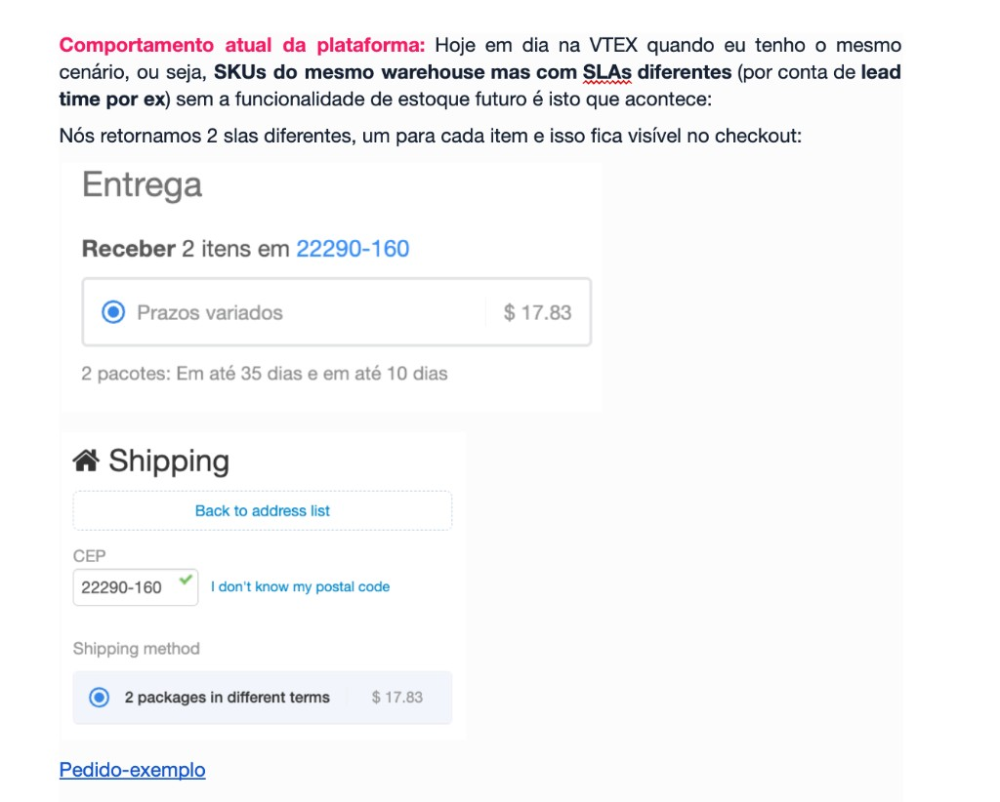

# Spec 002: Future Inventory

## Metadata

| Field | Value |
|---|---|
| **Module** | Inventory Management |
| **Status** | Work in Progress: discovery atualizado, ainda não pronto para desenvolvimento |
| **Author** | Carolina Tourinho |
| **Created** | May 2026 |
| **Source docs** | [[BRD] Future Inventory](https://docs.google.com/document/d/1jcSbSNa8LkDsgHXeqcEk0lT--6nWuUVPmazoazyNn14) · [Inventory Management Vision (PR #11)](https://github.com/vtex/vertical-distributed-order-management-dom/pull/11) |

---

## Context

Merchants routinely know that stock is on its way: a supplier confirmed a replenishment batch, a new product launches next month, a backorder is scheduled. VTEX gives them no good way to act on that knowledge. Inventory is modeled as a single present quantity, with no notion of *when* more will arrive, so a merchant who knows 100 units land on May 14 has to either hide the product (losing demand at the moment of highest intent) or open stock and risk overselling.

Future Inventory adds a time dimension to inventory: the ability to register that a quantity of a SKU will be available at a warehouse on a future date, sell against it now, and have that date anchor the delivery promise shown to the shopper, across the seller, franchise/white-label, and Delivery Promise architectures merchants actually run.

VTEX already ships a mechanism meant to cover this (Supply Lot), but it fails in exactly those architectures (detailed below). This spec documents the use cases and requirements a viable Future Inventory solution must satisfy.

---

## Supply Lot Today: Why It Is Not Recommended

Supply Lot is the existing platform feature for future inventory. It has existed since 2020, exposed only via API (no Admin UI, no help-center documentation beyond the Logistics API reference) and with no improvements since 2021. It guarantees future-inventory *availability*, but fails precisely in its applicability across the architectures enterprise customers are adopting. Its structural limitations make it unviable to evolve:

1. **No native integration with Delivery Promise.** Delivery Promise is a pipeline separate from the logistics monolith where Supply Lot is implemented. There is no contract/event that propagates the scheduled date outward, so the item appears as **unavailable** to the shopper in Delivery Promise architectures.
2. **Seller selection between white-label sellers ignores the future arrival date.** When the platform picks among white-label sellers, the SLA it compares is each seller's *transit-time* SLA, the time to ship and deliver once stock is on hand. It does not account for the wait until the future stock's arrival date. In practice, a seller whose units only arrive on May 14 looks just as fast as a seller with the item in hand today, so future stock does not influence seller selection the way it should.
3. **No "future inventory" mark in the order payload.** A supply-lot item is indistinguishable from a normal item with a long SLA: the order carries no flag or identifier saying it was placed against future stock. The only signal is a longer delivery date, forcing operations to infer the origin from the date. This hinders invoicing, fulfillment, customer service, and any report or integration that needs to isolate future-inventory orders.
4. **A cart with immediate + future stock is not split.** Both consolidate into a single shipment with the latest date. Even a unit available now is not offered as a fast delivery: the checkout unifies immediate and future into one shipment and applies the lot's arrival date to all units. The shopper waits for the worst date in the cart, even for items already in stock.
5. **Fulfillment simulation does not consider the Supply Lot SLA.** When simulating a SKU with only future stock (no immediate), the SLA is not updated to reflect the lot date.
6. **Undefined timezone and business-days behavior for the supply date.** The feature's integration into the new `logistics-shipping` module was done as a retroactive patch (PRs from April and June 2024).

**Recommendation:** build a native Future Inventory solution that is integrated with Delivery Promise, works in multi-seller and white-label seller selection, and ships with an Admin UI from day one: the integration points Supply Lot lacks. Lead Time is a useful reference for the bar to clear: it is a native inventory feature that was born already adapting to these platform surfaces. Give customers a path to migrate off Supply Lot; any decision about formally deprecating it depends on auditing its current production usage first.

> Gating dependency: no audit has been run on Supply Lot production usage. This is required before any deprecation communication (see Open Questions).

---

## Use Cases

### Shopper's POV

**[Case 1] Purchase with only future inventory items**

Context: Item has no immediate stock: it's at zero. A merchant sells iPhone 17, currently out of stock at every warehouse and seller. The supplier confirmed delivery of 100 units on May 14. The merchant wants to start capturing orders now, with the real arrival date informing the delivery promise.

Why current VTEX Lead Time does not solve this: Lead Time adds fixed preparation days to the item's SLA (e.g., "+3 days for assembly"), but (a) lead-time days count from the order date, not from a fixed replenishment date, so the promise "slides" as time passes instead of anchoring on May 14; and (b) there is no concept of quantity tied to the date, so there is no way to say "I can only sell 100 units until the batch arrives." The result is that either the item stays unavailable (and the merchant loses the capture window) or the merchant opens stock and risks overselling.

Expected outcome: The platform respects the same seller selection heuristic it uses today, with one addition: when calculating the SLA, the future inventory arrival date is taken into account. The SLA includes the number of days between today and the future arrival date (plus the usual transit time), so the promise anchors on May 14 instead of looking immediately available. That SLA is then used in the seller selection heuristic exactly as any other SLA. If another seller also had future inventory, both SLAs would be calculated the same way and the heuristic would use them to determine which seller is selected.

---

**[Case 2] Mixed-SLA cart with the same SKU**

Context: Shopper needs to buy 2 iPhone 17s. The merchant has 1 unit available for immediate shipment. The supplier confirmed 100 units arriving on May 14.

Current platform behavior (Supply Lot): the cart does not split: both units consolidate into a single shipment with the latest date, even though one unit is available now (see Supply Lot limitation #4). Without future inventory, the platform already returns 2 distinct SLAs (one per item) for the same warehouse when SLAs differ (e.g., due to lead time), and this is visible at checkout.

Expected outcome: The shopper can buy both: one for immediate shipment and one with a later date. We expect the **same result the platform already produces today when a single warehouse has items with different lead times**: the package is split and 2 SLAs are returned, one per item, each with its own freight. So this results in 2 shipments and 2 separate freight calculations, future inventory simply makes one of those SLAs anchor on the lot's arrival date.

Illustration: current behavior with two different SLAs in the same warehouse (split into 2 packages, "Prazos variados"):

---

**[Case 3] Cart using 2 future inventory batches of the same SKU**

Context: Shopper needs to buy 2 iPhone 17s. The merchant has 0 units immediately available but two future lots: 1 unit arriving May 14 and 100 units arriving May 21.

Expected outcome: The shopper can buy both units, each allocated to a different lot and therefore with a different SLA. As in Case 2, we expect the **same behavior the platform already produces today when one warehouse returns different SLAs**: the package is split and 2 SLAs are returned, one per unit, each with its own freight. The only difference is that here both SLAs anchor on future lot dates (May 14 and May 21) rather than one being immediate. This results in 2 shipments and 2 separate freight charges.

---

**[Case 4] Pre-order of a product with no registered stock**

Context: A merchant is launching iPhone 18, a brand-new product with no stock registered in any warehouse. The supplier confirmed first units arriving June 1. The merchant wants to capture orders before physical arrival.

Current platform behavior: today the merchant sets a "pre-sale date" (Data de pré-venda) in the Catalog, at the **SKU level**, not at the warehouse level. Because the field lives on the SKU, the rule applies to every warehouse of every seller, and therefore to all shipping policies and docks indiscriminately. There is no way to scope the pre-sale date to a specific warehouse/seller or tie it to a quantity.

Expected outcome: The item becomes sellable with its SLA calculated from June 1 + carrier transit time. Availability is created entirely by the registered future lot (no prior stock), scoped to the specific warehouse/seller. When stock is recorded on the expected date, pre-order orders are automatically released for fulfillment.

Interaction when both exist (SKU-level pre-sale date + warehouse-level future lots): the **SKU-level pre-sale/launch date takes precedence as an umbrella rule**: it is a floor that the item cannot be promised or sold before. The effective availability date for a lot is therefore `max(SKU pre-sale date, lot arrival date)`.

- Example: launch date Sept 1; one lot arriving Aug 20 and another Sept 1. Even though the Aug 20 lot physically arrives earlier, the item is not promised before Sept 1; both lots resolve to a Sept 1 availability date.
- If a lot arrives *after* the launch date (e.g., lot Sept 10 with launch Sept 1), the lot date governs (Sept 10), since the stock is not physically available until then.

Rationale: the pre-sale date is a deliberate SKU-wide business decision (a launch); an earlier warehouse-level arrival should not override it. (Behavior to validate with Catalog, since the pre-sale date lives on the SKU in Catalog.)

---

**[Case 5] Current and future stock for a SKU both sold out**

Context: A merchant sells iPhone 17. Immediate stock is depleted, and the only registered future lot (100 units arriving May 14) has all units reserved by prior orders. A new shopper tries to add the product to the cart.

Expected outcome: The item is unavailable for new orders, even though the lot date has not arrived yet, since all units, both on-hand and registered future, are committed. The merchant can register a new future lot to reopen availability.

---

**[Case 6] Cart with different SKUs with distinct availability from the same seller**

Context: Shopper adds an iPhone 17 and an iPhone case from the same seller. The case has immediate availability. The iPhone 17 only has future inventory, with a lot arriving May 14. The seller operates with a single warehouse.

Current platform behavior: the cart is split into two deliveries and the two distinct SLAs are shown at checkout.

Expected outcome: The order is split into 2 packages (the immediately available item ships now and the future-inventory item ships when its lot arrives), with 2 distinct SLAs and 2 freight charges. This matches the platform's current behavior for differing SLAs in the same warehouse.

---

**[Case 7] Purchase up to the available quantity in a lot**

Context: Shopper wants to buy 5 units of a product. The only future lot registered has 3 units available.

Expected outcome: The shopper can add at most 3 units to the cart. Attempting to add a 4th triggers a standard out-of-stock error. The platform treats this as a normal availability limit.

---

**[Case 8] Seller selection in multi-seller architecture with future inventory**

Context: A SKU is available through 2 sellers: Seller A has immediate stock, Seller B has a future lot arriving May 14. Both have the same SLA.

Expected outcome: The platform respects the same allocation criteria it uses today. The key point is that Seller B's SLA must be calculated recognizing the time between now and the future stock's arrival date (days until arrival + transit time), so future stock competes on a correct SLA instead of looking immediately available. With both SLAs computed correctly, the normal allocation criteria pick the winner; if the SLA ties, the usual tiebreaker applies, with no built-in preference for immediate over future stock. (Open with the Order Allocation PM: whether a more flexible rule should let a merchant prioritize immediate stock even at a worse SLA.)

---

**[Case 9] Order cancellation with future inventory reservation**

Context: A shopper bought 1 unit reserved from a future lot with arrival on May 14. Before the arrival date, the merchant cancels the order.

Expected outcome: The cancelled reservation is returned to the lot and becomes available for new orders, the same way any cancelled reservation works today.

---

**[Case 10] Multiple lots of the same SKU in the same warehouse**

Context: A merchant has 3 lots registered for iPhone 17 in the same warehouse: 50 units on May 14, 100 on May 28, and 80 on June 11. A shopper buys 1 unit.

Expected outcome: The reservation is allocated to the lot with the nearest date that still has available units (FIFO by arrival date). The SLA shown at checkout reflects that lot's date.

---

### Merchant's POV

**[Case 11] Lot quantity reduction with active reservations**

Context: A merchant registered a lot of 100 iPhone 17 units arriving July 14. 90 units are already reserved by active orders. Before July 14, the supplier confirms only 80 units will be shipped. The merchant updates the lot quantity to 80.

Current platform behavior (reservation mechanism is unchanged): the inventory endpoint updates the *total* quantity, never the available quantity. Available is always derived: `available = total − reserved`. So with total 100 and 90 reserved, available is 10; updating future stock to 80 makes available `80 − 90 = -10`. Reservations are not affected: they were created when the orders came in and are independent of the inventory total. Internally the balance goes negative, the platform blocks new sales, and the existing orders proceed normally to fulfillment. Future inventory introduces no new reservation logic here; it reuses this exact mechanism.

What happens to the excess orders: This is a merchant decision, outside the scope of inventory. The platform should not automatically cancel or migrate orders: those actions have financial and customer impact. The merchant must handle them.

---

**[Case 12] Arrival date change on a lot with active reservations**

Context: A merchant registered a lot of 100 iPhone 17 units arriving July 14. 90 units are already reserved by active orders, all with SLA calculated from that date. The supplier confirms the lot will now arrive July 21.

Expected outcome: Consistent with current platform behavior, the merchant remains responsible for communicating a delivery-date change to the shopper. To make that easier, the platform should expose the lot's arrival-date change as a **trigger the merchant can wire to a custom email template in Message Center**, if they choose. The exact mechanism (which event fires on a date change and how it maps to a Message Center trigger) is still to be defined; the goal is to let the date change drive an optional, merchant-configured notification instead of a fully manual process. Still open: whether SLA recalculation on existing orders is automatic or manual.

---

**[Case 13] Automatic transition from future lot to available stock on the scheduled date**

Context: The scheduled arrival date for a lot of 100 units of SKU A at Warehouse A has arrived. The merchant previously registered this lot with arrival date May 22. Before midnight, Warehouse A had 0 available units for SKU A.

Expected outcome: At the turn of May 22 (00:00 in the **account's configured timezone**), the 100 units are automatically converted to available stock at Warehouse A, with no manual action required from the merchant. The account timezone is what defines the moment of the turn (not UTC or any warehouse-local time), so the transition lands on the date the merchant registered. This inventory update triggers the same downstream flow as a manual update: item reindexing and broadcaster notification. The event must carry an origin identifier indicating it was triggered by a future inventory lot, ensuring traceability in logs for both the merchant and the internal team.

---

**[Case 14] Payment behavior for pre-order orders**

Context: A shopper completes checkout for a pre-order item with a lot arriving in 30 days.

Expected outcome: The order follows the platform's existing payment capture configuration. It is not possible to configure different capture behavior in Logistics specifically for future inventory orders.

---

**[Case 15] Inventory export including future lots**

Context: A merchant wants to know the full inventory position for a SKU (both on-hand and future) via API or Admin export.

Expected outcome: Inventory export endpoints (List inventory by SKU, List inventory per warehouse, List inventory per dock, List inventory per dock and warehouse) return the configured future inventory alongside on-hand stock, with a way to **clearly distinguish the two** (on-hand vs. future) and, for future inventory, surface the lot's arrival date (and lot identifier where applicable). The consumer must not have to infer which quantity is future from the date alone.

---

**[Case 16] Batch Updates incorporate future inventory**

Context: Merchants use the Batch Update solution to update stock in VTEX. Today it is not adapted for future inventory.

Expected outcome: Batch Update accepts optional columns in the CSV/spreadsheet to represent future inventory: at minimum, the lot arrival date. Behavior per row: with a date filled in → the row is treated as a future inventory lot (quantity + arrival date); without a date → current behavior unchanged (normal on-hand update). Backward compatible.

---

**[Case 17] Configuring how future inventory is released for sale**

Context: How future inventory is released for sale is a **per-lot configuration set at registration time**, not a per-SKU setting and not a per-order confirmation. The field is **optional**: when the merchant does not specify a mode, the lot defaults to **Simultaneous**. The same SKU can have multiple future lots, and each lot is registered as either Sequential or Simultaneous:
- **Simultaneous:** the lot's units join the SKU's sellable availability immediately, summing with on-hand stock in the same purchase. Each unit still carries the SLA anchored to that lot's arrival date.
- **Sequential:** the lot's units do not add to current availability; they only become sellable once the layers above them are exhausted.

Consumption model (layers): a purchase consumes availability in this order:
1. **On-hand** (immediate stock).
2. **Simultaneous lots** (available now, summed with on-hand), ordered FIFO by arrival date among themselves.
3. **Sequential lots**, ordered FIFO by arrival date among themselves, consumed only after layers 1 and 2 are depleted.

Precedence rule: **mode takes precedence over date**. A Sequential lot is always the last layer, even if its arrival date is earlier than a Simultaneous lot's. FIFO by date orders lots *within* a layer, not across layers.

Expected outcome (single lot): with 2 units of immediate stock + a 3-unit future lot and a shopper wanting 3: if the lot is Sequential the purchase is not possible (limited to the 2 immediate units); if Simultaneous the purchase is possible (immediate + future cover the 3 units).

Expected outcome (same SKU, mixed lots): iPhone with 2 on-hand, Lot A = 5 units arriving in 7 days registered **Simultaneous**, Lot B = 10 units arriving in 30 days registered **Sequential**. Sellable now = 2 (on-hand) + 5 (Lot A) = 7 units; orders beyond on-hand draw from Lot A with its 7-day-anchored SLA. Lot B's 10 units only open for sale once on-hand and Lot A are fully consumed, with their own 30-day-anchored SLA: even though nothing forces the shopper to wait for Lot B while earlier stock exists, the merchant has explicitly held it as a fallback reserve.

---

**[Case 18] Identifying orders placed with future inventory**

Context: A merchant sells iPhone 17 with both immediate stock and a future lot arriving July 14. Throughout the day, orders of both types come in: some ship immediately, others only when the lot arrives. Operationally, the merchant needs to quickly distinguish which orders depend on future inventory, to plan invoicing, shopper communication, and shipping.

Expected outcome: The order payload must carry an explicit mark that it was placed with future inventory: a tag/flag (ideally at item level, indicating the lot and expected arrival date), consumable by integrations, OMS, and reports. This payload mark is the core requirement; surfacing it in the OMS UI (e.g., a filter or an expected-arrival-date column) can follow from it. Today there is no such mark: a future-inventory item is indistinguishable from a normal item with a long SLA (see Supply Lot limitation #3).

---

**[Case 19] Managing franchise future inventory from the main account**

Context: In franchise architectures, a main account orchestrates multiple franchise sellers, each with its own warehouses. The operator of the main account needs to register and manage future inventory for the franchises centrally, without logging into each franchise account one by one.

Expected outcome: From the main account, the merchant can register, edit, and view future lots for franchise-owned warehouses, the same way on-hand inventory is managed across franchises today. The future SLA from those lots flows into seller selection and Delivery Promise exactly as it does for the main account's own warehouses, so franchise future stock competes on a correct SLA. This keeps future inventory operable in the franchise architecture without a separate, per-franchise management flow.

---

## Prioritization & Releases

**Principle:** V1 is the smallest slice that proves the core promise: *sell stock that hasn't physically arrived, with a correct delivery promise, in the architectures enterprise customers run*. Everything that composes carts, adds operational visibility, or adds configurability comes after the core is trustworthy.

### V1: first release

**Goal:** a merchant registers a future lot (units of a SKU arriving at a specific warehouse and seller on a future date), and the platform sells it immediately with an SLA anchored to that arrival date. That SLA flows correctly into Delivery Promise and into seller selection at checkout, and the lot converts to on-hand automatically on the arrival date.

1. **Lot registration & editing (Admin + API).** Register a future lot: a number of units of a specific SKU arriving at a specific warehouse and seller on a future date; and edit existing lots (both quantity and arrival date). (Case 4 registration mechanics, without the Catalog pre-sale precedence.)

2. **Future-inventory reference in the order:** the order payload carries an explicit mark that future inventory was the source, so future-inventory orders can be isolated without inferring it from the delivery date. (Case 18)

3. **Future stock availability mode (per lot, optional):** at registration, each lot is set as Simultaneous (joins sellable availability now, summed with on-hand) or Sequential (held as a fallback reserve, consumed only after on-hand and all Simultaneous lots are exhausted). The field is optional and defaults to Simultaneous when omitted. Mode takes precedence over date when ordering consumption across layers. (Case 17)

4. **Future SLA considered in seller selection:** the future-anchored SLA is used by seller selection in multi-seller and white-label architectures, just like lead time. (Case 8)

> Selling with future-only stock (Case 1) and the automatic turn of a lot into on-hand on its arrival date in the account timezone (Case 13) are the core mechanics described in the V1 Goal above; they are foundational to the four items and not listed as separate work items.

### V2: second release

1. **Future Inventory UI in "Inventory Management":** the future-inventory management surface in the Admin Inventory Management area.

2. **Future inventory in Inventory Export spreadsheet:** exports distinguish on-hand vs. future, surfacing the lot arrival date. (Case 15)

3. **Pre-sale date precedence:** `max(SKU pre-sale date, lot arrival date)`; depends on Catalog. (Case 4)

4. **Multiple lots, FIFO by date:** multiple lots per SKU × warehouse, consumed nearest-date first. (Case 10)

5. **Mixed cart split:** immediate + future in one cart split into separate packages/SLAs. (Cases 2, 3, 6)

6. **Franchise future inventory from the main account:** register and manage future lots for franchise warehouses centrally. (Case 19)

### Later

1. **Batch Inventory Update support:** future lots via spreadsheet/batch import. (Case 16)

2. **Date-change notification:** arrival-date change as a Message Center custom-template trigger. (Case 12)

> **Not prioritized (implicit / inherited):** reservation behavior, covering cancellation returns to the lot (Case 9), per-lot quantity limit (Case 7), sold-out becomes unavailable (Case 5), and quantity reduction with active reservations (Case 11), reuses the platform's existing reservation mechanism unchanged, so it is an implicit requirement across releases rather than a prioritized item. Pre-order payment (Case 14) inherits the platform default with no logistics-specific config, so it is not a prioritized work item.

---

## Open Questions

1. **Behavior when a lot date passes without confirmation:** What happens if midnight passes and the merchant has not confirmed or updated the lot? Does the lot expire automatically? Does the platform alert the merchant? Do existing reservations remain active? This is the concrete manifestation of the "expired" state in the planned lifecycle.

2. **Supply Lot deprecation:** Is any merchant actively using Supply Lot in production today? No audit has been run. This is a gating dependency for any deprecation communication.

---

## Out of Scope

- **Multiple future batches per SKU with quantity limits (full batch lifecycle management):** the use cases here describe the end-state behavior; the implementation of a multi-batch entity with a full lifecycle (scheduled → received → expired → cancelled) is a scope decision to be made with engineering.
- **Shopper-facing status labels** ("Pre-order", "Back-ordered: arrives June 1"): surfacing these labels in storefront, Intelligent Search, and PDP/PLP depends on Catalog and IS integration and is tracked separately.
- **Unified inventory visibility dashboard:** a consolidated Admin view of on-hand and future inventory across warehouses and sellers is referenced in Case 15 but not specified in detail here.
- **Supply chain forecasting and demand planning:** the platform receives arrival dates from the merchant; it does not predict or compute them.

---

## Appendix

### Affected Clients / Prospects

| Account | Need | Workaround today |
|---|---|---|
| Fast Shop | Anchored delivery promise for scheduled replenishments | Manual daily lead time adjustment |
| Samsung | Pre-order for high-ticket electronics | Manual daily lead time adjustment |
| Container Store | Backorder release when stock arrives | Manual WMS-to-VTEX release |
| World Wide Golf | Backorder release when stock arrives | Manual WMS-to-VTEX release |
| ODP | Future stock visibility | No workaround: SKUs go unavailable |
| NFI Parts | B2B restocking with scheduled availability | `[PM INPUT NEEDED]` |
| Kirklands | Pre-order with quantity cap and shopper notification | Not possible today |
| Chick-fil-A | Item status labels (pre-order / backorder) | Not possible today |

### Source Documents

| Document | Link |
|---|---|
| [BRD] Future Inventory | [Google Doc](https://docs.google.com/document/d/1jcSbSNa8LkDsgHXeqcEk0lT--6nWuUVPmazoazyNn14) |
| Inventory Management Vision | [PR #11](https://github.com/vtex/vertical-distributed-order-management-dom/pull/11) |

### Changelog

| Date | Author | Change |
|---|---|---|
| May 2026 | Carolina Tourinho | Initial draft: use cases from BRD discovery |
| Jun 2026 | Carolina Tourinho | Synced with BRD update: added "Supply Lot: Why It Is Not Recommended" section, Lead Time vs. Supply Lot comparison, deprecation recommendation; enriched Case 1; added current-behavior note to Case 2; added Cases 16 (batch updates), 17 (fallback vs. combined consumption), 18 (identifying future-inventory orders). |
| Jun 2026 | Carolina Tourinho | Review pass: rewrote Context around adding a time dimension to inventory; reframed Supply Lot limitation #2 (white-label seller selection compares transit-time SLA, ignoring the arrival date) without internal jargon; reframed limitation #3 and Case 18 to emphasize the order-payload mark; rewrote Recommendation to stop framing it as "evolve Lead Time" (Lead Time is only a reference); removed the Lead Time vs. Supply Lot section. |
| Jun 2026 | Carolina Tourinho | Synced cases with the latest BRD (updated Jun 23): Case 1 outcome (same heuristic + SLA counts days from today to the arrival date); Cases 2 & 3 outcome (same package-split / 2-SLA behavior the platform already produces for differing SLAs in one warehouse) with illustrative checkout screenshot; Case 6 current behavior (cart split into 2 deliveries with 2 SLAs); Case 11 current behavior (reservation mechanism unchanged: available = total − reserved, negative blocks new sales, existing orders intact). |
| Jun 2026 | Carolina Tourinho | Case 4: documented current platform behavior (SKU-level "Data de pré-venda" in Catalog, not warehouse-scoped) and added the precedence rule when both a SKU pre-sale date and warehouse future lots exist: the pre-sale/launch date is an umbrella floor; effective availability = max(pre-sale date, lot arrival date). |
| Jun 2026 | Carolina Tourinho | Added "Prioritization & First Delivery (MVP)" section mapping cases to MVP / Fast Follow / Later, defining the first-delivery scope and cross-team dependencies. |
| Jun 2026 | Carolina Tourinho | Reorganized prioritization into V1 / V2 / Later. V1: lot registration & editing, future-inventory reference in the order (Case 18), future stock availability mode (Case 17), future SLA in seller selection (Case 8); selling future-only (Case 1) and auto turn on-hand (Case 13) folded into the V1 Goal. V2: Future Inventory UI, inventory export (Case 15), pre-sale precedence (Case 4), multiple lots FIFO (Case 10), mixed cart split (Cases 2,3,6). Later: Batch Update (Case 16), date-change notification (Case 12). Reservation behavior and pre-order payment (Case 14) dropped from the prioritized list as implicit/inherited. |
| Jun 2026 | Carolina Tourinho | Case 17 reframed from per-SKU to **per-lot** availability mode: the same SKU can mix Sequential and Simultaneous lots. Added the layered consumption model (on-hand → Simultaneous lots → Sequential lots, FIFO within each layer) and the precedence rule that mode takes precedence over arrival date. |
